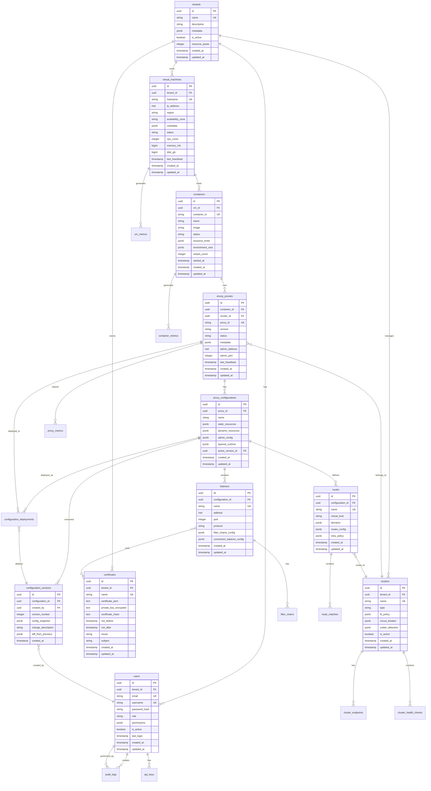

# Envoy Fleet Management System - Database Design Document

## 1. Overview

This document describes the PostgreSQL database schema for the Envoy Fleet Management System. The design supports multi-tenancy, configuration versioning, and efficient querying using SQLx with compile-time verification.

## 2. Database Architecture Principles

### 2.1 Design Principles
- **Normalized Design**: 3NF normalization with strategic denormalization for performance
- **Multi-tenancy**: Row-level security with tenant isolation
- **Audit Trail**: Comprehensive tracking of all changes
- **Version Control**: Full configuration history with rollback capability
- **JSONB Usage**: Flexible storage for complex Envoy configurations
- **Performance**: Strategic indexing and partitioning for scale

### 2.2 SQLx Integration
- All tables designed for SQLx compile-time query checking
- Use of PostgreSQL-specific features compatible with SQLx
- Prepared statements for all queries
- Connection pooling optimization

## 3. Entity Relationship Diagram



## 4. Detailed Table Schemas

### 4.1 Core Tables

#### tenants
```sql
CREATE TABLE tenants (
    id UUID PRIMARY KEY DEFAULT gen_random_uuid(),
    name VARCHAR(255) UNIQUE NOT NULL,
    description TEXT,
    metadata JSONB DEFAULT '{}',
    is_active BOOLEAN DEFAULT true,
    resource_quota INTEGER DEFAULT 100,
    created_at TIMESTAMPTZ DEFAULT CURRENT_TIMESTAMP,
    updated_at TIMESTAMPTZ DEFAULT CURRENT_TIMESTAMP
);

CREATE INDEX idx_tenants_name ON tenants(name);
CREATE INDEX idx_tenants_active ON tenants(is_active);
```

#### users
```sql
CREATE TABLE users (
    id UUID PRIMARY KEY DEFAULT gen_random_uuid(),
    tenant_id UUID NOT NULL REFERENCES tenants(id) ON DELETE CASCADE,
    email VARCHAR(255) UNIQUE NOT NULL,
    username VARCHAR(100) UNIQUE NOT NULL,
    password_hash VARCHAR(255) NOT NULL,
    role VARCHAR(50) NOT NULL CHECK (role IN ('admin', 'operator', 'viewer')),
    permissions JSONB DEFAULT '{}',
    is_active BOOLEAN DEFAULT true,
    last_login TIMESTAMPTZ,
    created_at TIMESTAMPTZ DEFAULT CURRENT_TIMESTAMP,
    updated_at TIMESTAMPTZ DEFAULT CURRENT_TIMESTAMP
);

CREATE INDEX idx_users_tenant ON users(tenant_id);
CREATE INDEX idx_users_email ON users(email);
CREATE INDEX idx_users_username ON users(username);
```

#### api_keys
```sql
CREATE TABLE api_keys (
    id UUID PRIMARY KEY DEFAULT gen_random_uuid(),
    user_id UUID NOT NULL REFERENCES users(id) ON DELETE CASCADE,
    key_hash VARCHAR(255) UNIQUE NOT NULL,
    name VARCHAR(255) NOT NULL,
    permissions JSONB DEFAULT '{}',
    expires_at TIMESTAMPTZ,
    last_used_at TIMESTAMPTZ,
    is_active BOOLEAN DEFAULT true,
    created_at TIMESTAMPTZ DEFAULT CURRENT_TIMESTAMP
);

CREATE INDEX idx_api_keys_user ON api_keys(user_id);
CREATE INDEX idx_api_keys_hash ON api_keys(key_hash);
```

### 4.2 Infrastructure Tables

#### virtual_machines
```sql
CREATE TABLE virtual_machines (
    id UUID PRIMARY KEY DEFAULT gen_random_uuid(),
    tenant_id UUID NOT NULL REFERENCES tenants(id) ON DELETE CASCADE,
    hostname VARCHAR(255) UNIQUE NOT NULL,
    ip_address INET NOT NULL,
    region VARCHAR(100),
    availability_zone VARCHAR(100),
    metadata JSONB DEFAULT '{}',
    status VARCHAR(50) DEFAULT 'unknown',
    cpu_cores INTEGER,
    memory_mb BIGINT,
    disk_gb BIGINT,
    last_heartbeat TIMESTAMPTZ,
    created_at TIMESTAMPTZ DEFAULT CURRENT_TIMESTAMP,
    updated_at TIMESTAMPTZ DEFAULT CURRENT_TIMESTAMP
);

CREATE INDEX idx_vms_tenant ON virtual_machines(tenant_id);
CREATE INDEX idx_vms_status ON virtual_machines(status);
CREATE INDEX idx_vms_region ON virtual_machines(region);
```

#### containers
```sql
CREATE TABLE containers (
    id UUID PRIMARY KEY DEFAULT gen_random_uuid(),
    vm_id UUID NOT NULL REFERENCES virtual_machines(id) ON DELETE CASCADE,
    container_id VARCHAR(255) UNIQUE NOT NULL,
    name VARCHAR(255),
    image VARCHAR(500),
    status VARCHAR(50) DEFAULT 'unknown',
    resource_limits JSONB DEFAULT '{}',
    environment_vars JSONB DEFAULT '{}',
    restart_count INTEGER DEFAULT 0,
    started_at TIMESTAMPTZ,
    created_at TIMESTAMPTZ DEFAULT CURRENT_TIMESTAMP,
    updated_at TIMESTAMPTZ DEFAULT CURRENT_TIMESTAMP
);

CREATE INDEX idx_containers_vm ON containers(vm_id);
CREATE INDEX idx_containers_status ON containers(status);
```

### 4.3 Envoy Configuration Tables

#### envoy_proxies
```sql
CREATE TABLE envoy_proxies (
    id UUID PRIMARY KEY DEFAULT gen_random_uuid(),
    container_id UUID NOT NULL REFERENCES containers(id) ON DELETE CASCADE,
    cluster_id UUID REFERENCES clusters(id) ON DELETE SET NULL,
    proxy_id VARCHAR(255) UNIQUE NOT NULL,
    version VARCHAR(50),
    status VARCHAR(50) DEFAULT 'unknown',
    metadata JSONB DEFAULT '{}',
    admin_address INET,
    admin_port INTEGER,
    last_heartbeat TIMESTAMPTZ,
    created_at TIMESTAMPTZ DEFAULT CURRENT_TIMESTAMP,
    updated_at TIMESTAMPTZ DEFAULT CURRENT_TIMESTAMP
);

CREATE INDEX idx_proxies_container ON envoy_proxies(container_id);
CREATE INDEX idx_proxies_cluster ON envoy_proxies(cluster_id);
CREATE INDEX idx_proxies_status ON envoy_proxies(status);
```

#### clusters
```sql
CREATE TABLE clusters (
    id UUID PRIMARY KEY DEFAULT gen_random_uuid(),
    tenant_id UUID NOT NULL REFERENCES tenants(id) ON DELETE CASCADE,
    name VARCHAR(255) NOT NULL,
    type VARCHAR(50) DEFAULT 'STRICT_DNS',
    lb_policy JSONB DEFAULT '{"type": "ROUND_ROBIN"}',
    circuit_breaker JSONB DEFAULT '{}',
    outlier_detection JSONB DEFAULT '{}',
    health_checks JSONB DEFAULT '[]',
    is_active BOOLEAN DEFAULT true,
    created_at TIMESTAMPTZ DEFAULT CURRENT_TIMESTAMP,
    updated_at TIMESTAMPTZ DEFAULT CURRENT_TIMESTAMP,
    UNIQUE(tenant_id, name)
);

CREATE INDEX idx_clusters_tenant ON clusters(tenant_id);
CREATE INDEX idx_clusters_name ON clusters(name);
```

#### proxy_configurations
```sql
CREATE TABLE proxy_configurations (
    id UUID PRIMARY KEY DEFAULT gen_random_uuid(),
    proxy_id UUID NOT NULL REFERENCES envoy_proxies(id) ON DELETE CASCADE,
    name VARCHAR(255),
    static_resources JSONB DEFAULT '{}',
    dynamic_resources JSONB DEFAULT '{}',
    admin_config JSONB DEFAULT '{}',
    layered_runtime JSONB DEFAULT '{}',
    active_version_id UUID,
    created_at TIMESTAMPTZ DEFAULT CURRENT_TIMESTAMP,
    updated_at TIMESTAMPTZ DEFAULT CURRENT_TIMESTAMP
);

CREATE INDEX idx_proxy_configs_proxy ON proxy_configurations(proxy_id);
```

#### configuration_versions
```sql
CREATE TABLE configuration_versions (
    id UUID PRIMARY KEY DEFAULT gen_random_uuid(),
    configuration_id UUID NOT NULL REFERENCES proxy_configurations(id) ON DELETE CASCADE,
    created_by UUID NOT NULL REFERENCES users(id),
    version_number INTEGER NOT NULL,
    config_snapshot JSONB NOT NULL,
    change_description TEXT,
    diff_from_previous JSONB,
    created_at TIMESTAMPTZ DEFAULT CURRENT_TIMESTAMP,
    UNIQUE(configuration_id, version_number)
);

CREATE INDEX idx_config_versions_config ON configuration_versions(configuration_id);
CREATE INDEX idx_config_versions_created_by ON configuration_versions(created_by);
CREATE INDEX idx_config_versions_created_at ON configuration_versions(created_at DESC);
```

### 4.4 Routing and Listener Tables

#### listeners
```sql
CREATE TABLE listeners (
    id UUID PRIMARY KEY DEFAULT gen_random_uuid(),
    configuration_id UUID NOT NULL REFERENCES proxy_configurations(id) ON DELETE CASCADE,
    name VARCHAR(255) NOT NULL,
    address INET NOT NULL,
    port INTEGER NOT NULL CHECK (port > 0 AND port < 65536),
    protocol VARCHAR(50) DEFAULT 'TCP',
    filter_chains_config JSONB DEFAULT '[]',
    connection_balance_config JSONB DEFAULT '{}',
    created_at TIMESTAMPTZ DEFAULT CURRENT_TIMESTAMP,
    updated_at TIMESTAMPTZ DEFAULT CURRENT_TIMESTAMP,
    UNIQUE(configuration_id, name)
);

CREATE INDEX idx_listeners_config ON listeners(configuration_id);
CREATE INDEX idx_listeners_port ON listeners(port);
```

#### routes
```sql
CREATE TABLE routes (
    id UUID PRIMARY KEY DEFAULT gen_random_uuid(),
    configuration_id UUID NOT NULL REFERENCES proxy_configurations(id) ON DELETE CASCADE,
    cluster_id UUID REFERENCES clusters(id) ON DELETE SET NULL,
    name VARCHAR(255) NOT NULL,
    virtual_host VARCHAR(255),
    domains JSONB DEFAULT '[]',
    routes_config JSONB DEFAULT '[]',
    retry_policy JSONB DEFAULT '{}',
    timeout_ms INTEGER DEFAULT 30000,
    created_at TIMESTAMPTZ DEFAULT CURRENT_TIMESTAMP,
    updated_at TIMESTAMPTZ DEFAULT CURRENT_TIMESTAMP,
    UNIQUE(configuration_id, name)
);

CREATE INDEX idx_routes_config ON routes(configuration_id);
CREATE INDEX idx_routes_cluster ON routes(cluster_id);
```

### 4.5 Security Tables

#### certificates
```sql
CREATE TABLE certificates (
    id UUID PRIMARY KEY DEFAULT gen_random_uuid(),
    tenant_id UUID NOT NULL REFERENCES tenants(id) ON DELETE CASCADE,
    name VARCHAR(255) NOT NULL,
    certificate_pem TEXT NOT NULL,
    private_key_encrypted TEXT NOT NULL,
    certificate_chain TEXT,
    not_before TIMESTAMPTZ NOT NULL,
    not_after TIMESTAMPTZ NOT NULL,
    issuer VARCHAR(500),
    subject VARCHAR(500),
    created_at TIMESTAMPTZ DEFAULT CURRENT_TIMESTAMP,
    updated_at TIMESTAMPTZ DEFAULT CURRENT_TIMESTAMP,
    UNIQUE(tenant_id, name)
);

CREATE INDEX idx_certificates_tenant ON certificates(tenant_id);
CREATE INDEX idx_certificates_expiry ON certificates(not_after);
```

### 4.6 Operational Tables

#### configuration_deployments
```sql
CREATE TABLE configuration_deployments (
    id UUID PRIMARY KEY DEFAULT gen_random_uuid(),
    proxy_id UUID NOT NULL REFERENCES envoy_proxies(id) ON DELETE CASCADE,
    version_id UUID NOT NULL REFERENCES configuration_versions(id),
    deployed_by UUID NOT NULL REFERENCES users(id),
    status VARCHAR(50) DEFAULT 'pending',
    deployment_strategy VARCHAR(50) DEFAULT 'immediate',
    started_at TIMESTAMPTZ DEFAULT CURRENT_TIMESTAMP,
    completed_at TIMESTAMPTZ,
    error_message TEXT,
    rollback_from_id UUID REFERENCES configuration_deployments(id)
);

CREATE INDEX idx_deployments_proxy ON configuration_deployments(proxy_id);
CREATE INDEX idx_deployments_version ON configuration_deployments(version_id);
CREATE INDEX idx_deployments_status ON configuration_deployments(status);
```

#### audit_logs
```sql
CREATE TABLE audit_logs (
    id UUID PRIMARY KEY DEFAULT gen_random_uuid(),
    tenant_id UUID NOT NULL REFERENCES tenants(id) ON DELETE CASCADE,
    user_id UUID REFERENCES users(id) ON DELETE SET NULL,
    action VARCHAR(100) NOT NULL,
    resource_type VARCHAR(100) NOT NULL,
    resource_id UUID,
    changes JSONB,
    ip_address INET,
    user_agent TEXT,
    created_at TIMESTAMPTZ DEFAULT CURRENT_TIMESTAMP
);

CREATE INDEX idx_audit_tenant ON audit_logs(tenant_id);
CREATE INDEX idx_audit_user ON audit_logs(user_id);
CREATE INDEX idx_audit_resource ON audit_logs(resource_type, resource_id);
CREATE INDEX idx_audit_created ON audit_logs(created_at DESC);
```

### 4.7 Metrics Tables

#### proxy_metrics
```sql
CREATE TABLE proxy_metrics (
    id UUID PRIMARY KEY DEFAULT gen_random_uuid(),
    proxy_id UUID NOT NULL REFERENCES envoy_proxies(id) ON DELETE CASCADE,
    timestamp TIMESTAMPTZ NOT NULL,
    requests_per_second NUMERIC(10,2),
    error_rate NUMERIC(5,2),
    p50_latency_ms NUMERIC(10,2),
    p95_latency_ms NUMERIC(10,2),
    p99_latency_ms NUMERIC(10,2),
    active_connections INTEGER,
    memory_usage_mb INTEGER,
    cpu_usage_percent NUMERIC(5,2)
) PARTITION BY RANGE (timestamp);

CREATE INDEX idx_proxy_metrics_proxy_time ON proxy_metrics(proxy_id, timestamp DESC);

-- Create monthly partitions
CREATE TABLE proxy_metrics_2024_01 PARTITION OF proxy_metrics
    FOR VALUES FROM ('2024-01-01') TO ('2024-02-01');
```

## 5. Advanced Database Features

### 5.1 Row-Level Security

```sql
-- Enable RLS on tenant-specific tables
ALTER TABLE virtual_machines ENABLE ROW LEVEL SECURITY;
ALTER TABLE clusters ENABLE ROW LEVEL SECURITY;
ALTER TABLE certificates ENABLE ROW LEVEL SECURITY;

-- Create policies
CREATE POLICY tenant_isolation_vms ON virtual_machines
    FOR ALL USING (tenant_id = current_setting('app.current_tenant')::UUID);

CREATE POLICY tenant_isolation_clusters ON clusters
    FOR ALL USING (tenant_id = current_setting('app.current_tenant')::UUID);
```

### 5.2 Triggers for Audit Trail

```sql
-- Function to update updated_at timestamp
CREATE OR REPLACE FUNCTION update_updated_at()
RETURNS TRIGGER AS $$
BEGIN
    NEW.updated_at = CURRENT_TIMESTAMP;
    RETURN NEW;
END;
$$ LANGUAGE plpgsql;

-- Apply trigger to all tables with updated_at
CREATE TRIGGER update_tenants_updated_at
    BEFORE UPDATE ON tenants
    FOR EACH ROW EXECUTE FUNCTION update_updated_at();

-- Function for audit logging
CREATE OR REPLACE FUNCTION audit_trigger_function()
RETURNS TRIGGER AS $$
BEGIN
    INSERT INTO audit_logs (
        tenant_id,
        user_id,
        action,
        resource_type,
        resource_id,
        changes
    ) VALUES (
        current_setting('app.current_tenant')::UUID,
        current_setting('app.current_user')::UUID,
        TG_OP,
        TG_TABLE_NAME,
        NEW.id,
        jsonb_build_object(
            'old', to_jsonb(OLD),
            'new', to_jsonb(NEW)
        )
    );
    RETURN NEW;
END;
$$ LANGUAGE plpgsql;
```

### 5.3 Functions for Complex Queries

```sql
-- Function to get latest configuration for a proxy
CREATE OR REPLACE FUNCTION get_latest_proxy_configuration(proxy_uuid UUID)
RETURNS TABLE (
    configuration_id UUID,
    version_id UUID,
    version_number INTEGER,
    config_snapshot JSONB
) AS $$
BEGIN
    RETURN QUERY
    SELECT
        pc.id,
        cv.id,
        cv.version_number,
        cv.config_snapshot
    FROM proxy_configurations pc
    JOIN configuration_versions cv ON cv.configuration_id = pc.id
    WHERE pc.proxy_id = proxy_uuid
    ORDER BY cv.version_number DESC
    LIMIT 1;
END;
$$ LANGUAGE plpgsql;

-- Function to rollback configuration
CREATE OR REPLACE FUNCTION rollback_configuration(
    proxy_uuid UUID,
    target_version INTEGER,
    user_uuid UUID
) RETURNS UUID AS $$
DECLARE
    deployment_id UUID;
    version_uuid UUID;
BEGIN
    -- Get the target version
    SELECT cv.id INTO version_uuid
    FROM configuration_versions cv
    JOIN proxy_configurations pc ON pc.id = cv.configuration_id
    WHERE pc.proxy_id = proxy_uuid
    AND cv.version_number = target_version;

    -- Create deployment record
    INSERT INTO configuration_deployments (
        proxy_id,
        version_id,
        deployed_by,
        deployment_strategy
    ) VALUES (
        proxy_uuid,
        version_uuid,
        user_uuid,
        'rollback'
    ) RETURNING id INTO deployment_id;

    RETURN deployment_id;
END;
$$ LANGUAGE plpgsql;
```

## 6. Indexing Strategy

### 6.1 Primary Indexes
- All primary keys have implicit B-tree indexes
- All foreign keys should have indexes for join performance
- Unique constraints create implicit unique indexes

### 6.2 Query Optimization Indexes

```sql
-- Composite indexes for common queries
CREATE INDEX idx_proxies_tenant_status
    ON envoy_proxies(container_id, status);

CREATE INDEX idx_deployments_proxy_status_time
    ON configuration_deployments(proxy_id, status, started_at DESC);

CREATE INDEX idx_versions_config_number
    ON configuration_versions(configuration_id, version_number DESC);

-- JSONB GIN indexes for configuration searches
CREATE INDEX idx_proxy_config_static_gin
    ON proxy_configurations USING gin(static_resources);

CREATE INDEX idx_proxy_config_dynamic_gin
    ON proxy_configurations USING gin(dynamic_resources);

-- Text search indexes
CREATE INDEX idx_audit_action_text
    ON audit_logs USING gin(to_tsvector('english', action));
```

## 7. Data Migration Strategy

### 7.1 SQLx Migration Files

```sql
-- migrations/001_initial_schema.sql
-- Create initial tables

-- migrations/002_add_indexes.sql
-- Add performance indexes

-- migrations/003_add_rls.sql
-- Enable row-level security

-- migrations/004_add_triggers.sql
-- Add audit triggers

-- migrations/005_add_partitions.sql
-- Set up table partitioning
```

### 7.2 Migration Management

```rust
// Using SQLx migrations in Rust
sqlx::migrate!("./migrations")
    .run(&pool)
    .await?;
```

## 8. Performance Considerations

### 8.1 Connection Pooling
- Recommended pool size: 20-30 connections per API server
- Connection timeout: 30 seconds
- Idle timeout: 10 minutes

### 8.2 Query Optimization
- Use prepared statements for all queries
- Implement query result caching for read-heavy operations
- Use EXPLAIN ANALYZE for query optimization
- Monitor slow query log

### 8.3 Partitioning Strategy
- Partition metrics tables by month
- Archive old audit logs after 1 year
- Consider sharding for >10,000 proxies

## 9. Backup and Recovery

### 9.1 Backup Strategy
- Full backup: Daily
- Incremental backup: Every 4 hours
- WAL archiving for point-in-time recovery
- Cross-region backup replication

### 9.2 Recovery Procedures
- RPO (Recovery Point Objective): 4 hours
- RTO (Recovery Time Objective): 1 hour
- Automated failover to standby
- Regular disaster recovery drills

## 10. Security Considerations

### 10.1 Encryption
- Encrypt sensitive columns (private_key_encrypted)
- Use pgcrypto extension for encryption functions
- TLS for all database connections
- Encrypted backups

### 10.2 Access Control
- Separate read/write database users
- Application-specific database users
- No direct database access from application
- Audit all privileged operations

## 11. Monitoring and Alerting

### 11.1 Key Metrics to Monitor
- Connection pool utilization
- Query response times
- Lock contention
- Table bloat
- Index usage
- Cache hit ratio

### 11.2 Alert Thresholds
- Connection pool > 80% utilized
- Query time > 1 second
- Deadlock detected
- Replication lag > 10 seconds
- Disk usage > 80%