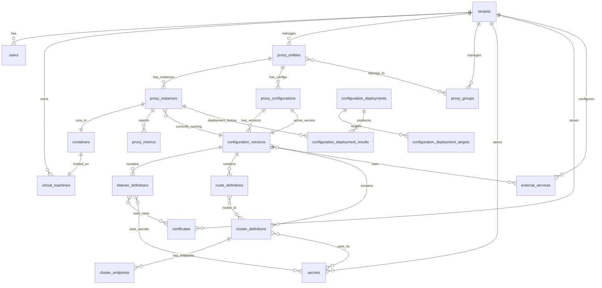

# Envoy Fleet Management System - Final Database Design

## 1. Overview

This final database design addresses all critical aspects of Envoy proxy configuration management including explicit running config tracking, proper instance identity, observed vs desired state, and comprehensive drift detection.

## 2. Critical Design Decisions

### 2.1 Running Configuration Tracking
- **Desired State**: `proxy_configurations.active_version_id` - What we want running
- **Observed State**: `envoy_proxies.current_version_id` - What's actually running
- **Drift Detection**: Compare desired vs observed for configuration drift

### 2.2 Logical vs Ephemeral Identity
- **Logical Proxy**: Stable identity that survives container restarts (`proxy_entities`)
- **Proxy Instance**: Ephemeral container instance (`proxy_instances`)
- **Proxy Groups**: Reference logical entities, not ephemeral instances

### 2.3 Configuration Versioning
- All xDS resources tied to `configuration_versions` for atomic rollback
- Hash tracking at every level for integrity and fast comparison
- Validation status tracking before deployment

## 3. Entity Relationship Diagram



## 4. Core Tables

### 4.1 Tenant & User Management

#### tenants
```sql
CREATE TABLE tenants (
    id UUID PRIMARY KEY DEFAULT gen_random_uuid(),
    name VARCHAR(255) UNIQUE NOT NULL,
    description TEXT,
    metadata JSONB DEFAULT '{}',
    is_active BOOLEAN DEFAULT true,
    resource_quota INTEGER DEFAULT 100,
    created_at TIMESTAMPTZ DEFAULT CURRENT_TIMESTAMP,
    updated_at TIMESTAMPTZ DEFAULT CURRENT_TIMESTAMP
);

CREATE INDEX idx_tenants_name ON tenants(name);
CREATE INDEX idx_tenants_active ON tenants(is_active);
```

#### users
```sql
CREATE TABLE users (
    id UUID PRIMARY KEY DEFAULT gen_random_uuid(),
    tenant_id UUID NOT NULL REFERENCES tenants(id) ON DELETE CASCADE,
    email VARCHAR(255) UNIQUE NOT NULL,
    username VARCHAR(100) NOT NULL,
    password_hash VARCHAR(255) NOT NULL,
    role VARCHAR(50) NOT NULL CHECK (role IN ('admin', 'operator', 'viewer')),
    permissions JSONB DEFAULT '{}',
    is_active BOOLEAN DEFAULT true,
    last_login TIMESTAMPTZ,
    created_at TIMESTAMPTZ DEFAULT CURRENT_TIMESTAMP,
    updated_at TIMESTAMPTZ DEFAULT CURRENT_TIMESTAMP,
    CONSTRAINT uk_tenant_username UNIQUE(tenant_id, username)
);

CREATE INDEX idx_users_tenant ON users(tenant_id);
CREATE INDEX idx_users_email ON users(email);
```

### 4.2 Infrastructure Layer

#### virtual_machines
```sql
CREATE TABLE virtual_machines (
    id UUID PRIMARY KEY DEFAULT gen_random_uuid(),
    tenant_id UUID NOT NULL REFERENCES tenants(id) ON DELETE CASCADE,
    hostname VARCHAR(255) NOT NULL,
    ip_address INET NOT NULL,
    region VARCHAR(100),
    availability_zone VARCHAR(100),
    metadata JSONB DEFAULT '{}',
    status VARCHAR(50) DEFAULT 'unknown',
    cpu_cores INTEGER,
    memory_mb BIGINT,
    disk_gb BIGINT,
    last_heartbeat TIMESTAMPTZ,
    created_at TIMESTAMPTZ DEFAULT CURRENT_TIMESTAMP,
    updated_at TIMESTAMPTZ DEFAULT CURRENT_TIMESTAMP,
    CONSTRAINT uk_tenant_hostname UNIQUE(tenant_id, hostname)
);

CREATE INDEX idx_vms_tenant ON virtual_machines(tenant_id);
CREATE INDEX idx_vms_status ON virtual_machines(status);
```

#### containers
```sql
CREATE TABLE containers (
    id UUID PRIMARY KEY DEFAULT gen_random_uuid(),
    vm_id UUID NOT NULL REFERENCES virtual_machines(id) ON DELETE CASCADE,
    container_id VARCHAR(255) UNIQUE NOT NULL,
    name VARCHAR(255),
    image VARCHAR(500),
    status VARCHAR(50) DEFAULT 'unknown',
    resource_limits JSONB DEFAULT '{}',
    environment_vars JSONB DEFAULT '{}',
    restart_count INTEGER DEFAULT 0,
    started_at TIMESTAMPTZ,
    created_at TIMESTAMPTZ DEFAULT CURRENT_TIMESTAMP,
    updated_at TIMESTAMPTZ DEFAULT CURRENT_TIMESTAMP
);

CREATE INDEX idx_containers_vm ON containers(vm_id);
CREATE INDEX idx_containers_status ON containers(status);
```

### 4.3 Proxy Identity Management

#### proxy_entities (Logical Proxy)
```sql
CREATE TABLE proxy_entities (
    id UUID PRIMARY KEY DEFAULT gen_random_uuid(),
    tenant_id UUID NOT NULL REFERENCES tenants(id) ON DELETE CASCADE,
    name VARCHAR(255) NOT NULL,
    description TEXT,
    labels JSONB DEFAULT '{}',  -- Stable labels for selection
    desired_replicas INTEGER DEFAULT 1,
    is_active BOOLEAN DEFAULT true,
    created_at TIMESTAMPTZ DEFAULT CURRENT_TIMESTAMP,
    updated_at TIMESTAMPTZ DEFAULT CURRENT_TIMESTAMP,
    CONSTRAINT uk_tenant_proxy_name UNIQUE(tenant_id, name)
);

CREATE INDEX idx_proxy_entities_tenant ON proxy_entities(tenant_id);
CREATE INDEX idx_proxy_entities_labels_gin ON proxy_entities USING gin(labels);
```

#### proxy_instances (Ephemeral Instance)
```sql
CREATE TABLE proxy_instances (
    id UUID PRIMARY KEY DEFAULT gen_random_uuid(),
    proxy_entity_id UUID NOT NULL REFERENCES proxy_entities(id) ON DELETE CASCADE,
    container_id UUID NOT NULL REFERENCES containers(id) ON DELETE CASCADE,

    -- Envoy Node Identity (stable within instance lifetime)
    node_id VARCHAR(255) UNIQUE NOT NULL,
    node_cluster VARCHAR(255) NOT NULL,  -- The node's cluster identity

    -- Locality Information
    locality_region VARCHAR(100),
    locality_zone VARCHAR(100),
    locality_subzone VARCHAR(100),

    -- Build Information
    envoy_version VARCHAR(50) NOT NULL,
    envoy_build VARCHAR(255),
    api_version VARCHAR(20) DEFAULT 'v3',

    -- Configuration State
    current_version_id UUID REFERENCES configuration_versions(id) ON DELETE SET NULL,  -- What's actually running
    current_version_hash VARCHAR(64),  -- For quick drift check

    -- Bootstrap
    bootstrap_snapshot JSONB,
    bootstrap_hash VARCHAR(64),

    -- Runtime State
    status VARCHAR(50) DEFAULT 'unknown',
    lifecycle_state VARCHAR(50) DEFAULT 'initializing',  -- initializing, running, draining, terminated
    drain_strategy VARCHAR(50) DEFAULT 'gradual',

    -- Admin API
    admin_address INET,
    admin_port INTEGER,

    -- Metadata
    metadata JSONB DEFAULT '{}',
    instance_number INTEGER DEFAULT 1,  -- For identifying replicas

    -- Health
    last_heartbeat TIMESTAMPTZ,
    last_config_ack TIMESTAMPTZ,
    started_at TIMESTAMPTZ DEFAULT CURRENT_TIMESTAMP,
    created_at TIMESTAMPTZ DEFAULT CURRENT_TIMESTAMP,
    updated_at TIMESTAMPTZ DEFAULT CURRENT_TIMESTAMP
);

CREATE INDEX idx_proxy_instances_entity ON proxy_instances(proxy_entity_id);
CREATE INDEX idx_proxy_instances_container ON proxy_instances(container_id);
CREATE INDEX idx_proxy_instances_node_id ON proxy_instances(node_id);
CREATE INDEX idx_proxy_instances_current_version ON proxy_instances(current_version_id);
CREATE INDEX idx_proxy_instances_lifecycle ON proxy_instances(lifecycle_state);
```

#### proxy_groups
```sql
CREATE TABLE proxy_groups (
    id UUID PRIMARY KEY DEFAULT gen_random_uuid(),
    tenant_id UUID NOT NULL REFERENCES tenants(id) ON DELETE CASCADE,
    name VARCHAR(255) NOT NULL,
    description TEXT,
    selector_labels JSONB DEFAULT '{}',  -- Label selector for automatic membership
    selection_strategy VARCHAR(50) DEFAULT 'all',  -- all, canary_percentage, blue_green
    canary_percentage INTEGER,  -- If using canary strategy
    is_active BOOLEAN DEFAULT true,
    created_at TIMESTAMPTZ DEFAULT CURRENT_TIMESTAMP,
    updated_at TIMESTAMPTZ DEFAULT CURRENT_TIMESTAMP,
    CONSTRAINT uk_tenant_group_name UNIQUE(tenant_id, name)
);

CREATE INDEX idx_proxy_groups_tenant ON proxy_groups(tenant_id);
```

#### proxy_group_members
```sql
CREATE TABLE proxy_group_members (
    proxy_group_id UUID NOT NULL REFERENCES proxy_groups(id) ON DELETE CASCADE,
    proxy_entity_id UUID NOT NULL REFERENCES proxy_entities(id) ON DELETE CASCADE,  -- Note: logical entities, not instances
    joined_at TIMESTAMPTZ DEFAULT CURRENT_TIMESTAMP,
    PRIMARY KEY (proxy_group_id, proxy_entity_id)
);

CREATE INDEX idx_group_members_entity ON proxy_group_members(proxy_entity_id);
```

### 4.4 Configuration Management

#### proxy_configurations
```sql
CREATE TABLE proxy_configurations (
    id UUID PRIMARY KEY DEFAULT gen_random_uuid(),
    proxy_entity_id UUID NOT NULL REFERENCES proxy_entities(id) ON DELETE CASCADE,
    name VARCHAR(255),
    description TEXT,

    -- Configuration tracking
    active_version_id UUID,  -- Desired version (FK added after configuration_versions created)

    -- Metadata
    tags JSONB DEFAULT '[]',
    created_at TIMESTAMPTZ DEFAULT CURRENT_TIMESTAMP,
    updated_at TIMESTAMPTZ DEFAULT CURRENT_TIMESTAMP
);

CREATE INDEX idx_proxy_configs_entity ON proxy_configurations(proxy_entity_id);
CREATE INDEX idx_proxy_configs_active_version ON proxy_configurations(active_version_id);
```

#### configuration_versions
```sql
CREATE TABLE configuration_versions (
    id UUID PRIMARY KEY DEFAULT gen_random_uuid(),
    configuration_id UUID NOT NULL REFERENCES proxy_configurations(id) ON DELETE CASCADE,
    created_by UUID NOT NULL REFERENCES users(id) ON DELETE RESTRICT,
    version_number INTEGER NOT NULL,

    -- Version control
    parent_version_id UUID REFERENCES configuration_versions(id) ON DELETE SET NULL,

    -- Complete configuration
    config_snapshot JSONB NOT NULL,  -- Complete Envoy configuration
    rendered_bootstrap TEXT NOT NULL,  -- Rendered YAML/JSON ready for Envoy

    -- Hashing for integrity and drift detection
    config_hash VARCHAR(64) NOT NULL,
    bootstrap_hash VARCHAR(64) NOT NULL,

    -- Schema and validation
    schema_version VARCHAR(20) DEFAULT 'v3',
    validation_status VARCHAR(50) DEFAULT 'pending',  -- pending, validating, valid, invalid
    validated_at TIMESTAMPTZ,
    validation_errors JSONB,

    -- xDS resource snapshots (for quick access without parsing)
    static_resources JSONB DEFAULT '{}',
    dynamic_resources JSONB DEFAULT '{}',
    admin_config JSONB DEFAULT '{}',
    layered_runtime JSONB DEFAULT '{}',

    -- Change tracking
    change_description TEXT,
    diff_from_previous JSONB,

    created_at TIMESTAMPTZ DEFAULT CURRENT_TIMESTAMP,
    CONSTRAINT uk_config_version_number UNIQUE(configuration_id, version_number)
);

CREATE INDEX idx_config_versions_config ON configuration_versions(configuration_id);
CREATE INDEX idx_config_versions_created_by ON configuration_versions(created_by);
CREATE INDEX idx_config_versions_hash ON configuration_versions(config_hash);
CREATE INDEX idx_config_versions_validation ON configuration_versions(validation_status);

-- Add foreign key constraint after table creation
ALTER TABLE proxy_configurations
    ADD CONSTRAINT fk_active_version
    FOREIGN KEY (active_version_id)
    REFERENCES configuration_versions(id) ON DELETE RESTRICT;
```

### 4.5 xDS Resources (LDS)

#### listener_definitions
```sql
CREATE TABLE listener_definitions (
    id UUID PRIMARY KEY DEFAULT gen_random_uuid(),
    configuration_version_id UUID NOT NULL REFERENCES configuration_versions(id) ON DELETE CASCADE,
    name VARCHAR(255) NOT NULL,

    -- Listener addressing
    address INET NOT NULL,
    port INTEGER NOT NULL CHECK (port > 0 AND port < 65536),

    -- Complete listener configuration
    listener_config JSONB NOT NULL,
    config_hash VARCHAR(64) NOT NULL,

    -- Queryable fields
    protocol VARCHAR(50) DEFAULT 'TCP',
    traffic_direction VARCHAR(20) DEFAULT 'INBOUND',

    created_at TIMESTAMPTZ DEFAULT CURRENT_TIMESTAMP,
    CONSTRAINT uk_version_listener_name UNIQUE(configuration_version_id, name)
);

CREATE INDEX idx_listeners_version ON listener_definitions(configuration_version_id);
CREATE INDEX idx_listeners_address_port ON listener_definitions(address, port);
```

#### listener_certificates (m:n join)
```sql
CREATE TABLE listener_certificates (
    listener_id UUID NOT NULL REFERENCES listener_definitions(id) ON DELETE CASCADE,
    certificate_id UUID NOT NULL REFERENCES certificates(id) ON DELETE RESTRICT,
    sni_hostnames JSONB DEFAULT '[]',  -- SNI hostnames for this cert
    is_default BOOLEAN DEFAULT false,
    created_at TIMESTAMPTZ DEFAULT CURRENT_TIMESTAMP,
    PRIMARY KEY (listener_id, certificate_id)
);

CREATE INDEX idx_listener_certs_cert ON listener_certificates(certificate_id);
```

#### listener_secrets (m:n join)
```sql
CREATE TABLE listener_secrets (
    listener_id UUID NOT NULL REFERENCES listener_definitions(id) ON DELETE CASCADE,
    secret_id UUID NOT NULL REFERENCES secrets(id) ON DELETE RESTRICT,
    secret_usage VARCHAR(50) NOT NULL,  -- tls_certificate, tls_key, validation_context
    created_at TIMESTAMPTZ DEFAULT CURRENT_TIMESTAMP,
    PRIMARY KEY (listener_id, secret_id, secret_usage)
);

CREATE INDEX idx_listener_secrets_secret ON listener_secrets(secret_id);
```

### 4.6 xDS Resources (RDS)

#### route_definitions
```sql
CREATE TABLE route_definitions (
    id UUID PRIMARY KEY DEFAULT gen_random_uuid(),
    configuration_version_id UUID NOT NULL REFERENCES configuration_versions(id) ON DELETE CASCADE,
    name VARCHAR(255) NOT NULL,

    -- Complete route configuration
    route_config JSONB NOT NULL,
    config_hash VARCHAR(64) NOT NULL,

    -- Queryable virtual hosts
    virtual_hosts JSONB NOT NULL,

    created_at TIMESTAMPTZ DEFAULT CURRENT_TIMESTAMP,
    CONSTRAINT uk_version_route_name UNIQUE(configuration_version_id, name)
);

CREATE INDEX idx_routes_version ON route_definitions(configuration_version_id);
```

#### route_target_clusters (m:n join)
```sql
CREATE TABLE route_target_clusters (
    route_definition_id UUID NOT NULL REFERENCES route_definitions(id) ON DELETE CASCADE,
    cluster_definition_id UUID NOT NULL REFERENCES cluster_definitions(id) ON DELETE CASCADE,
    route_path VARCHAR(500),  -- Which specific route path uses this cluster
    weight INTEGER DEFAULT 100,  -- For weighted routing
    created_at TIMESTAMPTZ DEFAULT CURRENT_TIMESTAMP,
    PRIMARY KEY (route_definition_id, cluster_definition_id, route_path)
);

CREATE INDEX idx_route_clusters_cluster ON route_target_clusters(cluster_definition_id);
```

### 4.7 xDS Resources (CDS)

#### cluster_definitions
```sql
CREATE TABLE cluster_definitions (
    id UUID PRIMARY KEY DEFAULT gen_random_uuid(),
    configuration_version_id UUID NOT NULL REFERENCES configuration_versions(id) ON DELETE CASCADE,
    name VARCHAR(255) NOT NULL,

    -- Cluster type and discovery
    cluster_type VARCHAR(50) NOT NULL,  -- STATIC, STRICT_DNS, LOGICAL_DNS, EDS, ORIGINAL_DST

    -- Complete cluster configuration
    cluster_config JSONB NOT NULL,
    config_hash VARCHAR(64) NOT NULL,

    -- Queryable fields
    connect_timeout_ms INTEGER DEFAULT 5000,
    lb_policy VARCHAR(50) DEFAULT 'ROUND_ROBIN',

    created_at TIMESTAMPTZ DEFAULT CURRENT_TIMESTAMP,
    CONSTRAINT uk_version_cluster_name UNIQUE(configuration_version_id, name)
);

CREATE INDEX idx_clusters_version ON cluster_definitions(configuration_version_id);
CREATE INDEX idx_clusters_type ON cluster_definitions(cluster_type);
```

#### cluster_endpoints (Version-specific endpoints)
```sql
CREATE TABLE cluster_endpoints (
    id UUID PRIMARY KEY DEFAULT gen_random_uuid(),
    cluster_definition_id UUID NOT NULL REFERENCES cluster_definitions(id) ON DELETE CASCADE,
    configuration_version_id UUID NOT NULL REFERENCES configuration_versions(id) ON DELETE CASCADE,

    -- Endpoint addressing
    address INET NOT NULL,
    port INTEGER NOT NULL CHECK (port > 0 AND port < 65536),

    -- Load balancing
    priority INTEGER DEFAULT 0,
    weight INTEGER DEFAULT 100,

    -- Locality
    locality_region VARCHAR(100),
    locality_zone VARCHAR(100),
    locality_subzone VARCHAR(100),

    -- Health
    health_status VARCHAR(50) DEFAULT 'UNKNOWN',

    metadata JSONB DEFAULT '{}',
    created_at TIMESTAMPTZ DEFAULT CURRENT_TIMESTAMP
);

CREATE INDEX idx_cluster_endpoints_cluster ON cluster_endpoints(cluster_definition_id);
CREATE INDEX idx_cluster_endpoints_version ON cluster_endpoints(configuration_version_id);
```

#### cluster_tls_secrets (m:n join)
```sql
CREATE TABLE cluster_tls_secrets (
    cluster_definition_id UUID NOT NULL REFERENCES cluster_definitions(id) ON DELETE CASCADE,
    secret_id UUID NOT NULL REFERENCES secrets(id) ON DELETE RESTRICT,
    secret_usage VARCHAR(50) NOT NULL,  -- upstream_tls_cert, upstream_tls_key, validation_context
    created_at TIMESTAMPTZ DEFAULT CURRENT_TIMESTAMP,
    PRIMARY KEY (cluster_definition_id, secret_id, secret_usage)
);

CREATE INDEX idx_cluster_tls_secrets_secret ON cluster_tls_secrets(secret_id);
```

### 4.8 Secrets & Certificates

#### secrets
```sql
CREATE TABLE secrets (
    id UUID PRIMARY KEY DEFAULT gen_random_uuid(),
    tenant_id UUID NOT NULL REFERENCES tenants(id) ON DELETE CASCADE,
    name VARCHAR(255) NOT NULL,

    -- Secret type and storage
    secret_type VARCHAR(50) NOT NULL,  -- tls_certificate, tls_key, generic, validation_context
    provider VARCHAR(50) NOT NULL DEFAULT 'local',  -- local, sds, vault, aws_kms, gcp_kms, azure_keyvault

    -- External reference (for non-local providers)
    provider_reference TEXT,  -- e.g., vault path, KMS key ID, SDS resource name

    -- Local storage (encrypted, only when provider='local')
    material_encrypted TEXT,  -- Only used if provider='local'

    -- Metadata
    metadata JSONB DEFAULT '{}',
    expires_at TIMESTAMPTZ,
    rotation_schedule VARCHAR(100),  -- Cron expression
    last_rotated_at TIMESTAMPTZ,

    created_at TIMESTAMPTZ DEFAULT CURRENT_TIMESTAMP,
    updated_at TIMESTAMPTZ DEFAULT CURRENT_TIMESTAMP,
    CONSTRAINT uk_tenant_secret_name UNIQUE(tenant_id, name)
);

CREATE INDEX idx_secrets_tenant ON secrets(tenant_id);
CREATE INDEX idx_secrets_provider ON secrets(provider);
CREATE INDEX idx_secrets_expires ON secrets(expires_at);
```

#### certificates
```sql
CREATE TABLE certificates (
    id UUID PRIMARY KEY DEFAULT gen_random_uuid(),
    tenant_id UUID NOT NULL REFERENCES tenants(id) ON DELETE CASCADE,
    name VARCHAR(255) NOT NULL,

    -- Certificate components (separate storage)
    cert_pem TEXT NOT NULL,
    chain_pem TEXT,  -- Certificate chain (optional)
    private_key_ref UUID REFERENCES secrets(id) ON DELETE RESTRICT,  -- Reference to private key secret

    -- Certificate metadata
    not_before TIMESTAMPTZ NOT NULL,
    not_after TIMESTAMPTZ NOT NULL,
    issuer VARCHAR(500),
    subject VARCHAR(500),
    san_dns_names JSONB DEFAULT '[]',
    san_ip_addresses JSONB DEFAULT '[]',
    serial_number VARCHAR(100),
    fingerprint_sha256 VARCHAR(64) UNIQUE,

    -- Management
    auto_renew BOOLEAN DEFAULT false,
    renewal_days_before_expiry INTEGER DEFAULT 30,

    created_at TIMESTAMPTZ DEFAULT CURRENT_TIMESTAMP,
    updated_at TIMESTAMPTZ DEFAULT CURRENT_TIMESTAMP,
    CONSTRAINT uk_tenant_cert_name UNIQUE(tenant_id, name)
);

CREATE INDEX idx_certificates_tenant ON certificates(tenant_id);
CREATE INDEX idx_certificates_expiry ON certificates(not_after);
CREATE INDEX idx_certificates_private_key ON certificates(private_key_ref);
```

### 4.9 External Services

#### external_services
```sql
CREATE TABLE external_services (
    id UUID PRIMARY KEY DEFAULT gen_random_uuid(),
    tenant_id UUID NOT NULL REFERENCES tenants(id) ON DELETE CASCADE,
    name VARCHAR(255) NOT NULL,

    -- Service classification
    service_kind VARCHAR(50) NOT NULL,  -- rate_limit, ext_authz, tracing, access_log, stats_sink, wasm

    -- Configuration
    service_config JSONB NOT NULL,
    endpoint_url TEXT,

    -- Connection settings
    timeout_ms INTEGER DEFAULT 5000,
    retry_policy JSONB DEFAULT '{}',

    is_active BOOLEAN DEFAULT true,
    created_at TIMESTAMPTZ DEFAULT CURRENT_TIMESTAMP,
    updated_at TIMESTAMPTZ DEFAULT CURRENT_TIMESTAMP,
    CONSTRAINT uk_tenant_service_name UNIQUE(tenant_id, name)
);

CREATE INDEX idx_external_services_tenant ON external_services(tenant_id);
CREATE INDEX idx_external_services_kind ON external_services(service_kind);
```

#### configuration_version_services (m:n join with scope)
```sql
CREATE TABLE configuration_version_services (
    configuration_version_id UUID NOT NULL REFERENCES configuration_versions(id) ON DELETE CASCADE,
    external_service_id UUID NOT NULL REFERENCES external_services(id) ON DELETE RESTRICT,
    scope VARCHAR(50) NOT NULL,  -- listener, route, cluster, global
    scope_reference VARCHAR(255),  -- Which specific resource (e.g., listener name)
    config_override JSONB,  -- Version-specific overrides
    created_at TIMESTAMPTZ DEFAULT CURRENT_TIMESTAMP,
    PRIMARY KEY (configuration_version_id, external_service_id, scope, scope_reference)
);

CREATE INDEX idx_config_version_services_service ON configuration_version_services(external_service_id);
```

### 4.10 Deployments

#### configuration_deployments
```sql
CREATE TABLE configuration_deployments (
    id UUID PRIMARY KEY DEFAULT gen_random_uuid(),
    configuration_version_id UUID NOT NULL REFERENCES configuration_versions(id) ON DELETE RESTRICT,
    initiated_by UUID NOT NULL REFERENCES users(id) ON DELETE RESTRICT,

    -- Strategy
    deployment_strategy VARCHAR(50) NOT NULL,  -- immediate, rolling, canary, blue_green
    deployment_config JSONB DEFAULT '{}',

    -- Status tracking
    status VARCHAR(50) NOT NULL DEFAULT 'pending',  -- pending, in_progress, successful, failed, cancelled

    -- Timing
    scheduled_at TIMESTAMPTZ,
    started_at TIMESTAMPTZ,
    completed_at TIMESTAMPTZ,

    -- Results summary
    total_targets INTEGER DEFAULT 0,
    successful_targets INTEGER DEFAULT 0,
    failed_targets INTEGER DEFAULT 0,

    -- Metadata
    notes TEXT,
    rollback_from_id UUID REFERENCES configuration_deployments(id),
    error_details JSONB,

    created_at TIMESTAMPTZ DEFAULT CURRENT_TIMESTAMP,
    updated_at TIMESTAMPTZ DEFAULT CURRENT_TIMESTAMP
);

CREATE INDEX idx_deployments_version ON configuration_deployments(configuration_version_id);
CREATE INDEX idx_deployments_status ON configuration_deployments(status);
CREATE INDEX idx_deployments_started ON configuration_deployments(started_at DESC);
```

#### configuration_deployment_targets
```sql
CREATE TABLE configuration_deployment_targets (
    id UUID PRIMARY KEY DEFAULT gen_random_uuid(),
    deployment_id UUID NOT NULL REFERENCES configuration_deployments(id) ON DELETE CASCADE,

    -- Target can be entity or group
    proxy_entity_id UUID REFERENCES proxy_entities(id) ON DELETE CASCADE,
    proxy_group_id UUID REFERENCES proxy_groups(id) ON DELETE CASCADE,

    -- Status for this target
    status VARCHAR(50) NOT NULL DEFAULT 'pending',

    created_at TIMESTAMPTZ DEFAULT CURRENT_TIMESTAMP,

    CONSTRAINT target_type CHECK (
        (proxy_entity_id IS NOT NULL AND proxy_group_id IS NULL) OR
        (proxy_entity_id IS NULL AND proxy_group_id IS NOT NULL)
    )
);

CREATE INDEX idx_deployment_targets_deployment ON configuration_deployment_targets(deployment_id);
CREATE INDEX idx_deployment_targets_entity ON configuration_deployment_targets(proxy_entity_id);
CREATE INDEX idx_deployment_targets_group ON configuration_deployment_targets(proxy_group_id);
```

#### configuration_deployment_results (Observed deployment state)
```sql
CREATE TABLE configuration_deployment_results (
    id UUID PRIMARY KEY DEFAULT gen_random_uuid(),
    deployment_id UUID NOT NULL REFERENCES configuration_deployments(id) ON DELETE CASCADE,
    proxy_instance_id UUID NOT NULL REFERENCES proxy_instances(id) ON DELETE CASCADE,

    -- Deployment result
    status VARCHAR(50) NOT NULL,  -- pending, applying, successful, failed
    error_message TEXT,

    -- Version tracking
    applied_version_id UUID REFERENCES configuration_versions(id) ON DELETE SET NULL,
    applied_version_hash VARCHAR(64),

    -- Timing
    started_at TIMESTAMPTZ,
    completed_at TIMESTAMPTZ,
    observed_at TIMESTAMPTZ,  -- When we confirmed it was running

    -- Health after deployment
    health_check_passed BOOLEAN,
    health_check_details JSONB,

    created_at TIMESTAMPTZ DEFAULT CURRENT_TIMESTAMP
);

CREATE INDEX idx_deployment_results_deployment ON configuration_deployment_results(deployment_id);
CREATE INDEX idx_deployment_results_instance ON configuration_deployment_results(proxy_instance_id);
CREATE INDEX idx_deployment_results_status ON configuration_deployment_results(status);
```

### 4.11 Observability

#### audit_logs
```sql
CREATE TABLE audit_logs (
    id UUID PRIMARY KEY DEFAULT gen_random_uuid(),
    tenant_id UUID NOT NULL REFERENCES tenants(id) ON DELETE CASCADE,
    user_id UUID REFERENCES users(id) ON DELETE SET NULL,

    -- Action details
    action VARCHAR(100) NOT NULL,
    resource_type VARCHAR(100) NOT NULL,
    resource_id UUID,
    resource_name VARCHAR(255),

    -- Change tracking
    changes JSONB,

    -- Request context
    ip_address INET,
    user_agent TEXT,
    request_id UUID,

    created_at TIMESTAMPTZ DEFAULT CURRENT_TIMESTAMP
) PARTITION BY RANGE (created_at);

CREATE INDEX idx_audit_tenant_created ON audit_logs(tenant_id, created_at DESC);
CREATE INDEX idx_audit_user ON audit_logs(user_id);
CREATE INDEX idx_audit_resource ON audit_logs(resource_type, resource_id);
CREATE INDEX idx_audit_action ON audit_logs(action);
```

#### proxy_metrics
```sql
CREATE TABLE proxy_metrics (
    id UUID PRIMARY KEY DEFAULT gen_random_uuid(),
    proxy_instance_id UUID NOT NULL REFERENCES proxy_instances(id) ON DELETE CASCADE,
    timestamp TIMESTAMPTZ NOT NULL,

    -- Traffic metrics
    requests_per_second NUMERIC(12,2),
    bytes_sent_per_second NUMERIC(15,2),
    bytes_received_per_second NUMERIC(15,2),

    -- Error metrics
    error_rate NUMERIC(5,4),
    upstream_5xx_rate NUMERIC(5,4),
    upstream_4xx_rate NUMERIC(5,4),

    -- Latency metrics
    p50_latency_ms NUMERIC(10,2),
    p95_latency_ms NUMERIC(10,2),
    p99_latency_ms NUMERIC(10,2),

    -- Resource metrics
    active_connections INTEGER,
    memory_usage_mb INTEGER,
    cpu_usage_percent NUMERIC(5,2)
) PARTITION BY RANGE (timestamp);

CREATE INDEX idx_proxy_metrics_instance_time ON proxy_metrics(proxy_instance_id, timestamp DESC);
```

## 5. Critical Views

```sql
-- View to detect configuration drift
CREATE VIEW configuration_drift AS
SELECT
    pe.name as entity_name,
    pi.node_id,
    pc.active_version_id as desired_version_id,
    pi.current_version_id as observed_version_id,
    cv_desired.config_hash as desired_hash,
    pi.current_version_hash as observed_hash,
    CASE
        WHEN pc.active_version_id = pi.current_version_id THEN 'in_sync'
        WHEN pi.current_version_id IS NULL THEN 'unknown'
        ELSE 'drift_detected'
    END as drift_status,
    pi.last_config_ack,
    pi.last_heartbeat
FROM proxy_entities pe
JOIN proxy_instances pi ON pi.proxy_entity_id = pe.id
JOIN proxy_configurations pc ON pc.proxy_entity_id = pe.id
LEFT JOIN configuration_versions cv_desired ON cv_desired.id = pc.active_version_id
WHERE pi.lifecycle_state = 'running';

-- View for deployment progress tracking
CREATE VIEW deployment_progress AS
SELECT
    cd.id as deployment_id,
    cd.status as deployment_status,
    cv.version_number,
    cd.total_targets,
    cd.successful_targets,
    cd.failed_targets,
    COUNT(DISTINCT cdr.id) as results_reported,
    COUNT(DISTINCT CASE WHEN cdr.status = 'successful' THEN cdr.id END) as instances_successful,
    COUNT(DISTINCT CASE WHEN cdr.status = 'failed' THEN cdr.id END) as instances_failed
FROM configuration_deployments cd
JOIN configuration_versions cv ON cv.id = cd.configuration_version_id
LEFT JOIN configuration_deployment_results cdr ON cdr.deployment_id = cd.id
GROUP BY cd.id, cd.status, cv.version_number, cd.total_targets, cd.successful_targets, cd.failed_targets;
```

## 6. Functions for Drift Detection

```sql
-- Function to check configuration drift for a proxy
CREATE OR REPLACE FUNCTION check_configuration_drift(
    p_proxy_entity_id UUID
) RETURNS TABLE (
    instance_id UUID,
    node_id VARCHAR,
    has_drift BOOLEAN,
    desired_version UUID,
    observed_version UUID,
    drift_details JSONB
) AS $$
BEGIN
    RETURN QUERY
    SELECT
        pi.id,
        pi.node_id,
        pc.active_version_id != pi.current_version_id as has_drift,
        pc.active_version_id,
        pi.current_version_id,
        jsonb_build_object(
            'desired_hash', cv_desired.config_hash,
            'observed_hash', pi.current_version_hash,
            'last_ack', pi.last_config_ack,
            'time_since_ack', EXTRACT(EPOCH FROM (NOW() - pi.last_config_ack))
        ) as drift_details
    FROM proxy_instances pi
    JOIN proxy_configurations pc ON pc.proxy_entity_id = pi.proxy_entity_id
    LEFT JOIN configuration_versions cv_desired ON cv_desired.id = pc.active_version_id
    WHERE pi.proxy_entity_id = p_proxy_entity_id
    AND pi.lifecycle_state = 'running';
END;
$$ LANGUAGE plpgsql;

-- Function to record deployment result
CREATE OR REPLACE FUNCTION record_deployment_result(
    p_deployment_id UUID,
    p_proxy_instance_id UUID,
    p_status VARCHAR,
    p_applied_version_id UUID,
    p_error_message TEXT DEFAULT NULL
) RETURNS UUID AS $$
DECLARE
    v_result_id UUID;
BEGIN
    INSERT INTO configuration_deployment_results (
        deployment_id,
        proxy_instance_id,
        status,
        applied_version_id,
        error_message,
        started_at,
        completed_at,
        observed_at
    ) VALUES (
        p_deployment_id,
        p_proxy_instance_id,
        p_status,
        p_applied_version_id,
        p_error_message,
        NOW(),
        CASE WHEN p_status IN ('successful', 'failed') THEN NOW() ELSE NULL END,
        CASE WHEN p_status = 'successful' THEN NOW() ELSE NULL END
    ) RETURNING id INTO v_result_id;

    -- Update proxy instance's current version if successful
    IF p_status = 'successful' THEN
        UPDATE proxy_instances
        SET
            current_version_id = p_applied_version_id,
            current_version_hash = (
                SELECT config_hash FROM configuration_versions WHERE id = p_applied_version_id
            ),
            last_config_ack = NOW()
        WHERE id = p_proxy_instance_id;
    END IF;

    RETURN v_result_id;
END;
$$ LANGUAGE plpgsql;
```

## 7. Triggers for State Management

```sql
-- Trigger to update deployment status based on results
CREATE OR REPLACE FUNCTION update_deployment_from_results()
RETURNS TRIGGER AS $$
DECLARE
    v_total_targets INTEGER;
    v_successful INTEGER;
    v_failed INTEGER;
    v_pending INTEGER;
BEGIN
    -- Count results for this deployment
    SELECT
        COUNT(DISTINCT pi.id),
        COUNT(DISTINCT cdr.proxy_instance_id) FILTER (WHERE cdr.status = 'successful'),
        COUNT(DISTINCT cdr.proxy_instance_id) FILTER (WHERE cdr.status = 'failed')
    INTO v_total_targets, v_successful, v_failed
    FROM configuration_deployment_targets cdt
    LEFT JOIN proxy_entities pe ON pe.id = cdt.proxy_entity_id
    LEFT JOIN proxy_instances pi ON pi.proxy_entity_id = pe.id
    LEFT JOIN configuration_deployment_results cdr ON cdr.deployment_id = NEW.deployment_id AND cdr.proxy_instance_id = pi.id
    WHERE cdt.deployment_id = NEW.deployment_id
    AND pi.lifecycle_state = 'running';

    v_pending := v_total_targets - v_successful - v_failed;

    -- Update deployment status
    UPDATE configuration_deployments
    SET
        successful_targets = v_successful,
        failed_targets = v_failed,
        status = CASE
            WHEN v_failed > 0 AND v_pending = 0 THEN 'failed'
            WHEN v_successful = v_total_targets THEN 'successful'
            WHEN v_pending > 0 THEN 'in_progress'
            ELSE status
        END,
        completed_at = CASE
            WHEN v_pending = 0 THEN NOW()
            ELSE completed_at
        END,
        updated_at = NOW()
    WHERE id = NEW.deployment_id;

    RETURN NEW;
END;
$$ LANGUAGE plpgsql;

CREATE TRIGGER trg_update_deployment_status
    AFTER INSERT OR UPDATE ON configuration_deployment_results
    FOR EACH ROW EXECUTE FUNCTION update_deployment_from_results();
```

## 8. Indexes for Performance

```sql
-- Critical performance indexes
CREATE INDEX idx_proxy_instances_drift ON proxy_instances(proxy_entity_id, current_version_id)
    WHERE lifecycle_state = 'running';

CREATE INDEX idx_config_versions_hash ON configuration_versions USING hash(config_hash);
CREATE INDEX idx_proxy_instances_hash ON proxy_instances USING hash(current_version_hash);

CREATE INDEX idx_deployment_results_pending ON configuration_deployment_results(deployment_id)
    WHERE status = 'pending';

CREATE INDEX idx_certificates_expiring ON certificates(not_after)
    WHERE auto_renew = true AND not_after < NOW() + INTERVAL '30 days';

-- GIN indexes for JSONB searching
CREATE INDEX idx_proxy_entities_labels ON proxy_entities USING gin(labels);
CREATE INDEX idx_proxy_groups_selector ON proxy_groups USING gin(selector_labels);
```

## 9. Data Integrity Constraints

```sql
-- Ensure version numbers are sequential
CREATE OR REPLACE FUNCTION ensure_sequential_versions()
RETURNS TRIGGER AS $$
BEGIN
    IF NEW.version_number != COALESCE(
        (SELECT MAX(version_number) + 1
         FROM configuration_versions
         WHERE configuration_id = NEW.configuration_id), 1
    ) THEN
        RAISE EXCEPTION 'Version numbers must be sequential';
    END IF;
    RETURN NEW;
END;
$$ LANGUAGE plpgsql;

CREATE TRIGGER trg_sequential_versions
    BEFORE INSERT ON configuration_versions
    FOR EACH ROW EXECUTE FUNCTION ensure_sequential_versions();

-- Ensure proxy instance uniqueness per entity
CREATE OR REPLACE FUNCTION ensure_instance_number_unique()
RETURNS TRIGGER AS $$
BEGIN
    NEW.instance_number := COALESCE(
        (SELECT MAX(instance_number) + 1
         FROM proxy_instances
         WHERE proxy_entity_id = NEW.proxy_entity_id
         AND lifecycle_state != 'terminated'), 1
    );
    RETURN NEW;
END;
$$ LANGUAGE plpgsql;

CREATE TRIGGER trg_instance_numbering
    BEFORE INSERT ON proxy_instances
    FOR EACH ROW EXECUTE FUNCTION ensure_instance_number_unique();
```

## 10. Summary of Critical Improvements

### ✅ Running Config Made Explicit
- `proxy_configurations.active_version_id` - Desired state
- `proxy_instances.current_version_id` - Observed state
- Drift detection views and functions

### ✅ Instance Identity vs Logical Membership
- `proxy_entities` - Logical, stable proxy identity
- `proxy_instances` - Ephemeral container instances
- Proxy groups reference logical entities

### ✅ All m:n Joins Concretized
- `listener_certificates`
- `listener_secrets`
- `route_target_clusters`
- `cluster_tls_secrets`
- `configuration_version_services`

### ✅ Proper Uniqueness Scoping
- `(tenant_id, name)` for tenant resources
- `(configuration_version_id, name)` for versioned resources

### ✅ Hash and Validation
- `config_hash`, `bootstrap_hash` at every level
- `validation_status`, `validated_at`
- `rendered_bootstrap` for ready-to-use configs

### ✅ EDS Normalization
- Removed global `endpoint_definitions`
- `cluster_endpoints` tied to both cluster and version

### ✅ Deployment State Tracking
- `configuration_deployment_results` for observed state
- Automatic status updates via triggers
- Health check results after deployment

### ✅ External Services Scoped
- `configuration_version_services` with scope field
- Per-version service configuration

### ✅ Improved Secrets
- Provider abstraction (SDS, Vault, KMS)
- Reference-based storage preferred
- Separate cert components

### ✅ Complete Index & FK Discipline
- All foreign keys properly defined
- CASCADE for metrics, RESTRICT for configs
- Performance indexes on all join columns

This final design provides complete observability into desired vs actual state, proper identity management, and comprehensive deployment tracking while maintaining data integrity and performance.