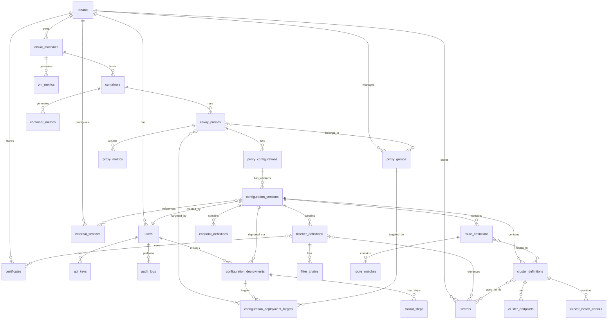

# Envoy Fleet Management System - Revised Database Design

## 1. Overview

This revised database design properly models Envoy proxy configuration following the xDS protocol architecture (LDS, RDS, CDS, EDS, SDS). It addresses all identified issues with proper relationships, missing tables, and multi-tenancy considerations.

## 2. Core Design Principles

### 2.1 Key Corrections Applied
- ✅ Envoy proxies now reference multiple clusters through configurations (not belongs_to)
- ✅ All xDS resources (LDS/RDS/CDS/EDS/SDS) are first-class citizens
- ✅ Configuration versions contain complete snapshots with queryable indexes
- ✅ Proper multi-tenant name scoping with composite unique constraints
- ✅ Complete table definitions for all referenced entities
- ✅ Proper certificate and secret management with SDS support

## 3. Revised Entity Relationship Diagram



## 4. Complete Table Definitions

### 4.1 Core Multi-Tenant Tables

#### tenants
```sql
CREATE TABLE tenants (
    id UUID PRIMARY KEY DEFAULT gen_random_uuid(),
    name VARCHAR(255) UNIQUE NOT NULL,
    description TEXT,
    metadata JSONB DEFAULT '{}',
    is_active BOOLEAN DEFAULT true,
    resource_quota INTEGER DEFAULT 100,
    created_at TIMESTAMPTZ DEFAULT CURRENT_TIMESTAMP,
    updated_at TIMESTAMPTZ DEFAULT CURRENT_TIMESTAMP
);

CREATE INDEX idx_tenants_name ON tenants(name);
CREATE INDEX idx_tenants_active ON tenants(is_active);
```

#### users
```sql
CREATE TABLE users (
    id UUID PRIMARY KEY DEFAULT gen_random_uuid(),
    tenant_id UUID NOT NULL REFERENCES tenants(id) ON DELETE CASCADE,
    email VARCHAR(255) UNIQUE NOT NULL,
    username VARCHAR(100) NOT NULL,
    password_hash VARCHAR(255) NOT NULL,
    role VARCHAR(50) NOT NULL CHECK (role IN ('admin', 'operator', 'viewer')),
    permissions JSONB DEFAULT '{}',
    is_active BOOLEAN DEFAULT true,
    last_login TIMESTAMPTZ,
    created_at TIMESTAMPTZ DEFAULT CURRENT_TIMESTAMP,
    updated_at TIMESTAMPTZ DEFAULT CURRENT_TIMESTAMP,
    UNIQUE(tenant_id, username)
);

CREATE INDEX idx_users_tenant ON users(tenant_id);
CREATE INDEX idx_users_email ON users(email);
CREATE INDEX idx_users_tenant_username ON users(tenant_id, username);
```

#### api_keys
```sql
CREATE TABLE api_keys (
    id UUID PRIMARY KEY DEFAULT gen_random_uuid(),
    user_id UUID NOT NULL REFERENCES users(id) ON DELETE CASCADE,
    key_hash VARCHAR(255) UNIQUE NOT NULL,
    name VARCHAR(255) NOT NULL,
    permissions JSONB DEFAULT '{}',
    expires_at TIMESTAMPTZ,
    last_used_at TIMESTAMPTZ,
    is_active BOOLEAN DEFAULT true,
    created_at TIMESTAMPTZ DEFAULT CURRENT_TIMESTAMP
);

CREATE INDEX idx_api_keys_user ON api_keys(user_id);
CREATE INDEX idx_api_keys_hash ON api_keys(key_hash);
CREATE INDEX idx_api_keys_active_expires ON api_keys(is_active, expires_at);
```

### 4.2 Infrastructure Tables

#### virtual_machines
```sql
CREATE TABLE virtual_machines (
    id UUID PRIMARY KEY DEFAULT gen_random_uuid(),
    tenant_id UUID NOT NULL REFERENCES tenants(id) ON DELETE CASCADE,
    hostname VARCHAR(255) NOT NULL,
    ip_address INET NOT NULL,
    region VARCHAR(100),
    availability_zone VARCHAR(100),
    metadata JSONB DEFAULT '{}',
    status VARCHAR(50) DEFAULT 'unknown',
    cpu_cores INTEGER,
    memory_mb BIGINT,
    disk_gb BIGINT,
    last_heartbeat TIMESTAMPTZ,
    created_at TIMESTAMPTZ DEFAULT CURRENT_TIMESTAMP,
    updated_at TIMESTAMPTZ DEFAULT CURRENT_TIMESTAMP,
    UNIQUE(tenant_id, hostname)
);

CREATE INDEX idx_vms_tenant ON virtual_machines(tenant_id);
CREATE INDEX idx_vms_tenant_hostname ON virtual_machines(tenant_id, hostname);
CREATE INDEX idx_vms_status ON virtual_machines(status);
CREATE INDEX idx_vms_region ON virtual_machines(region);
```

#### containers
```sql
CREATE TABLE containers (
    id UUID PRIMARY KEY DEFAULT gen_random_uuid(),
    vm_id UUID NOT NULL REFERENCES virtual_machines(id) ON DELETE CASCADE,
    container_id VARCHAR(255) UNIQUE NOT NULL,
    name VARCHAR(255),
    image VARCHAR(500),
    status VARCHAR(50) DEFAULT 'unknown',
    resource_limits JSONB DEFAULT '{}',
    environment_vars JSONB DEFAULT '{}',
    restart_count INTEGER DEFAULT 0,
    started_at TIMESTAMPTZ,
    created_at TIMESTAMPTZ DEFAULT CURRENT_TIMESTAMP,
    updated_at TIMESTAMPTZ DEFAULT CURRENT_TIMESTAMP
);

CREATE INDEX idx_containers_vm ON containers(vm_id);
CREATE INDEX idx_containers_status ON containers(status);
CREATE INDEX idx_containers_container_id ON containers(container_id);
```

### 4.3 Envoy Proxy Tables

#### envoy_proxies
```sql
CREATE TABLE envoy_proxies (
    id UUID PRIMARY KEY DEFAULT gen_random_uuid(),
    container_id UUID NOT NULL REFERENCES containers(id) ON DELETE CASCADE,
    -- Envoy Node Identity
    node_id VARCHAR(255) UNIQUE NOT NULL,
    node_cluster VARCHAR(255),  -- The node's cluster name (not upstream cluster)
    locality_region VARCHAR(100),
    locality_zone VARCHAR(100),
    locality_subzone VARCHAR(100),
    -- Envoy Build Info
    envoy_version VARCHAR(50),
    envoy_build VARCHAR(255),
    envoy_api_version VARCHAR(20) DEFAULT 'v3',
    -- Runtime Info
    status VARCHAR(50) DEFAULT 'unknown',
    metadata JSONB DEFAULT '{}',
    admin_address INET,
    admin_port INTEGER,
    -- Bootstrap Configuration
    bootstrap_snapshot JSONB,
    bootstrap_hash VARCHAR(64),
    -- Lifecycle
    drain_strategy VARCHAR(50) DEFAULT 'gradual',
    lifecycle_state VARCHAR(50) DEFAULT 'running',
    last_heartbeat TIMESTAMPTZ,
    created_at TIMESTAMPTZ DEFAULT CURRENT_TIMESTAMP,
    updated_at TIMESTAMPTZ DEFAULT CURRENT_TIMESTAMP
);

CREATE INDEX idx_proxies_container ON envoy_proxies(container_id);
CREATE INDEX idx_proxies_node_id ON envoy_proxies(node_id);
CREATE INDEX idx_proxies_node_cluster ON envoy_proxies(node_cluster);
CREATE INDEX idx_proxies_status ON envoy_proxies(status);
CREATE INDEX idx_proxies_lifecycle ON envoy_proxies(lifecycle_state);
```

#### proxy_groups
```sql
CREATE TABLE proxy_groups (
    id UUID PRIMARY KEY DEFAULT gen_random_uuid(),
    tenant_id UUID NOT NULL REFERENCES tenants(id) ON DELETE CASCADE,
    name VARCHAR(255) NOT NULL,
    description TEXT,
    labels JSONB DEFAULT '{}',  -- For targeting (e.g., {"env": "prod", "region": "us-west"})
    selection_strategy VARCHAR(50) DEFAULT 'all',  -- all, canary_percentage, blue_green
    is_active BOOLEAN DEFAULT true,
    created_at TIMESTAMPTZ DEFAULT CURRENT_TIMESTAMP,
    updated_at TIMESTAMPTZ DEFAULT CURRENT_TIMESTAMP,
    UNIQUE(tenant_id, name)
);

CREATE INDEX idx_proxy_groups_tenant ON proxy_groups(tenant_id);
CREATE INDEX idx_proxy_groups_labels ON proxy_groups USING gin(labels);
```

#### proxy_group_members
```sql
CREATE TABLE proxy_group_members (
    proxy_group_id UUID NOT NULL REFERENCES proxy_groups(id) ON DELETE CASCADE,
    envoy_proxy_id UUID NOT NULL REFERENCES envoy_proxies(id) ON DELETE CASCADE,
    joined_at TIMESTAMPTZ DEFAULT CURRENT_TIMESTAMP,
    PRIMARY KEY (proxy_group_id, envoy_proxy_id)
);

CREATE INDEX idx_proxy_group_members_proxy ON proxy_group_members(envoy_proxy_id);
```

### 4.4 Configuration Management Tables

#### proxy_configurations
```sql
CREATE TABLE proxy_configurations (
    id UUID PRIMARY KEY DEFAULT gen_random_uuid(),
    proxy_id UUID NOT NULL REFERENCES envoy_proxies(id) ON DELETE CASCADE,
    name VARCHAR(255),
    description TEXT,
    -- Active configuration tracking
    active_version_id UUID,  -- Will be FK after configuration_versions exists
    -- Metadata
    tags JSONB DEFAULT '[]',
    created_at TIMESTAMPTZ DEFAULT CURRENT_TIMESTAMP,
    updated_at TIMESTAMPTZ DEFAULT CURRENT_TIMESTAMP
);

CREATE INDEX idx_proxy_configs_proxy ON proxy_configurations(proxy_id);
CREATE INDEX idx_proxy_configs_active_version ON proxy_configurations(active_version_id);
```

#### configuration_versions
```sql
CREATE TABLE configuration_versions (
    id UUID PRIMARY KEY DEFAULT gen_random_uuid(),
    configuration_id UUID NOT NULL REFERENCES proxy_configurations(id) ON DELETE CASCADE,
    created_by UUID NOT NULL REFERENCES users(id) ON DELETE RESTRICT,
    version_number INTEGER NOT NULL,
    -- Complete configuration snapshot
    config_snapshot JSONB NOT NULL,  -- Full Envoy config
    rendered_bootstrap TEXT,          -- Rendered YAML/JSON for Envoy
    config_hash VARCHAR(64) NOT NULL,
    -- xDS resource snapshots for quick access
    static_resources JSONB DEFAULT '{}',
    dynamic_resources JSONB DEFAULT '{}',
    admin_config JSONB DEFAULT '{}',
    layered_runtime JSONB DEFAULT '{}',
    -- Versioning and validation
    schema_version VARCHAR(20) DEFAULT 'v3',
    validation_status VARCHAR(50) DEFAULT 'pending',
    validated_at TIMESTAMPTZ,
    validation_errors JSONB,
    -- Change tracking
    change_description TEXT,
    diff_from_previous JSONB,
    created_at TIMESTAMPTZ DEFAULT CURRENT_TIMESTAMP,
    UNIQUE(configuration_id, version_number)
);

CREATE INDEX idx_config_versions_config ON configuration_versions(configuration_id);
CREATE INDEX idx_config_versions_created_by ON configuration_versions(created_by);
CREATE INDEX idx_config_versions_created_at ON configuration_versions(created_at DESC);
CREATE INDEX idx_config_versions_hash ON configuration_versions(config_hash);
CREATE INDEX idx_config_versions_validation ON configuration_versions(validation_status);

-- Add foreign key to proxy_configurations after table creation
ALTER TABLE proxy_configurations
    ADD CONSTRAINT fk_active_version
    FOREIGN KEY (active_version_id)
    REFERENCES configuration_versions(id) ON DELETE SET NULL;
```

### 4.5 xDS Resource Tables (LDS)

#### listener_definitions
```sql
CREATE TABLE listener_definitions (
    id UUID PRIMARY KEY DEFAULT gen_random_uuid(),
    configuration_version_id UUID NOT NULL REFERENCES configuration_versions(id) ON DELETE CASCADE,
    name VARCHAR(255) NOT NULL,
    address INET NOT NULL,
    port INTEGER NOT NULL CHECK (port > 0 AND port < 65536),
    protocol VARCHAR(50) DEFAULT 'TCP',
    -- Complete listener config
    listener_config JSONB NOT NULL,  -- Full Envoy listener config
    -- Indexable fields for queries
    traffic_direction VARCHAR(20) DEFAULT 'INBOUND',
    connection_balance_config JSONB DEFAULT '{}',
    transparent BOOLEAN DEFAULT false,
    freebind BOOLEAN DEFAULT false,
    created_at TIMESTAMPTZ DEFAULT CURRENT_TIMESTAMP,
    UNIQUE(configuration_version_id, name)
);

CREATE INDEX idx_listeners_version ON listener_definitions(configuration_version_id);
CREATE INDEX idx_listeners_address_port ON listener_definitions(address, port);
```

#### filter_chains
```sql
CREATE TABLE filter_chains (
    id UUID PRIMARY KEY DEFAULT gen_random_uuid(),
    listener_id UUID NOT NULL REFERENCES listener_definitions(id) ON DELETE CASCADE,
    name VARCHAR(255),
    filter_chain_match JSONB DEFAULT '{}',  -- Match conditions
    filters JSONB NOT NULL,  -- Array of filter configs
    transport_socket JSONB,  -- TLS config if any
    use_proxy_proto BOOLEAN DEFAULT false,
    metadata JSONB DEFAULT '{}',
    chain_order INTEGER DEFAULT 0,  -- For ordering
    created_at TIMESTAMPTZ DEFAULT CURRENT_TIMESTAMP
);

CREATE INDEX idx_filter_chains_listener ON filter_chains(listener_id);
CREATE INDEX idx_filter_chains_order ON filter_chains(listener_id, chain_order);
```

#### listener_certificates
```sql
CREATE TABLE listener_certificates (
    listener_id UUID NOT NULL REFERENCES listener_definitions(id) ON DELETE CASCADE,
    certificate_id UUID NOT NULL REFERENCES certificates(id) ON DELETE RESTRICT,
    sni_names JSONB DEFAULT '[]',  -- SNI hostnames for this cert
    is_default BOOLEAN DEFAULT false,
    created_at TIMESTAMPTZ DEFAULT CURRENT_TIMESTAMP,
    PRIMARY KEY (listener_id, certificate_id)
);

CREATE INDEX idx_listener_certs_cert ON listener_certificates(certificate_id);
```

#### listener_secrets
```sql
CREATE TABLE listener_secrets (
    listener_id UUID NOT NULL REFERENCES listener_definitions(id) ON DELETE CASCADE,
    secret_id UUID NOT NULL REFERENCES secrets(id) ON DELETE RESTRICT,
    secret_type VARCHAR(50) NOT NULL,  -- tls_certificate, tls_key, validation_context
    created_at TIMESTAMPTZ DEFAULT CURRENT_TIMESTAMP,
    PRIMARY KEY (listener_id, secret_id)
);

CREATE INDEX idx_listener_secrets_secret ON listener_secrets(secret_id);
```

### 4.6 xDS Resource Tables (RDS)

#### route_definitions
```sql
CREATE TABLE route_definitions (
    id UUID PRIMARY KEY DEFAULT gen_random_uuid(),
    configuration_version_id UUID NOT NULL REFERENCES configuration_versions(id) ON DELETE CASCADE,
    name VARCHAR(255) NOT NULL,
    -- Route configuration
    virtual_hosts JSONB NOT NULL,  -- Array of virtual host configs
    internal_only_headers JSONB DEFAULT '[]',
    response_headers_to_add JSONB DEFAULT '[]',
    response_headers_to_remove JSONB DEFAULT '[]',
    request_headers_to_add JSONB DEFAULT '[]',
    request_headers_to_remove JSONB DEFAULT '[]',
    validate_clusters BOOLEAN DEFAULT true,
    created_at TIMESTAMPTZ DEFAULT CURRENT_TIMESTAMP,
    UNIQUE(configuration_version_id, name)
);

CREATE INDEX idx_routes_version ON route_definitions(configuration_version_id);
```

#### route_matches
```sql
CREATE TABLE route_matches (
    id UUID PRIMARY KEY DEFAULT gen_random_uuid(),
    route_definition_id UUID NOT NULL REFERENCES route_definitions(id) ON DELETE CASCADE,
    virtual_host_name VARCHAR(255) NOT NULL,
    match_config JSONB NOT NULL,  -- Path, headers, query params match rules
    route_action JSONB NOT NULL,  -- Cluster, weighted_clusters, redirect, direct_response
    metadata JSONB DEFAULT '{}',
    timeout_ms INTEGER,
    retry_policy JSONB,
    match_order INTEGER DEFAULT 0,
    created_at TIMESTAMPTZ DEFAULT CURRENT_TIMESTAMP
);

CREATE INDEX idx_route_matches_route ON route_matches(route_definition_id);
CREATE INDEX idx_route_matches_vhost ON route_matches(virtual_host_name);
CREATE INDEX idx_route_matches_order ON route_matches(route_definition_id, match_order);
```

### 4.7 xDS Resource Tables (CDS)

#### cluster_definitions
```sql
CREATE TABLE cluster_definitions (
    id UUID PRIMARY KEY DEFAULT gen_random_uuid(),
    configuration_version_id UUID NOT NULL REFERENCES configuration_versions(id) ON DELETE CASCADE,
    name VARCHAR(255) NOT NULL,
    -- Cluster configuration
    cluster_type VARCHAR(50) NOT NULL,  -- STATIC, STRICT_DNS, LOGICAL_DNS, EDS, ORIGINAL_DST
    connect_timeout_ms INTEGER DEFAULT 5000,
    lb_policy VARCHAR(50) DEFAULT 'ROUND_ROBIN',
    -- Complete cluster config
    cluster_config JSONB NOT NULL,  -- Full Envoy cluster config
    -- Indexable fields
    circuit_breakers JSONB DEFAULT '{}',
    outlier_detection JSONB DEFAULT '{}',
    load_assignment JSONB,  -- For STATIC clusters
    eds_config JSONB,  -- For EDS clusters
    dns_resolvers JSONB DEFAULT '[]',
    transport_socket JSONB,  -- Upstream TLS config
    metadata JSONB DEFAULT '{}',
    created_at TIMESTAMPTZ DEFAULT CURRENT_TIMESTAMP,
    UNIQUE(configuration_version_id, name)
);

CREATE INDEX idx_clusters_version ON cluster_definitions(configuration_version_id);
CREATE INDEX idx_clusters_type ON cluster_definitions(cluster_type);
```

#### cluster_endpoints
```sql
CREATE TABLE cluster_endpoints (
    id UUID PRIMARY KEY DEFAULT gen_random_uuid(),
    cluster_id UUID NOT NULL REFERENCES cluster_definitions(id) ON DELETE CASCADE,
    address INET NOT NULL,
    port INTEGER NOT NULL CHECK (port > 0 AND port < 65536),
    priority INTEGER DEFAULT 0,
    weight INTEGER DEFAULT 100,
    locality_region VARCHAR(100),
    locality_zone VARCHAR(100),
    locality_subzone VARCHAR(100),
    health_status VARCHAR(50) DEFAULT 'UNKNOWN',
    metadata JSONB DEFAULT '{}',
    created_at TIMESTAMPTZ DEFAULT CURRENT_TIMESTAMP,
    updated_at TIMESTAMPTZ DEFAULT CURRENT_TIMESTAMP
);

CREATE INDEX idx_endpoints_cluster ON cluster_endpoints(cluster_id);
CREATE INDEX idx_endpoints_health ON cluster_endpoints(health_status);
CREATE INDEX idx_endpoints_locality ON cluster_endpoints(locality_region, locality_zone);
```

#### cluster_health_checks
```sql
CREATE TABLE cluster_health_checks (
    id UUID PRIMARY KEY DEFAULT gen_random_uuid(),
    cluster_id UUID NOT NULL REFERENCES cluster_definitions(id) ON DELETE CASCADE,
    timeout_ms INTEGER DEFAULT 3000,
    interval_ms INTEGER DEFAULT 10000,
    interval_jitter_ms INTEGER,
    unhealthy_threshold INTEGER DEFAULT 3,
    healthy_threshold INTEGER DEFAULT 2,
    path VARCHAR(500),  -- For HTTP health checks
    http_method VARCHAR(20) DEFAULT 'GET',
    expected_statuses JSONB DEFAULT '[200]',
    tcp_send TEXT,  -- For TCP health checks
    tcp_receive JSONB DEFAULT '[]',
    grpc_service_name VARCHAR(255),  -- For gRPC health checks
    created_at TIMESTAMPTZ DEFAULT CURRENT_TIMESTAMP
);

CREATE INDEX idx_health_checks_cluster ON cluster_health_checks(cluster_id);
```

#### cluster_transport_socket_secrets
```sql
CREATE TABLE cluster_transport_socket_secrets (
    cluster_id UUID NOT NULL REFERENCES cluster_definitions(id) ON DELETE CASCADE,
    secret_id UUID NOT NULL REFERENCES secrets(id) ON DELETE RESTRICT,
    secret_type VARCHAR(50) NOT NULL,  -- tls_certificate, tls_key, validation_context
    created_at TIMESTAMPTZ DEFAULT CURRENT_TIMESTAMP,
    PRIMARY KEY (cluster_id, secret_id)
);

CREATE INDEX idx_cluster_secrets_secret ON cluster_transport_socket_secrets(secret_id);
```

### 4.8 xDS Resource Tables (EDS)

#### endpoint_definitions
```sql
CREATE TABLE endpoint_definitions (
    id UUID PRIMARY KEY DEFAULT gen_random_uuid(),
    configuration_version_id UUID NOT NULL REFERENCES configuration_versions(id) ON DELETE CASCADE,
    cluster_name VARCHAR(255) NOT NULL,  -- References cluster by name
    endpoints JSONB NOT NULL,  -- Array of endpoint configs
    policy JSONB DEFAULT '{}',  -- Load balancing policy
    created_at TIMESTAMPTZ DEFAULT CURRENT_TIMESTAMP,
    updated_at TIMESTAMPTZ DEFAULT CURRENT_TIMESTAMP,
    UNIQUE(configuration_version_id, cluster_name)
);

CREATE INDEX idx_endpoint_defs_version ON endpoint_definitions(configuration_version_id);
CREATE INDEX idx_endpoint_defs_cluster ON endpoint_definitions(cluster_name);
```

### 4.9 Security Tables

#### secrets
```sql
CREATE TABLE secrets (
    id UUID PRIMARY KEY DEFAULT gen_random_uuid(),
    tenant_id UUID NOT NULL REFERENCES tenants(id) ON DELETE CASCADE,
    name VARCHAR(255) NOT NULL,
    secret_type VARCHAR(50) NOT NULL,  -- tls_certificate, tls_key, generic, validation_context
    provider VARCHAR(50) DEFAULT 'local',  -- local, vault, aws_secrets_manager, gcp_secret_manager
    provider_reference TEXT,  -- External reference if not local
    -- For local storage (encrypted)
    secret_data TEXT,  -- Encrypted secret data
    -- Metadata
    metadata JSONB DEFAULT '{}',
    expires_at TIMESTAMPTZ,
    rotation_schedule VARCHAR(100),  -- Cron expression for rotation
    last_rotated_at TIMESTAMPTZ,
    created_at TIMESTAMPTZ DEFAULT CURRENT_TIMESTAMP,
    updated_at TIMESTAMPTZ DEFAULT CURRENT_TIMESTAMP,
    UNIQUE(tenant_id, name)
);

CREATE INDEX idx_secrets_tenant ON secrets(tenant_id);
CREATE INDEX idx_secrets_type ON secrets(secret_type);
CREATE INDEX idx_secrets_expires ON secrets(expires_at);
```

#### certificates
```sql
CREATE TABLE certificates (
    id UUID PRIMARY KEY DEFAULT gen_random_uuid(),
    tenant_id UUID NOT NULL REFERENCES tenants(id) ON DELETE CASCADE,
    name VARCHAR(255) NOT NULL,
    certificate_pem TEXT NOT NULL,
    certificate_chain TEXT,
    -- Associated secret for private key
    private_key_secret_id UUID REFERENCES secrets(id) ON DELETE RESTRICT,
    -- Certificate metadata
    not_before TIMESTAMPTZ NOT NULL,
    not_after TIMESTAMPTZ NOT NULL,
    issuer VARCHAR(500),
    subject VARCHAR(500),
    san_dns_names JSONB DEFAULT '[]',
    san_ip_addresses JSONB DEFAULT '[]',
    serial_number VARCHAR(100),
    fingerprint_sha256 VARCHAR(64),
    -- Management
    auto_renew BOOLEAN DEFAULT false,
    renewal_days_before_expiry INTEGER DEFAULT 30,
    created_at TIMESTAMPTZ DEFAULT CURRENT_TIMESTAMP,
    updated_at TIMESTAMPTZ DEFAULT CURRENT_TIMESTAMP,
    UNIQUE(tenant_id, name)
);

CREATE INDEX idx_certificates_tenant ON certificates(tenant_id);
CREATE INDEX idx_certificates_expiry ON certificates(not_after);
CREATE INDEX idx_certificates_fingerprint ON certificates(fingerprint_sha256);
```

### 4.10 External Services Tables

#### external_services
```sql
CREATE TABLE external_services (
    id UUID PRIMARY KEY DEFAULT gen_random_uuid(),
    tenant_id UUID NOT NULL REFERENCES tenants(id) ON DELETE CASCADE,
    name VARCHAR(255) NOT NULL,
    service_kind VARCHAR(50) NOT NULL,  -- rate_limit, ext_authz, tracing, access_log, stats, wasm
    service_config JSONB NOT NULL,  -- Complete service configuration
    endpoint_url TEXT,
    timeout_ms INTEGER DEFAULT 5000,
    retry_policy JSONB DEFAULT '{}',
    circuit_breaker JSONB DEFAULT '{}',
    is_active BOOLEAN DEFAULT true,
    created_at TIMESTAMPTZ DEFAULT CURRENT_TIMESTAMP,
    updated_at TIMESTAMPTZ DEFAULT CURRENT_TIMESTAMP,
    UNIQUE(tenant_id, name)
);

CREATE INDEX idx_external_services_tenant ON external_services(tenant_id);
CREATE INDEX idx_external_services_kind ON external_services(service_kind);
```

#### configuration_version_services
```sql
CREATE TABLE configuration_version_services (
    configuration_version_id UUID NOT NULL REFERENCES configuration_versions(id) ON DELETE CASCADE,
    external_service_id UUID NOT NULL REFERENCES external_services(id) ON DELETE RESTRICT,
    scope VARCHAR(50) NOT NULL,  -- listener, http_connection_manager, cluster, global
    scope_reference VARCHAR(255),  -- Which specific resource uses this service
    config_override JSONB,  -- Version-specific config overrides
    created_at TIMESTAMPTZ DEFAULT CURRENT_TIMESTAMP,
    PRIMARY KEY (configuration_version_id, external_service_id, scope)
);

CREATE INDEX idx_config_services_service ON configuration_version_services(external_service_id);
```

### 4.11 Deployment Tables

#### configuration_deployments
```sql
CREATE TABLE configuration_deployments (
    id UUID PRIMARY KEY DEFAULT gen_random_uuid(),
    configuration_version_id UUID NOT NULL REFERENCES configuration_versions(id) ON DELETE RESTRICT,
    initiated_by UUID NOT NULL REFERENCES users(id) ON DELETE RESTRICT,
    deployment_strategy VARCHAR(50) NOT NULL,  -- immediate, rolling, canary, blue_green
    deployment_config JSONB DEFAULT '{}',  -- Strategy-specific config
    status VARCHAR(50) NOT NULL DEFAULT 'pending',
    -- Timing
    scheduled_at TIMESTAMPTZ,
    started_at TIMESTAMPTZ,
    completed_at TIMESTAMPTZ,
    -- Results
    total_targets INTEGER DEFAULT 0,
    successful_targets INTEGER DEFAULT 0,
    failed_targets INTEGER DEFAULT 0,
    -- Metadata
    notes TEXT,
    rollback_from_id UUID REFERENCES configuration_deployments(id),
    error_details JSONB,
    created_at TIMESTAMPTZ DEFAULT CURRENT_TIMESTAMP,
    updated_at TIMESTAMPTZ DEFAULT CURRENT_TIMESTAMP
);

CREATE INDEX idx_deployments_version ON configuration_deployments(configuration_version_id);
CREATE INDEX idx_deployments_status ON configuration_deployments(status);
CREATE INDEX idx_deployments_initiated_by ON configuration_deployments(initiated_by);
CREATE INDEX idx_deployments_started ON configuration_deployments(started_at DESC);
```

#### configuration_deployment_targets
```sql
CREATE TABLE configuration_deployment_targets (
    id UUID PRIMARY KEY DEFAULT gen_random_uuid(),
    deployment_id UUID NOT NULL REFERENCES configuration_deployments(id) ON DELETE CASCADE,
    -- Target can be individual proxy or group
    envoy_proxy_id UUID REFERENCES envoy_proxies(id) ON DELETE CASCADE,
    proxy_group_id UUID REFERENCES proxy_groups(id) ON DELETE CASCADE,
    -- Deployment status for this target
    status VARCHAR(50) NOT NULL DEFAULT 'pending',
    started_at TIMESTAMPTZ,
    completed_at TIMESTAMPTZ,
    error_message TEXT,
    -- Ensure either proxy or group, not both
    CONSTRAINT target_type CHECK (
        (envoy_proxy_id IS NOT NULL AND proxy_group_id IS NULL) OR
        (envoy_proxy_id IS NULL AND proxy_group_id IS NOT NULL)
    )
);

CREATE INDEX idx_deployment_targets_deployment ON configuration_deployment_targets(deployment_id);
CREATE INDEX idx_deployment_targets_proxy ON configuration_deployment_targets(envoy_proxy_id);
CREATE INDEX idx_deployment_targets_group ON configuration_deployment_targets(proxy_group_id);
CREATE INDEX idx_deployment_targets_status ON configuration_deployment_targets(status);
```

#### rollout_steps
```sql
CREATE TABLE rollout_steps (
    id UUID PRIMARY KEY DEFAULT gen_random_uuid(),
    deployment_id UUID NOT NULL REFERENCES configuration_deployments(id) ON DELETE CASCADE,
    step_number INTEGER NOT NULL,
    step_type VARCHAR(50) NOT NULL,  -- percentage, count, pause, validation
    target_percentage INTEGER,  -- For percentage rollouts
    target_count INTEGER,  -- For count-based rollouts
    pause_duration_seconds INTEGER,  -- For pause steps
    validation_checks JSONB,  -- Health checks to run
    status VARCHAR(50) DEFAULT 'pending',
    started_at TIMESTAMPTZ,
    completed_at TIMESTAMPTZ,
    created_at TIMESTAMPTZ DEFAULT CURRENT_TIMESTAMP,
    UNIQUE(deployment_id, step_number)
);

CREATE INDEX idx_rollout_steps_deployment ON rollout_steps(deployment_id);
CREATE INDEX idx_rollout_steps_order ON rollout_steps(deployment_id, step_number);
```

### 4.12 Observability Tables

#### audit_logs
```sql
CREATE TABLE audit_logs (
    id UUID PRIMARY KEY DEFAULT gen_random_uuid(),
    tenant_id UUID NOT NULL REFERENCES tenants(id) ON DELETE CASCADE,
    user_id UUID REFERENCES users(id) ON DELETE SET NULL,
    action VARCHAR(100) NOT NULL,
    resource_type VARCHAR(100) NOT NULL,
    resource_id UUID,
    resource_name VARCHAR(255),
    changes JSONB,
    ip_address INET,
    user_agent TEXT,
    request_id UUID,
    created_at TIMESTAMPTZ DEFAULT CURRENT_TIMESTAMP
);

CREATE INDEX idx_audit_tenant ON audit_logs(tenant_id);
CREATE INDEX idx_audit_user ON audit_logs(user_id);
CREATE INDEX idx_audit_resource ON audit_logs(resource_type, resource_id);
CREATE INDEX idx_audit_created ON audit_logs(created_at DESC);
CREATE INDEX idx_audit_action ON audit_logs(action);

-- Partition by month for better performance
CREATE TABLE audit_logs_2024_01 PARTITION OF audit_logs
    FOR VALUES FROM ('2024-01-01') TO ('2024-02-01');
```

#### proxy_metrics
```sql
CREATE TABLE proxy_metrics (
    id UUID PRIMARY KEY DEFAULT gen_random_uuid(),
    proxy_id UUID NOT NULL REFERENCES envoy_proxies(id) ON DELETE CASCADE,
    timestamp TIMESTAMPTZ NOT NULL,
    -- Traffic metrics
    requests_per_second NUMERIC(12,2),
    bytes_sent_per_second NUMERIC(15,2),
    bytes_received_per_second NUMERIC(15,2),
    -- Error metrics
    error_rate NUMERIC(5,4),
    upstream_5xx_rate NUMERIC(5,4),
    upstream_4xx_rate NUMERIC(5,4),
    -- Latency metrics
    p50_latency_ms NUMERIC(10,2),
    p95_latency_ms NUMERIC(10,2),
    p99_latency_ms NUMERIC(10,2),
    -- Resource metrics
    active_connections INTEGER,
    memory_usage_mb INTEGER,
    cpu_usage_percent NUMERIC(5,2),
    -- Health
    healthy_upstream_count INTEGER,
    unhealthy_upstream_count INTEGER
) PARTITION BY RANGE (timestamp);

CREATE INDEX idx_proxy_metrics_proxy_time ON proxy_metrics(proxy_id, timestamp DESC);
CREATE INDEX idx_proxy_metrics_timestamp ON proxy_metrics(timestamp DESC);
```

#### vm_metrics
```sql
CREATE TABLE vm_metrics (
    id UUID PRIMARY KEY DEFAULT gen_random_uuid(),
    vm_id UUID NOT NULL REFERENCES virtual_machines(id) ON DELETE CASCADE,
    timestamp TIMESTAMPTZ NOT NULL,
    cpu_usage_percent NUMERIC(5,2),
    memory_usage_percent NUMERIC(5,2),
    disk_usage_percent NUMERIC(5,2),
    network_in_mbps NUMERIC(10,2),
    network_out_mbps NUMERIC(10,2),
    load_average_1m NUMERIC(10,2),
    load_average_5m NUMERIC(10,2),
    load_average_15m NUMERIC(10,2)
) PARTITION BY RANGE (timestamp);

CREATE INDEX idx_vm_metrics_vm_time ON vm_metrics(vm_id, timestamp DESC);
```

#### container_metrics
```sql
CREATE TABLE container_metrics (
    id UUID PRIMARY KEY DEFAULT gen_random_uuid(),
    container_id UUID NOT NULL REFERENCES containers(id) ON DELETE CASCADE,
    timestamp TIMESTAMPTZ NOT NULL,
    cpu_usage_percent NUMERIC(5,2),
    memory_usage_mb INTEGER,
    memory_limit_mb INTEGER,
    network_rx_bytes BIGINT,
    network_tx_bytes BIGINT,
    disk_read_bytes BIGINT,
    disk_write_bytes BIGINT,
    restart_count INTEGER
) PARTITION BY RANGE (timestamp);

CREATE INDEX idx_container_metrics_container_time ON container_metrics(container_id, timestamp DESC);
```

## 5. Critical Indexes and Constraints

### 5.1 Performance Indexes
```sql
-- Composite indexes for common queries
CREATE INDEX idx_proxies_tenant_status ON envoy_proxies
    USING btree (node_cluster, status)
    WHERE status IN ('healthy', 'unhealthy');

CREATE INDEX idx_config_versions_latest ON configuration_versions
    USING btree (configuration_id, version_number DESC);

CREATE INDEX idx_deployments_active ON configuration_deployments
    WHERE status IN ('pending', 'in_progress');

-- JSONB GIN indexes for searching
CREATE INDEX idx_proxy_metadata_gin ON envoy_proxies USING gin(metadata);
CREATE INDEX idx_cluster_config_gin ON cluster_definitions USING gin(cluster_config);
CREATE INDEX idx_listener_config_gin ON listener_definitions USING gin(listener_config);

-- Hash indexes for exact matches
CREATE INDEX idx_config_hash ON configuration_versions USING hash(config_hash);
CREATE INDEX idx_bootstrap_hash ON envoy_proxies USING hash(bootstrap_hash);
```

### 5.2 Foreign Key Constraints with Proper Cascading
```sql
-- Ensure proper cascading for metrics (delete metrics when resource deleted)
ALTER TABLE proxy_metrics
    DROP CONSTRAINT proxy_metrics_proxy_id_fkey,
    ADD CONSTRAINT proxy_metrics_proxy_id_fkey
    FOREIGN KEY (proxy_id) REFERENCES envoy_proxies(id) ON DELETE CASCADE;

-- Prevent deletion of configuration versions that are deployed
ALTER TABLE configuration_deployments
    DROP CONSTRAINT configuration_deployments_configuration_version_id_fkey,
    ADD CONSTRAINT configuration_deployments_configuration_version_id_fkey
    FOREIGN KEY (configuration_version_id) REFERENCES configuration_versions(id) ON DELETE RESTRICT;

-- Prevent deletion of secrets in use
ALTER TABLE listener_secrets
    DROP CONSTRAINT listener_secrets_secret_id_fkey,
    ADD CONSTRAINT listener_secrets_secret_id_fkey
    FOREIGN KEY (secret_id) REFERENCES secrets(id) ON DELETE RESTRICT;
```

## 6. Views for Common Queries

```sql
-- View for active proxy configurations
CREATE VIEW active_proxy_configs AS
SELECT
    ep.node_id,
    ep.node_cluster,
    pc.id as config_id,
    cv.id as version_id,
    cv.version_number,
    cv.config_hash,
    cv.created_at as version_created,
    cv.created_by
FROM envoy_proxies ep
JOIN proxy_configurations pc ON pc.proxy_id = ep.id
JOIN configuration_versions cv ON cv.id = pc.active_version_id
WHERE ep.lifecycle_state = 'running';

-- View for deployment status overview
CREATE VIEW deployment_overview AS
SELECT
    cd.id,
    cd.status,
    cd.deployment_strategy,
    cv.version_number,
    cv.config_hash,
    cd.total_targets,
    cd.successful_targets,
    cd.failed_targets,
    cd.started_at,
    cd.completed_at,
    u.username as initiated_by_username
FROM configuration_deployments cd
JOIN configuration_versions cv ON cv.id = cd.configuration_version_id
JOIN users u ON u.id = cd.initiated_by
ORDER BY cd.started_at DESC;

-- View for certificate expiration monitoring
CREATE VIEW certificate_expiration AS
SELECT
    c.id,
    c.tenant_id,
    t.name as tenant_name,
    c.name as certificate_name,
    c.subject,
    c.not_after as expires_at,
    EXTRACT(DAY FROM c.not_after - CURRENT_TIMESTAMP) as days_until_expiry,
    c.auto_renew
FROM certificates c
JOIN tenants t ON t.id = c.tenant_id
WHERE c.not_after > CURRENT_TIMESTAMP
ORDER BY c.not_after ASC;
```

## 7. Functions for Complex Operations

```sql
-- Function to get complete configuration for a proxy
CREATE OR REPLACE FUNCTION get_proxy_configuration(proxy_node_id VARCHAR)
RETURNS TABLE (
    configuration JSONB,
    listeners JSONB,
    routes JSONB,
    clusters JSONB,
    endpoints JSONB
) AS $$
BEGIN
    RETURN QUERY
    WITH proxy_config AS (
        SELECT cv.*
        FROM envoy_proxies ep
        JOIN proxy_configurations pc ON pc.proxy_id = ep.id
        JOIN configuration_versions cv ON cv.id = pc.active_version_id
        WHERE ep.node_id = proxy_node_id
    )
    SELECT
        pc.config_snapshot as configuration,
        jsonb_agg(DISTINCT ld.*) as listeners,
        jsonb_agg(DISTINCT rd.*) as routes,
        jsonb_agg(DISTINCT cd.*) as clusters,
        jsonb_agg(DISTINCT ed.*) as endpoints
    FROM proxy_config pc
    LEFT JOIN listener_definitions ld ON ld.configuration_version_id = pc.id
    LEFT JOIN route_definitions rd ON rd.configuration_version_id = pc.id
    LEFT JOIN cluster_definitions cd ON cd.configuration_version_id = pc.id
    LEFT JOIN endpoint_definitions ed ON ed.configuration_version_id = pc.id
    GROUP BY pc.config_snapshot;
END;
$$ LANGUAGE plpgsql;

-- Function to detect configuration drift
CREATE OR REPLACE FUNCTION detect_config_drift(proxy_node_id VARCHAR, reported_hash VARCHAR)
RETURNS BOOLEAN AS $$
DECLARE
    expected_hash VARCHAR;
BEGIN
    SELECT cv.config_hash INTO expected_hash
    FROM envoy_proxies ep
    JOIN proxy_configurations pc ON pc.proxy_id = ep.id
    JOIN configuration_versions cv ON cv.id = pc.active_version_id
    WHERE ep.node_id = proxy_node_id;

    RETURN expected_hash != reported_hash;
END;
$$ LANGUAGE plpgsql;
```

## 8. Triggers for Data Integrity

```sql
-- Trigger to validate configuration before insert
CREATE OR REPLACE FUNCTION validate_configuration()
RETURNS TRIGGER AS $$
BEGIN
    -- Ensure version numbers are sequential
    IF NEW.version_number != COALESCE(
        (SELECT MAX(version_number) + 1
         FROM configuration_versions
         WHERE configuration_id = NEW.configuration_id), 1
    ) THEN
        RAISE EXCEPTION 'Version number must be sequential';
    END IF;

    -- Validate JSON structure
    IF NEW.config_snapshot IS NULL OR NEW.config_snapshot = '{}'::jsonb THEN
        RAISE EXCEPTION 'Configuration snapshot cannot be empty';
    END IF;

    RETURN NEW;
END;
$$ LANGUAGE plpgsql;

CREATE TRIGGER validate_config_before_insert
    BEFORE INSERT ON configuration_versions
    FOR EACH ROW EXECUTE FUNCTION validate_configuration();

-- Trigger to update deployment status based on targets
CREATE OR REPLACE FUNCTION update_deployment_status()
RETURNS TRIGGER AS $$
DECLARE
    total_count INTEGER;
    success_count INTEGER;
    failed_count INTEGER;
    new_status VARCHAR(50);
BEGIN
    SELECT
        COUNT(*),
        COUNT(*) FILTER (WHERE status = 'successful'),
        COUNT(*) FILTER (WHERE status = 'failed')
    INTO total_count, success_count, failed_count
    FROM configuration_deployment_targets
    WHERE deployment_id = NEW.deployment_id;

    -- Update deployment counts
    UPDATE configuration_deployments
    SET
        total_targets = total_count,
        successful_targets = success_count,
        failed_targets = failed_count,
        status = CASE
            WHEN failed_count > 0 AND success_count + failed_count = total_count THEN 'failed'
            WHEN success_count = total_count THEN 'successful'
            WHEN success_count + failed_count < total_count THEN 'in_progress'
            ELSE status
        END,
        completed_at = CASE
            WHEN success_count + failed_count = total_count THEN CURRENT_TIMESTAMP
            ELSE completed_at
        END
    WHERE id = NEW.deployment_id;

    RETURN NEW;
END;
$$ LANGUAGE plpgsql;

CREATE TRIGGER update_deployment_on_target_change
    AFTER INSERT OR UPDATE ON configuration_deployment_targets
    FOR EACH ROW EXECUTE FUNCTION update_deployment_status();
```

## 9. Migration Script

```sql
-- Migration 001: Initial schema
BEGIN;

-- Create all tables in order of dependencies
-- ... (all CREATE TABLE statements from above)

-- Add indexes
-- ... (all CREATE INDEX statements from above)

-- Add views
-- ... (all CREATE VIEW statements from above)

-- Add functions
-- ... (all CREATE FUNCTION statements from above)

-- Add triggers
-- ... (all CREATE TRIGGER statements from above)

-- Create initial partitions for metrics tables
CREATE TABLE proxy_metrics_2024_01 PARTITION OF proxy_metrics
    FOR VALUES FROM ('2024-01-01') TO ('2024-02-01');
CREATE TABLE vm_metrics_2024_01 PARTITION OF vm_metrics
    FOR VALUES FROM ('2024-01-01') TO ('2024-02-01');
CREATE TABLE container_metrics_2024_01 PARTITION OF container_metrics
    FOR VALUES FROM ('2024-01-01') TO ('2024-02-01');

COMMIT;
```

## 10. Summary of Key Improvements

### ✅ Fixed Issues:

1. **Envoy ↔ Cluster Relationship**: Envoy proxies no longer "belong to" a single cluster. Clusters are now part of configuration versions that proxies reference.

2. **All Tables Defined**: Added complete DDL for all previously missing tables including metrics, audit logs, deployments, etc.

3. **xDS as First-Class Citizens**: Created dedicated tables for LDS (listeners), RDS (routes), CDS (clusters), EDS (endpoints), and SDS (secrets).

4. **Deployment & Targeting**: Added proxy_groups, configuration_deployments, deployment_targets, and rollout_steps for sophisticated deployment strategies.

5. **Certificate Management**: Added proper m:n relationships with listener_certificates join table.

6. **Bootstrap & Node Identity**: Enhanced envoy_proxies table with complete node identity, bootstrap configuration, and lifecycle management.

7. **Secret Management**: Added comprehensive secrets table with support for external providers (Vault, KMS, etc.).

8. **External Services**: Added tables for rate limiting, authz, tracing, and other external services.

9. **Multi-Tenant Name Scoping**: All names are now scoped to tenant_id or parent resource with composite unique constraints.

10. **Performance & Safety**: Added comprehensive indexes, proper foreign key constraints with appropriate cascading, and hash tracking for drift detection.

This revised design properly models Envoy's configuration architecture and provides a solid foundation for a production-grade control plane implementation.