# Envoy Fleet Management System - System Architecture Design

## 1. Executive Summary

This document presents the comprehensive system architecture for the Envoy Fleet Management System, built using Rust with Axum framework and SQLx for database operations. The architecture follows microservices principles with a focus on scalability, reliability, and performance.

## 2. High-Level Architecture

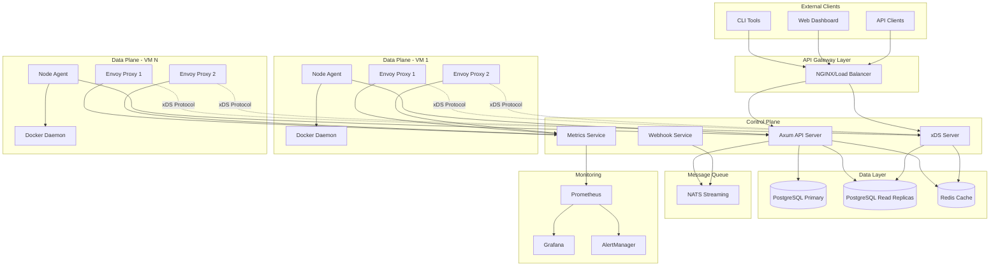
```mermaid
graph TB
    subgraph "External Clients"
        CLI[CLI Tools]
        WEB[Web Dashboard]
        API_CLIENT[API Clients]
    end

    subgraph "API Gateway Layer"
        NGINX[NGINX/Load Balancer]
    end

    subgraph "Control Plane"
        API[Axum API Server]
        XDS[xDS Server]
        WEBHOOK[Webhook Service]
        METRICS[Metrics Service]
    end

    subgraph "Data Layer"
        PG[(PostgreSQL Primary)]
        PG_READ[(PostgreSQL Read Replicas)]
        REDIS[(Redis Cache)]
    end

    subgraph "Message Queue"
        NATS[NATS Streaming]
    end

    subgraph "Data Plane - VM 1"
        VM1_DOCKER[Docker Daemon]
        VM1_EP1[Envoy Proxy 1]
        VM1_EP2[Envoy Proxy 2]
        VM1_AGENT[Node Agent]
    end

    subgraph "Data Plane - VM N"
        VMN_DOCKER[Docker Daemon]
        VMN_EP1[Envoy Proxy 1]
        VMN_EP2[Envoy Proxy 2]
        VMN_AGENT[Node Agent]
    end

    subgraph "Monitoring"
        PROM[Prometheus]
        GRAF[Grafana]
        ALERT[AlertManager]
    end

    CLI --> NGINX
    WEB --> NGINX
    API_CLIENT --> NGINX

    NGINX --> API
    NGINX --> XDS

    API --> PG
    API --> PG_READ
    API --> REDIS
    API --> NATS

    XDS --> PG_READ
    XDS --> REDIS

    WEBHOOK --> NATS

    VM1_EP1 -.->|xDS Protocol| XDS
    VM1_EP2 -.->|xDS Protocol| XDS
    VMN_EP1 -.->|xDS Protocol| XDS
    VMN_EP2 -.->|xDS Protocol| XDS

    VM1_AGENT --> API
    VMN_AGENT --> API

    VM1_AGENT --> VM1_DOCKER
    VMN_AGENT --> VMN_DOCKER

    METRICS --> PROM
    VM1_EP1 --> METRICS
    VM1_EP2 --> METRICS
    VMN_EP1 --> METRICS
    VMN_EP2 --> METRICS

    PROM --> GRAF
    PROM --> ALERT
```

## 3. Component Architecture

### 3.1 API Server (Axum)

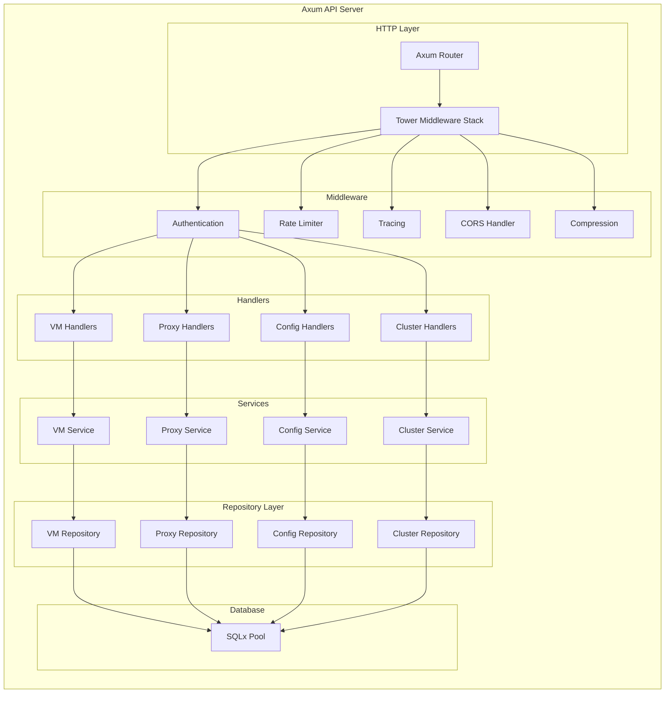
```mermaid
graph LR
    subgraph "Axum API Server"
        subgraph "HTTP Layer"
            Router[Axum Router]
            MW[Tower Middleware Stack]
        end

        subgraph "Middleware"
            AUTH[Authentication]
            RATE[Rate Limiter]
            TRACE[Tracing]
            CORS[CORS Handler]
            COMPRESS[Compression]
        end

        subgraph "Handlers"
            VM_H[VM Handlers]
            PROXY_H[Proxy Handlers]
            CONFIG_H[Config Handlers]
            CLUSTER_H[Cluster Handlers]
        end

        subgraph "Services"
            VM_S[VM Service]
            PROXY_S[Proxy Service]
            CONFIG_S[Config Service]
            CLUSTER_S[Cluster Service]
        end

        subgraph "Repository Layer"
            VM_R[VM Repository]
            PROXY_R[Proxy Repository]
            CONFIG_R[Config Repository]
            CLUSTER_R[Cluster Repository]
        end

        subgraph "Database"
            SQLX[SQLx Pool]
        end
    end

    Router --> MW
    MW --> AUTH
    MW --> RATE
    MW --> TRACE
    MW --> CORS
    MW --> COMPRESS

    AUTH --> VM_H
    AUTH --> PROXY_H
    AUTH --> CONFIG_H
    AUTH --> CLUSTER_H

    VM_H --> VM_S
    PROXY_H --> PROXY_S
    CONFIG_H --> CONFIG_S
    CLUSTER_H --> CLUSTER_S

    VM_S --> VM_R
    PROXY_S --> PROXY_R
    CONFIG_S --> CONFIG_R
    CLUSTER_S --> CLUSTER_R

    VM_R --> SQLX
    PROXY_R --> SQLX
    CONFIG_R --> SQLX
    CLUSTER_R --> SQLX
```

### 3.2 xDS Server Architecture

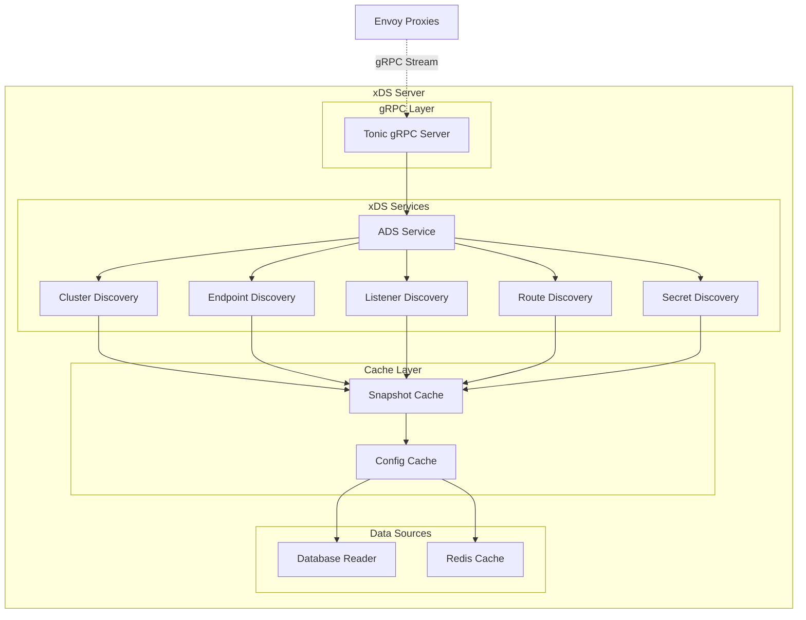
```mermaid
graph TB
    subgraph "xDS Server"
        subgraph "gRPC Layer"
            GRPC[Tonic gRPC Server]
        end

        subgraph "xDS Services"
            ADS[ADS Service]
            CDS[Cluster Discovery]
            EDS[Endpoint Discovery]
            LDS[Listener Discovery]
            RDS[Route Discovery]
            SDS[Secret Discovery]
        end

        subgraph "Cache Layer"
            SNAP[Snapshot Cache]
            CONF[Config Cache]
        end

        subgraph "Data Sources"
            DB_READ[Database Reader]
            REDIS_C[Redis Cache]
        end
    end

    ENVOY[Envoy Proxies] -.->|gRPC Stream| GRPC

    GRPC --> ADS
    ADS --> CDS
    ADS --> EDS
    ADS --> LDS
    ADS --> RDS
    ADS --> SDS

    CDS --> SNAP
    EDS --> SNAP
    LDS --> SNAP
    RDS --> SNAP
    SDS --> SNAP

    SNAP --> CONF
    CONF --> DB_READ
    CONF --> REDIS_C
```

### 3.3 Data Flow Architecture

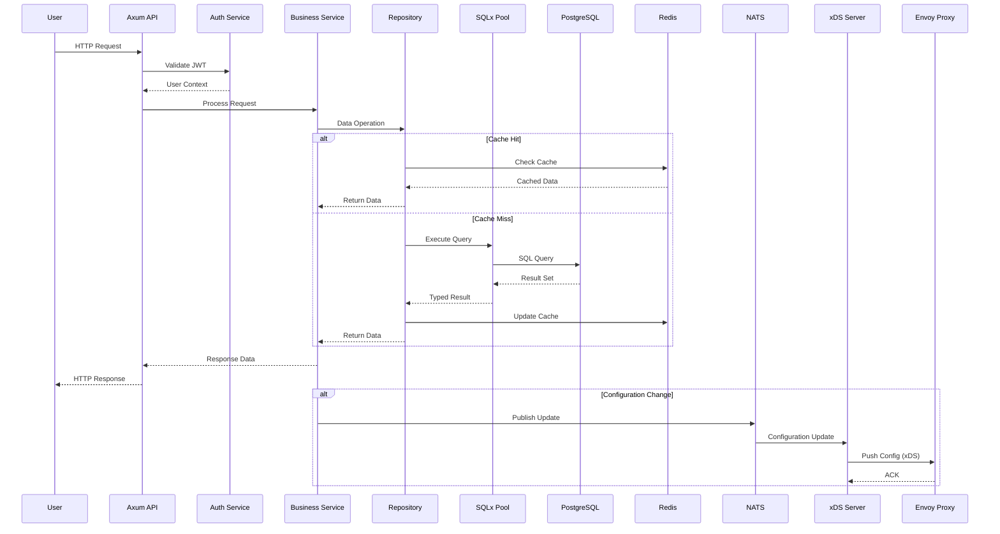
```mermaid
sequenceDiagram
    participant User
    participant API as Axum API
    participant Auth as Auth Service
    participant Service as Business Service
    participant Repo as Repository
    participant SQLx as SQLx Pool
    participant DB as PostgreSQL
    participant Cache as Redis
    participant Queue as NATS
    participant xDS as xDS Server
    participant Envoy as Envoy Proxy

    User->>API: HTTP Request
    API->>Auth: Validate JWT
    Auth-->>API: User Context
    API->>Service: Process Request
    Service->>Repo: Data Operation

    alt Cache Hit
        Repo->>Cache: Check Cache
        Cache-->>Repo: Cached Data
        Repo-->>Service: Return Data
    else Cache Miss
        Repo->>SQLx: Execute Query
        SQLx->>DB: SQL Query
        DB-->>SQLx: Result Set
        SQLx-->>Repo: Typed Result
        Repo->>Cache: Update Cache
        Repo-->>Service: Return Data
    end

    Service-->>API: Response Data
    API-->>User: HTTP Response

    alt Configuration Change
        Service->>Queue: Publish Update
        Queue->>xDS: Configuration Update
        xDS->>Envoy: Push Config (xDS)
        Envoy-->>xDS: ACK
    end
```

## 4. Layered Architecture

### 4.1 Application Layers

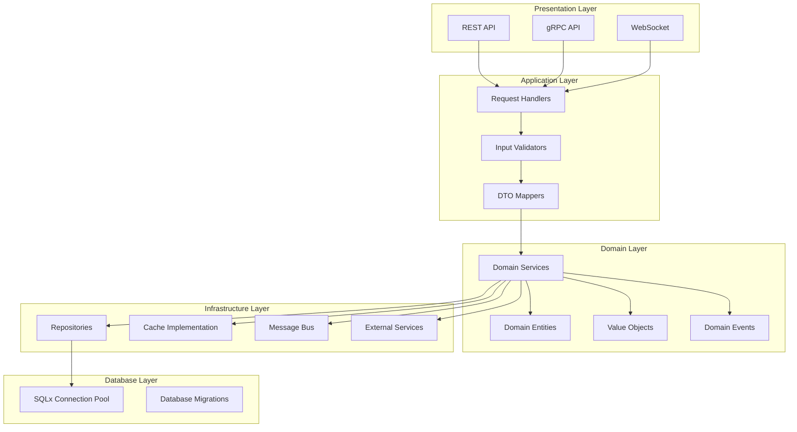
```mermaid
graph TD
    subgraph "Presentation Layer"
        REST[REST API]
        GRPC_API[gRPC API]
        WS[WebSocket]
    end

    subgraph "Application Layer"
        HANDLERS[Request Handlers]
        VALIDATORS[Input Validators]
        MAPPERS[DTO Mappers]
    end

    subgraph "Domain Layer"
        SERVICES[Domain Services]
        ENTITIES[Domain Entities]
        VALUE_OBJ[Value Objects]
        DOMAIN_EVENTS[Domain Events]
    end

    subgraph "Infrastructure Layer"
        REPOS[Repositories]
        CACHE_IMPL[Cache Implementation]
        MESSAGE_BUS[Message Bus]
        EXTERNAL[External Services]
    end

    subgraph "Database Layer"
        SQLX_POOL[SQLx Connection Pool]
        MIGRATIONS[Database Migrations]
    end

    REST --> HANDLERS
    GRPC_API --> HANDLERS
    WS --> HANDLERS

    HANDLERS --> VALIDATORS
    VALIDATORS --> MAPPERS
    MAPPERS --> SERVICES

    SERVICES --> ENTITIES
    SERVICES --> VALUE_OBJ
    SERVICES --> DOMAIN_EVENTS

    SERVICES --> REPOS
    REPOS --> SQLX_POOL

    SERVICES --> CACHE_IMPL
    SERVICES --> MESSAGE_BUS
    SERVICES --> EXTERNAL
```

### 4.2 Module Structure

```
backend/
├── src/
│   ├── main.rs                 # Application entry point
│   ├── config/                 # Configuration management
│   │   ├── mod.rs
│   │   ├── app_config.rs       # Application configuration
│   │   └── database.rs         # Database configuration
│   │
│   ├── api/                    # API layer (Axum)
│   │   ├── mod.rs
│   │   ├── routes.rs           # Route definitions
│   │   ├── middleware/         # Custom middleware
│   │   │   ├── auth.rs         # JWT authentication
│   │   │   ├── rate_limit.rs   # Rate limiting
│   │   │   └── tracing.rs      # Request tracing
│   │   └── handlers/           # Request handlers
│   │       ├── vm.rs            # VM endpoints
│   │       ├── proxy.rs         # Proxy endpoints
│   │       ├── config.rs        # Config endpoints
│   │       └── cluster.rs       # Cluster endpoints
│   │
│   ├── domain/                 # Domain layer
│   │   ├── mod.rs
│   │   ├── entities/           # Domain entities
│   │   │   ├── tenant.rs
│   │   │   ├── vm.rs
│   │   │   ├── proxy.rs
│   │   │   └── config.rs
│   │   ├── value_objects/      # Value objects
│   │   │   ├── proxy_id.rs
│   │   │   └── config_version.rs
│   │   └── events/             # Domain events
│   │       └── config_updated.rs
│   │
│   ├── services/               # Business logic
│   │   ├── mod.rs
│   │   ├── vm_service.rs
│   │   ├── proxy_service.rs
│   │   ├── config_service.rs
│   │   └── cluster_service.rs
│   │
│   ├── repository/             # Data access layer
│   │   ├── mod.rs
│   │   ├── vm_repository.rs
│   │   ├── proxy_repository.rs
│   │   ├── config_repository.rs
│   │   └── cluster_repository.rs
│   │
│   ├── infrastructure/         # Infrastructure
│   │   ├── mod.rs
│   │   ├── database.rs         # SQLx pool management
│   │   ├── cache.rs            # Redis integration
│   │   ├── messaging.rs        # NATS integration
│   │   └── metrics.rs          # Prometheus metrics
│   │
│   ├── xds/                    # xDS server
│   │   ├── mod.rs
│   │   ├── server.rs           # gRPC server
│   │   ├── snapshot.rs         # Snapshot management
│   │   └── services/           # xDS services
│   │       ├── ads.rs
│   │       ├── cds.rs
│   │       ├── eds.rs
│   │       ├── lds.rs
│   │       └── rds.rs
│   │
│   └── utils/                  # Utilities
│       ├── mod.rs
│       ├── errors.rs           # Error types
│       ├── validators.rs       # Input validation
│       └── crypto.rs           # Cryptography utilities
│
├── migrations/                 # SQLx migrations
│   ├── 001_initial_schema.sql
│   ├── 002_add_indexes.sql
│   └── 003_add_triggers.sql
│
├── tests/                      # Integration tests
│   ├── api_tests.rs
│   ├── service_tests.rs
│   └── repository_tests.rs
│
├── Cargo.toml                  # Dependencies
├── .env.example                # Environment variables
└── sqlx-data.json             # SQLx offline mode data
```

## 5. Security Architecture

### 5.1 Authentication & Authorization Flow

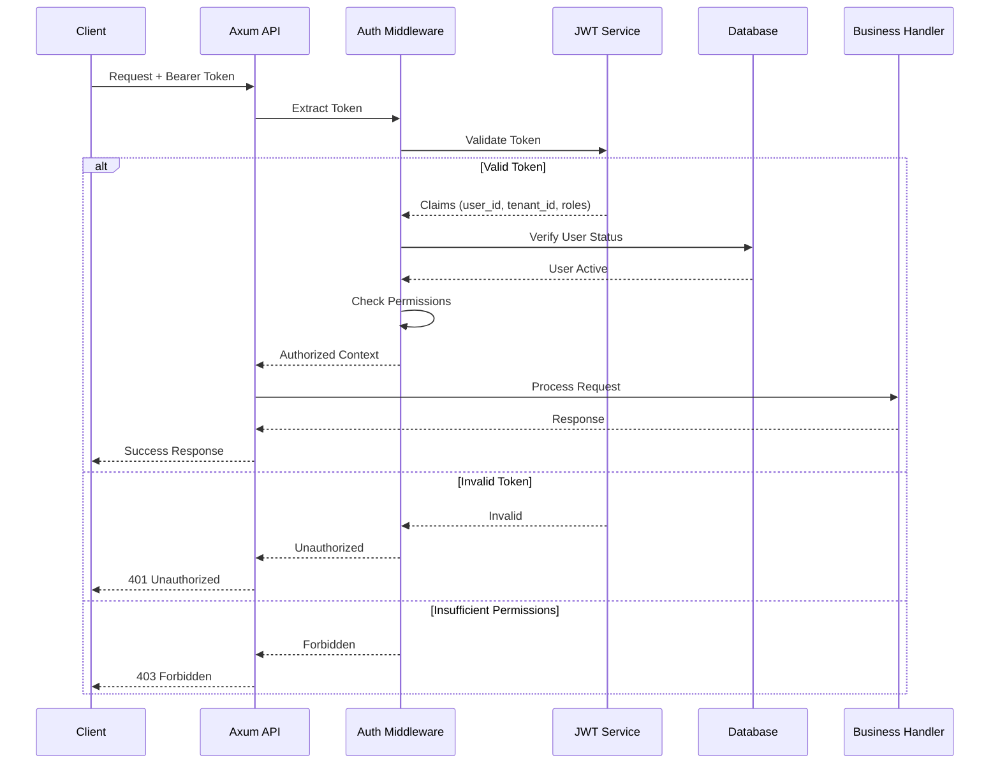
```mermaid
sequenceDiagram
    participant Client
    participant API as Axum API
    participant Auth as Auth Middleware
    participant JWT as JWT Service
    participant DB as Database
    participant Handler as Business Handler

    Client->>API: Request + Bearer Token
    API->>Auth: Extract Token
    Auth->>JWT: Validate Token

    alt Valid Token
        JWT-->>Auth: Claims (user_id, tenant_id, roles)
        Auth->>DB: Verify User Status
        DB-->>Auth: User Active
        Auth->>Auth: Check Permissions
        Auth-->>API: Authorized Context
        API->>Handler: Process Request
        Handler-->>API: Response
        API-->>Client: Success Response
    else Invalid Token
        JWT-->>Auth: Invalid
        Auth-->>API: Unauthorized
        API-->>Client: 401 Unauthorized
    else Insufficient Permissions
        Auth-->>API: Forbidden
        API-->>Client: 403 Forbidden
    end
```

### 5.2 Multi-Tenancy Architecture

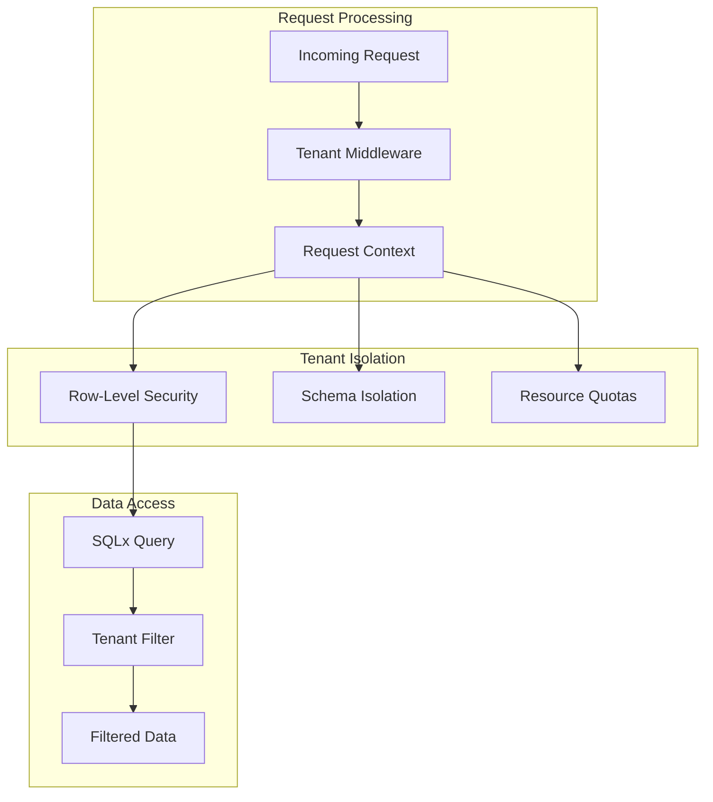
```mermaid
graph TB
    subgraph "Request Processing"
        REQ[Incoming Request]
        MW[Tenant Middleware]
        CTX[Request Context]
    end

    subgraph "Tenant Isolation"
        RLS[Row-Level Security]
        SCHEMA[Schema Isolation]
        QUOTA[Resource Quotas]
    end

    subgraph "Data Access"
        QUERY[SQLx Query]
        TENANT_FILTER[Tenant Filter]
        DATA[Filtered Data]
    end

    REQ --> MW
    MW --> CTX
    CTX --> RLS
    CTX --> SCHEMA
    CTX --> QUOTA

    RLS --> QUERY
    QUERY --> TENANT_FILTER
    TENANT_FILTER --> DATA
```

## 6. Deployment Architecture

### 6.1 Container Deployment

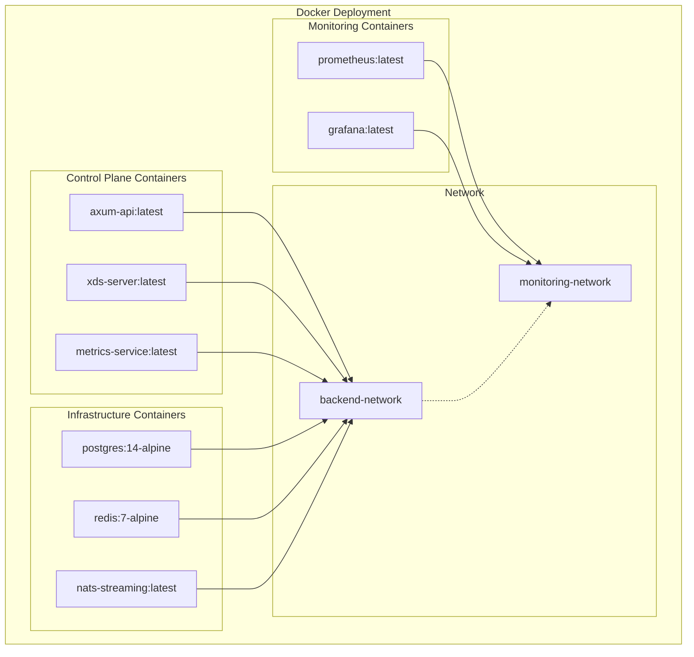
```mermaid
graph TB
    subgraph "Docker Deployment"
        subgraph "Control Plane Containers"
            API_C[axum-api:latest]
            XDS_C[xds-server:latest]
            METRICS_C[metrics-service:latest]
        end

        subgraph "Infrastructure Containers"
            PG_C[postgres:14-alpine]
            REDIS_C[redis:7-alpine]
            NATS_C[nats-streaming:latest]
        end

        subgraph "Monitoring Containers"
            PROM_C[prometheus:latest]
            GRAF_C[grafana:latest]
        end

        subgraph "Network"
            BACKEND_NET[backend-network]
            MONITOR_NET[monitoring-network]
        end
    end

    API_C --> BACKEND_NET
    XDS_C --> BACKEND_NET
    METRICS_C --> BACKEND_NET

    PG_C --> BACKEND_NET
    REDIS_C --> BACKEND_NET
    NATS_C --> BACKEND_NET

    PROM_C --> MONITOR_NET
    GRAF_C --> MONITOR_NET

    BACKEND_NET -.-> MONITOR_NET
```

### 6.2 Kubernetes Architecture (Future)

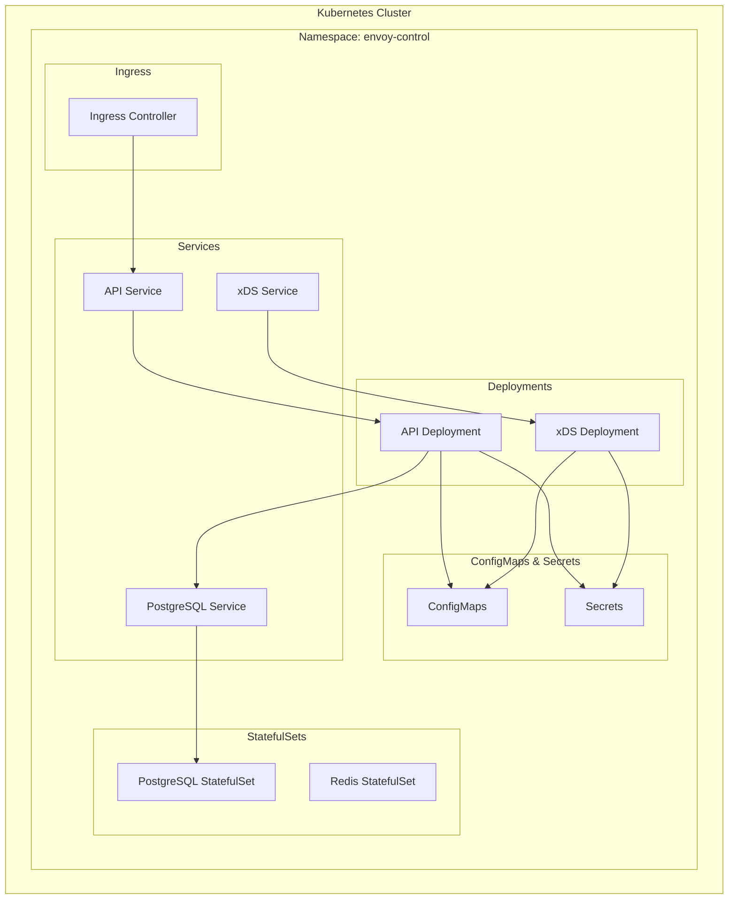
```mermaid
graph TB
    subgraph "Kubernetes Cluster"
        subgraph "Namespace: envoy-control"
            subgraph "Deployments"
                API_D[API Deployment]
                XDS_D[xDS Deployment]
            end

            subgraph "StatefulSets"
                PG_SS[PostgreSQL StatefulSet]
                REDIS_SS[Redis StatefulSet]
            end

            subgraph "Services"
                API_SVC[API Service]
                XDS_SVC[xDS Service]
                PG_SVC[PostgreSQL Service]
            end

            subgraph "ConfigMaps & Secrets"
                CONFIG[ConfigMaps]
                SECRETS[Secrets]
            end

            subgraph "Ingress"
                INGRESS[Ingress Controller]
            end
        end
    end

    INGRESS --> API_SVC
    API_SVC --> API_D
    XDS_SVC --> XDS_D

    API_D --> CONFIG
    API_D --> SECRETS
    XDS_D --> CONFIG
    XDS_D --> SECRETS

    API_D --> PG_SVC
    PG_SVC --> PG_SS
```

## 7. Scaling Architecture

### 7.1 Horizontal Scaling Strategy

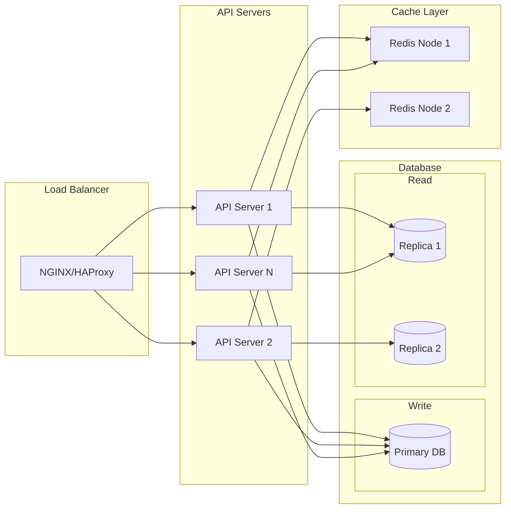
```mermaid
graph LR
    subgraph "Load Balancer"
        LB[NGINX/HAProxy]
    end

    subgraph "API Servers"
        API1[API Server 1]
        API2[API Server 2]
        API3[API Server N]
    end

    subgraph "Database"
        subgraph "Write"
            PRIMARY[(Primary DB)]
        end

        subgraph "Read"
            REPLICA1[(Replica 1)]
            REPLICA2[(Replica 2)]
        end
    end

    subgraph "Cache Layer"
        REDIS1[Redis Node 1]
        REDIS2[Redis Node 2]
    end

    LB --> API1
    LB --> API2
    LB --> API3

    API1 --> PRIMARY
    API2 --> PRIMARY
    API3 --> PRIMARY

    API1 --> REPLICA1
    API2 --> REPLICA2
    API3 --> REPLICA1

    API1 --> REDIS1
    API2 --> REDIS2
    API3 --> REDIS1
```

### 7.2 Auto-Scaling Metrics

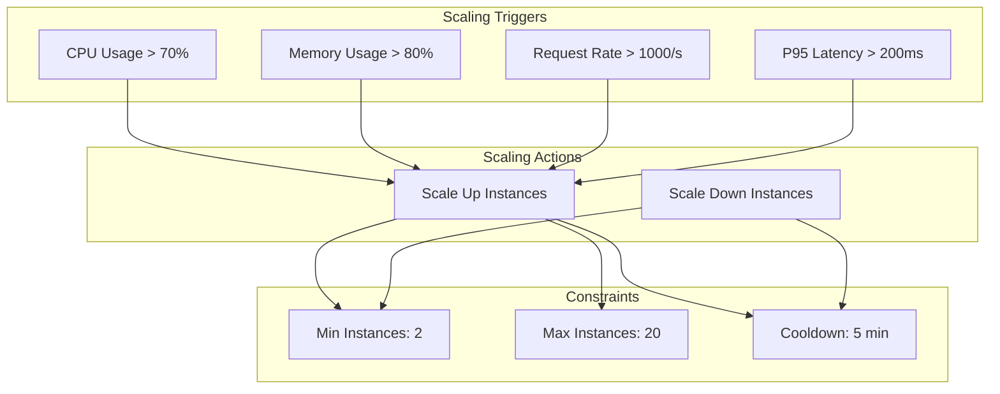
```mermaid
graph TD
    subgraph "Scaling Triggers"
        CPU[CPU Usage > 70%]
        MEM[Memory Usage > 80%]
        REQ[Request Rate > 1000/s]
        LAT[P95 Latency > 200ms]
    end

    subgraph "Scaling Actions"
        SCALE_UP[Scale Up Instances]
        SCALE_DOWN[Scale Down Instances]
    end

    subgraph "Constraints"
        MIN[Min Instances: 2]
        MAX[Max Instances: 20]
        COOL[Cooldown: 5 min]
    end

    CPU --> SCALE_UP
    MEM --> SCALE_UP
    REQ --> SCALE_UP
    LAT --> SCALE_UP

    SCALE_UP --> MIN
    SCALE_UP --> MAX
    SCALE_UP --> COOL

    SCALE_DOWN --> MIN
    SCALE_DOWN --> COOL
```

## 8. Monitoring & Observability

### 8.1 Metrics Collection

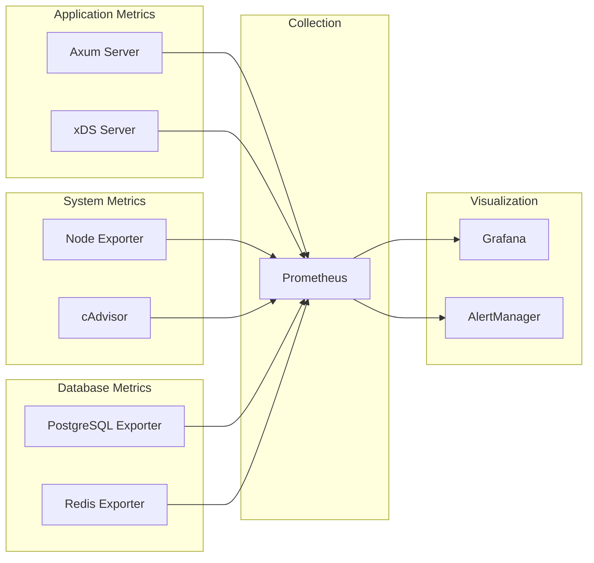
```mermaid
graph LR
    subgraph "Application Metrics"
        APP[Axum Server]
        XDS_M[xDS Server]
    end

    subgraph "System Metrics"
        NODE[Node Exporter]
        CADV[cAdvisor]
    end

    subgraph "Database Metrics"
        PG_EXP[PostgreSQL Exporter]
        REDIS_EXP[Redis Exporter]
    end

    subgraph "Collection"
        PROM[Prometheus]
    end

    subgraph "Visualization"
        GRAF[Grafana]
        ALERT[AlertManager]
    end

    APP --> PROM
    XDS_M --> PROM
    NODE --> PROM
    CADV --> PROM
    PG_EXP --> PROM
    REDIS_EXP --> PROM

    PROM --> GRAF
    PROM --> ALERT
```

### 8.2 Distributed Tracing

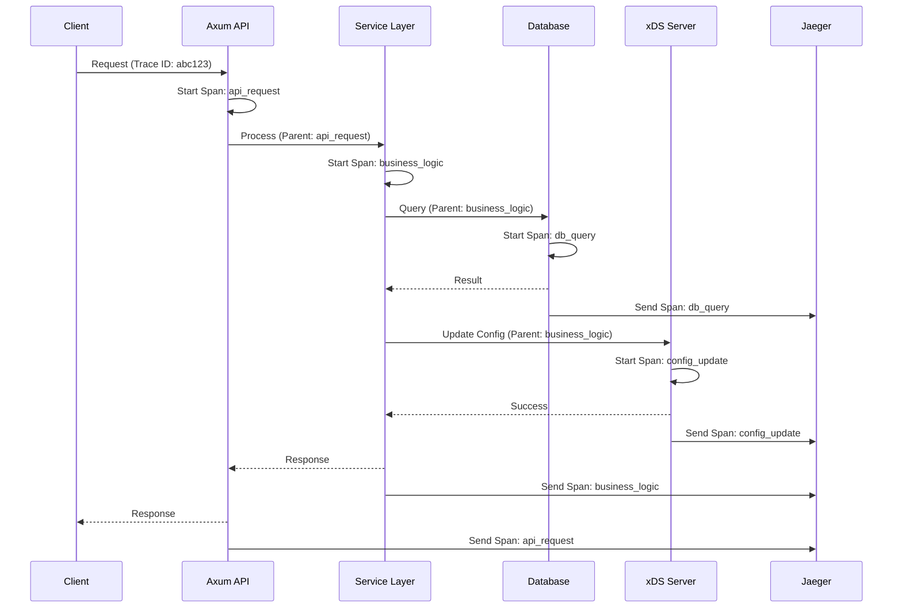
```mermaid
sequenceDiagram
    participant Client
    participant API as Axum API
    participant Service as Service Layer
    participant DB as Database
    participant xDS as xDS Server
    participant Jaeger as Jaeger

    Client->>API: Request (Trace ID: abc123)
    API->>API: Start Span: api_request
    API->>Service: Process (Parent: api_request)
    Service->>Service: Start Span: business_logic
    Service->>DB: Query (Parent: business_logic)
    DB->>DB: Start Span: db_query
    DB-->>Service: Result
    DB->>Jaeger: Send Span: db_query
    Service->>xDS: Update Config (Parent: business_logic)
    xDS->>xDS: Start Span: config_update
    xDS-->>Service: Success
    xDS->>Jaeger: Send Span: config_update
    Service-->>API: Response
    Service->>Jaeger: Send Span: business_logic
    API-->>Client: Response
    API->>Jaeger: Send Span: api_request
```

## 9. Disaster Recovery

### 9.1 Backup and Restore Strategy

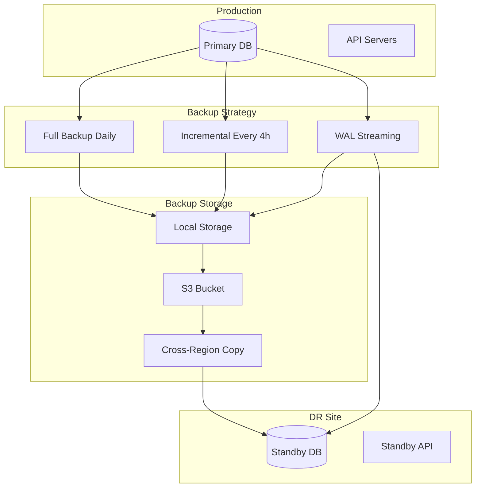
```mermaid
graph TB
    subgraph "Production"
        PROD_DB[(Primary DB)]
        PROD_API[API Servers]
    end

    subgraph "Backup Strategy"
        FULL[Full Backup Daily]
        INCR[Incremental Every 4h]
        WAL[WAL Streaming]
    end

    subgraph "Backup Storage"
        LOCAL[Local Storage]
        S3[S3 Bucket]
        CROSS[Cross-Region Copy]
    end

    subgraph "DR Site"
        DR_DB[(Standby DB)]
        DR_API[Standby API]
    end

    PROD_DB --> FULL
    PROD_DB --> INCR
    PROD_DB --> WAL

    FULL --> LOCAL
    INCR --> LOCAL
    WAL --> LOCAL

    LOCAL --> S3
    S3 --> CROSS

    WAL --> DR_DB
    CROSS --> DR_DB
```

### 9.2 Failover Process

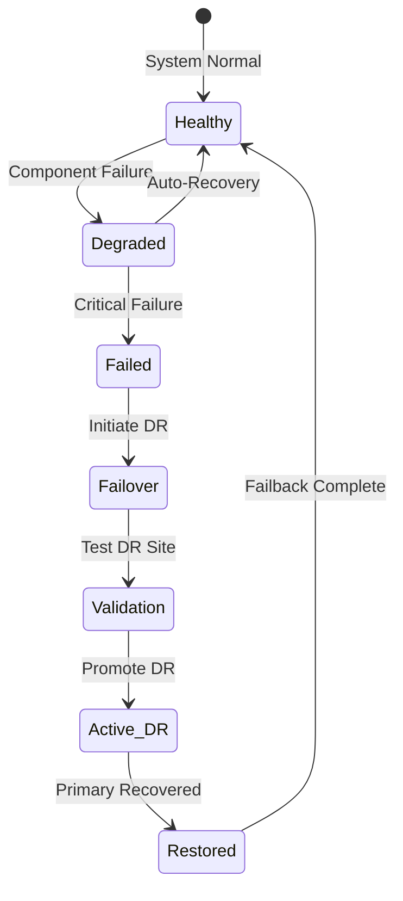
```mermaid
stateDiagram-v2
    [*] --> Healthy: System Normal
    Healthy --> Degraded: Component Failure
    Degraded --> Healthy: Auto-Recovery
    Degraded --> Failed: Critical Failure
    Failed --> Failover: Initiate DR
    Failover --> Validation: Test DR Site
    Validation --> Active_DR: Promote DR
    Active_DR --> Restored: Primary Recovered
    Restored --> Healthy: Failback Complete
```

## 10. Performance Architecture

### 10.1 Caching Strategy

```mermaid
graph TD
    subgraph "Cache Layers"
        L1[L1: Application Cache]
        L2[L2: Redis Cache]
        L3[L3: Database Cache]
    end

    subgraph "Cache Patterns"
        ASIDE[Cache Aside]
        THROUGH[Write Through]
        BEHIND[Write Behind]
    end

    subgraph "Cache Keys"
        CONFIG[config:proxy:{id}]
        CLUSTER[cluster:{tenant}:{name}]
        METRICS[metrics:{proxy}:{timestamp}]
    end

    REQUEST[API Request] --> L1
    L1 -->|Miss| L2
    L2 -->|Miss| L3
    L3 -->|Miss| DB[(Database)]

    L1 --> ASIDE
    L2 --> THROUGH
    L3 --> BEHIND
```

### 10.2 Query Optimization

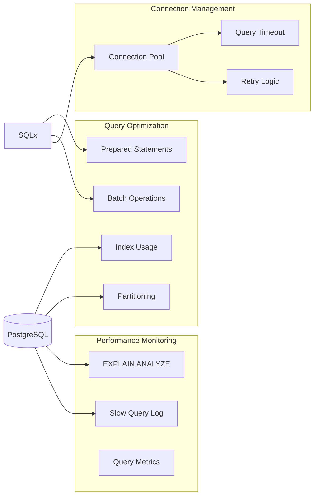
```mermaid
graph LR
    subgraph "Query Optimization"
        PREP[Prepared Statements]
        BATCH[Batch Operations]
        INDEX[Index Usage]
        PART[Partitioning]
    end

    subgraph "Connection Management"
        POOL[Connection Pool]
        TIMEOUT[Query Timeout]
        RETRY[Retry Logic]
    end

    subgraph "Performance Monitoring"
        EXPLAIN[EXPLAIN ANALYZE]
        SLOW[Slow Query Log]
        METRICS[Query Metrics]
    end

    SQLX[SQLx] --> PREP
    SQLX --> BATCH
    SQLX --> POOL

    POOL --> TIMEOUT
    POOL --> RETRY

    DB[(PostgreSQL)] --> INDEX
    DB --> PART
    DB --> EXPLAIN
    DB --> SLOW
```

## 11. Integration Patterns

### 11.1 Event-Driven Architecture

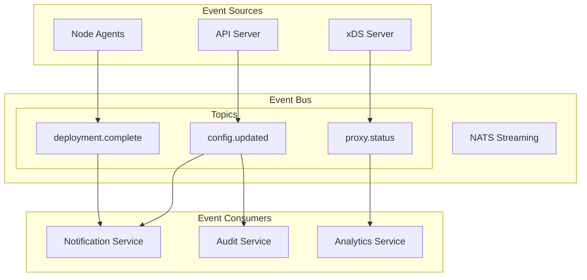
```mermaid
graph TB
    subgraph "Event Sources"
        API[API Server]
        XDS[xDS Server]
        AGENT[Node Agents]
    end

    subgraph "Event Bus"
        NATS[NATS Streaming]
        subgraph "Topics"
            CONFIG_TOPIC[config.updated]
            PROXY_TOPIC[proxy.status]
            DEPLOY_TOPIC[deployment.complete]
        end
    end

    subgraph "Event Consumers"
        NOTIF[Notification Service]
        AUDIT[Audit Service]
        ANALYTICS[Analytics Service]
    end

    API --> CONFIG_TOPIC
    XDS --> PROXY_TOPIC
    AGENT --> DEPLOY_TOPIC

    CONFIG_TOPIC --> NOTIF
    CONFIG_TOPIC --> AUDIT
    PROXY_TOPIC --> ANALYTICS
    DEPLOY_TOPIC --> NOTIF
```

### 11.2 External System Integration

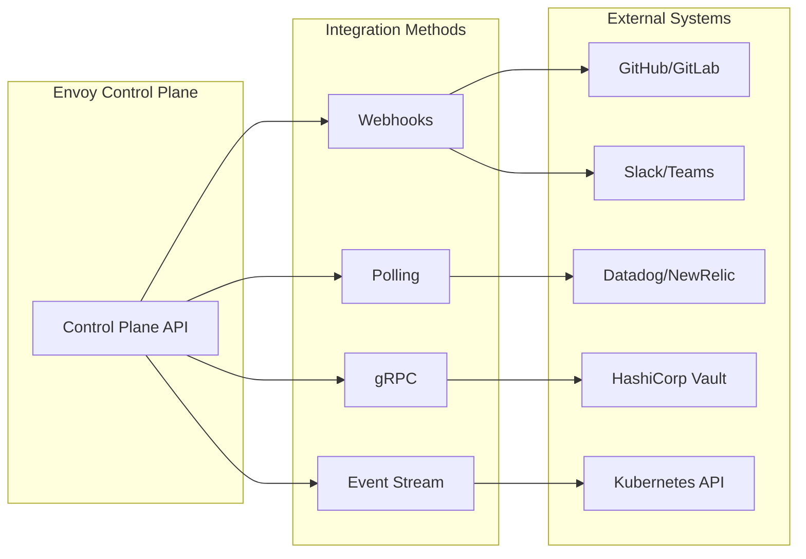
```mermaid
graph LR
    subgraph "Envoy Control Plane"
        CP[Control Plane API]
    end

    subgraph "External Systems"
        GITHUB[GitHub/GitLab]
        SLACK[Slack/Teams]
        DATADOG[Datadog/NewRelic]
        VAULT[HashiCorp Vault]
        K8S[Kubernetes API]
    end

    subgraph "Integration Methods"
        WEBHOOK[Webhooks]
        POLLING[Polling]
        STREAM[Event Stream]
        GRPC[gRPC]
    end

    CP --> WEBHOOK
    CP --> POLLING
    CP --> STREAM
    CP --> GRPC

    WEBHOOK --> GITHUB
    WEBHOOK --> SLACK
    POLLING --> DATADOG
    GRPC --> VAULT
    STREAM --> K8S
```

## 12. Development & Testing Architecture

### 12.1 Testing Strategy

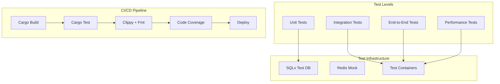
```mermaid
graph TD
    subgraph "Test Levels"
        UNIT[Unit Tests]
        INTEG[Integration Tests]
        E2E[End-to-End Tests]
        PERF[Performance Tests]
    end

    subgraph "Test Infrastructure"
        MOCK_DB[SQLx Test DB]
        MOCK_REDIS[Redis Mock]
        TEST_ENV[Test Containers]
    end

    subgraph "CI/CD Pipeline"
        BUILD[Cargo Build]
        TEST[Cargo Test]
        LINT[Clippy + Fmt]
        COVER[Code Coverage]
        DEPLOY[Deploy]
    end

    UNIT --> MOCK_DB
    INTEG --> TEST_ENV
    E2E --> TEST_ENV
    PERF --> TEST_ENV

    BUILD --> TEST
    TEST --> LINT
    LINT --> COVER
    COVER --> DEPLOY
```

## 13. Technology Stack Summary

### 13.1 Core Technologies

| Component | Technology | Purpose |
|-----------|------------|---------|
| Language | Rust | Primary development language |
| Web Framework | Axum | HTTP server and routing |
| Database Access | SQLx | Type-safe SQL queries |
| Database | PostgreSQL 14+ | Primary data storage |
| Cache | Redis | Performance optimization |
| Message Queue | NATS Streaming | Event-driven communication |
| Container Runtime | Docker | Application containerization |
| Load Balancer | NGINX | Request distribution |
| Monitoring | Prometheus + Grafana | Metrics and visualization |

### 13.2 Rust Crates

| Crate | Version | Purpose |
|-------|---------|---------|
| axum | 0.7 | Web framework |
| sqlx | 0.7 | Database access |
| tokio | 1.35 | Async runtime |
| tower | 0.4 | Middleware framework |
| serde | 1.0 | Serialization |
| tracing | 0.1 | Structured logging |
| jsonwebtoken | 9.2 | JWT authentication |
| uuid | 1.6 | UUID generation |
| redis | 0.24 | Redis client |
| tonic | 0.10 | gRPC framework |

## 14. Conclusion

This architecture provides a robust, scalable, and maintainable foundation for the Envoy Fleet Management System. Key architectural decisions include:

1. **Rust + Axum + SQLx**: Provides type safety, performance, and compile-time guarantees
2. **Microservices Pattern**: Enables independent scaling and deployment
3. **Event-Driven Design**: Supports real-time configuration updates
4. **Multi-Tenancy**: Ensures secure isolation between tenants
5. **Comprehensive Monitoring**: Enables proactive issue detection and resolution
6. **Disaster Recovery**: Ensures business continuity

The architecture is designed to handle 10,000+ Envoy proxy instances while maintaining sub-100ms API response times and 99.9% availability.