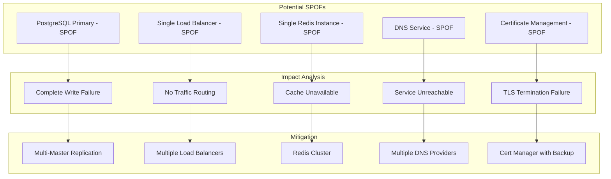
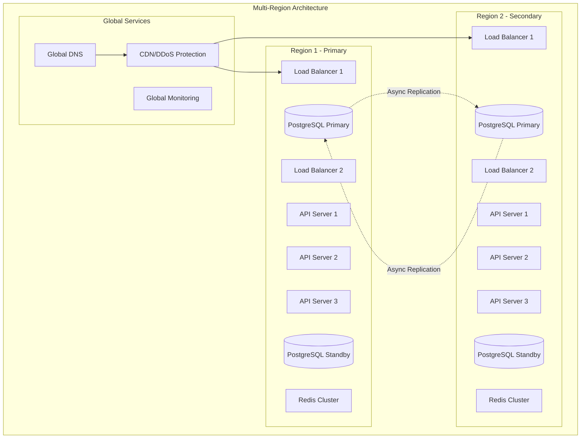

# Envoy Fleet Management System - Risk Management & Reliability Engineering

## 1. Executive Summary

This document provides a comprehensive risk assessment and mitigation strategy for the Envoy Fleet Management System. It identifies potential single points of failure (SPOFs), defines risk mitigation strategies, and establishes procedures for achieving high reliability through proactive monitoring, self-healing mechanisms, and auto-scaling capabilities.

## 2. Risk Assessment Matrix

### 2.1 Risk Severity Classification

| Severity | Impact | Recovery Time | Business Impact |
|----------|--------|---------------|-----------------|
| Critical | System-wide outage | > 1 hour | Complete service disruption |
| High | Major feature unavailable | 15-60 minutes | Significant degradation |
| Medium | Performance degradation | 5-15 minutes | Noticeable user impact |
| Low | Minor feature issue | < 5 minutes | Minimal user impact |

### 2.2 Risk Probability Scale

| Probability | Likelihood | Frequency |
|-------------|------------|-----------|
| Very High | > 75% | Daily |
| High | 50-75% | Weekly |
| Medium | 25-50% | Monthly |
| Low | 10-25% | Quarterly |
| Very Low | < 10% | Yearly |

## 3. Single Points of Failure Analysis

### 3.1 Infrastructure SPOFs



### 3.2 Application SPOFs

| Component | SPOF Risk | Impact | Current State | Mitigation Required |
|-----------|-----------|---------|---------------|-------------------|
| API Gateway | High | No API access | Single instance | Multiple instances with failover |
| xDS Server | Critical | Envoys can't update | Limited replicas | Active-active deployment |
| Message Queue | Medium | Event loss | Single NATS | NATS cluster with persistence |
| Authentication Service | High | No login possible | Embedded in API | Separate auth service with cache |
| Configuration Store | Critical | Config unavailable | Database only | Multi-layer caching |

## 4. Comprehensive Risk Register

### 4.1 Infrastructure Risks

```yaml
risks:
  - id: INFRA-001
    name: Database Primary Failure
    category: Infrastructure
    severity: Critical
    probability: Low
    impact:
      - No write operations possible
      - Configuration updates blocked
      - Potential data loss
    mitigation:
      primary:
        - Synchronous replication to standby
        - Automatic failover within 30 seconds
        - Point-in-time recovery capability
      secondary:
        - Multi-master setup for critical regions
        - Cross-region replication
      monitoring:
        - Replication lag < 1 second
        - WAL archiving status
        - Connection pool health

  - id: INFRA-002
    name: Network Partition
    category: Infrastructure
    severity: High
    probability: Medium
    impact:
      - Split-brain scenarios
      - Inconsistent configuration states
      - Partial system availability
    mitigation:
      primary:
        - Quorum-based consensus (Raft)
        - Network redundancy (multiple paths)
        - Graceful degradation
      secondary:
        - Eventual consistency model
        - Conflict resolution strategies

  - id: INFRA-003
    name: Complete Region Failure
    category: Infrastructure
    severity: Critical
    probability: Very Low
    impact:
      - Total service outage in region
      - Customer data inaccessible
    mitigation:
      primary:
        - Multi-region deployment
        - Active-active architecture
        - Geo-distributed database
      secondary:
        - DR site activation < 5 minutes
        - Cross-region traffic routing
```

### 4.2 Application Risks

```yaml
risks:
  - id: APP-001
    name: Memory Leak in API Server
    category: Application
    severity: High
    probability: Medium
    impact:
      - Service degradation
      - Eventually OOM kill
    mitigation:
      primary:
        - Memory limits enforcement
        - Automatic restart on threshold
        - Memory profiling in production
      monitoring:
        - Memory usage trends
        - Heap growth rate
        - GC metrics

  - id: APP-002
    name: SQLx Connection Pool Exhaustion
    category: Application
    severity: High
    probability: Medium
    impact:
      - Database queries timeout
      - API requests fail
    mitigation:
      primary:
        - Dynamic pool sizing
        - Connection timeout tuning
        - Query optimization
      secondary:
        - Circuit breaker pattern
        - Read replica fallback

  - id: APP-003
    name: Configuration Corruption
    category: Application
    severity: Critical
    probability: Low
    impact:
      - Invalid Envoy configs deployed
      - Service disruption
    mitigation:
      primary:
        - Configuration validation
        - Staged rollout
        - Automatic rollback
      secondary:
        - Config versioning
        - Canary deployments
```

### 4.3 Security Risks

```yaml
risks:
  - id: SEC-001
    name: JWT Secret Compromise
    category: Security
    severity: Critical
    probability: Very Low
    impact:
      - Unauthorized access
      - Data breach potential
    mitigation:
      primary:
        - Secret rotation every 30 days
        - Hardware security modules (HSM)
        - Key management service (KMS)
      monitoring:
        - Unusual authentication patterns
        - Failed auth spike detection

  - id: SEC-002
    name: DDoS Attack
    category: Security
    severity: High
    probability: Medium
    impact:
      - Service unavailability
      - Resource exhaustion
    mitigation:
      primary:
        - Rate limiting per IP/user
        - CDN with DDoS protection
        - Auto-scaling under load
      secondary:
        - Geographic distribution
        - Traffic pattern analysis
```

## 5. High Reliability Architecture

### 5.1 Redundancy Design



### 5.2 Failure Isolation Zones

```yaml
# Deployment configuration for failure isolation
apiVersion: v1
kind: ConfigMap
metadata:
  name: failure-zones
data:
  zones.yaml: |
    failure_zones:
      - zone: api-critical
        components:
          - authentication
          - configuration-read
        isolation:
          cpu_limit: 4000m
          memory_limit: 8Gi
          network_policy: strict
        scaling:
          min_replicas: 3
          max_replicas: 10

      - zone: api-standard
        components:
          - metrics-collection
          - audit-logging
        isolation:
          cpu_limit: 2000m
          memory_limit: 4Gi
          network_policy: standard
        scaling:
          min_replicas: 2
          max_replicas: 5

      - zone: data-plane
        components:
          - xds-server
          - config-distribution
        isolation:
          cpu_limit: 3000m
          memory_limit: 6Gi
          network_policy: restricted
        scaling:
          min_replicas: 2
          max_replicas: 8
```

## 6. Proactive Monitoring Strategy

### 6.1 Four Golden Signals

```yaml
monitoring:
  latency:
    metrics:
      - name: http_request_duration_seconds
        thresholds:
          p50: 50ms
          p95: 200ms
          p99: 500ms
        alerts:
          - condition: p99 > 500ms for 5m
            severity: warning
          - condition: p99 > 1s for 5m
            severity: critical

  traffic:
    metrics:
      - name: http_requests_per_second
        thresholds:
          normal: 1000-5000
          high: 5000-10000
          critical: > 10000
        alerts:
          - condition: rate < 100 for 5m
            severity: warning
            description: "Abnormally low traffic"

  errors:
    metrics:
      - name: http_error_rate
        thresholds:
          acceptable: < 0.1%
          warning: 0.1-1%
          critical: > 1%
        alerts:
          - condition: rate > 1% for 2m
            severity: critical

  saturation:
    metrics:
      - name: resource_utilization
        resources:
          cpu:
            warning: 70%
            critical: 85%
          memory:
            warning: 80%
            critical: 90%
          disk:
            warning: 75%
            critical: 85%
```

### 6.2 Custom Business Metrics

```rust
// src/monitoring/business_metrics.rs
use prometheus::{register_histogram_vec, register_counter_vec, register_gauge_vec};

pub struct BusinessMetrics {
    config_update_duration: HistogramVec,
    config_validation_failures: CounterVec,
    active_proxies: GaugeVec,
    config_drift_detected: CounterVec,
    deployment_success_rate: GaugeVec,
}

impl BusinessMetrics {
    pub fn new() -> Self {
        Self {
            config_update_duration: register_histogram_vec!(
                "config_update_duration_seconds",
                "Time taken to update configuration",
                &["tenant", "proxy_id", "status"]
            ).unwrap(),

            config_validation_failures: register_counter_vec!(
                "config_validation_failures_total",
                "Number of configuration validation failures",
                &["tenant", "reason"]
            ).unwrap(),

            active_proxies: register_gauge_vec!(
                "active_proxies_count",
                "Number of active Envoy proxies",
                &["tenant", "cluster", "status"]
            ).unwrap(),

            config_drift_detected: register_counter_vec!(
                "config_drift_detected_total",
                "Configuration drift detection events",
                &["tenant", "proxy_id", "severity"]
            ).unwrap(),

            deployment_success_rate: register_gauge_vec!(
                "deployment_success_rate",
                "Rolling success rate of deployments",
                &["tenant", "strategy"]
            ).unwrap(),
        }
    }
}
```

### 6.3 Monitoring Dashboard Configuration

```json
{
  "dashboard": {
    "title": "Risk Management Dashboard",
    "panels": [
      {
        "title": "System Health Score",
        "type": "stat",
        "targets": [
          {
            "expr": "(1 - (rate(errors[5m]) + (p99_latency / 1000) + (cpu_usage / 100) + (memory_usage / 100)) / 4) * 100"
          }
        ],
        "thresholds": {
          "steps": [
            {"value": 0, "color": "red"},
            {"value": 70, "color": "yellow"},
            {"value": 90, "color": "green"}
          ]
        }
      },
      {
        "title": "Risk Heat Map",
        "type": "heatmap",
        "targets": [
          {
            "expr": "risk_score_by_component"
          }
        ]
      },
      {
        "title": "SPOF Detection",
        "type": "table",
        "targets": [
          {
            "expr": "single_point_of_failure_detected"
          }
        ]
      },
      {
        "title": "Failure Prediction",
        "type": "graph",
        "targets": [
          {
            "expr": "predict_linear(disk_usage[1h], 3600)"
          }
        ]
      }
    ]
  }
}
```

## 7. Alerting Strategy

### 7.1 Alert Hierarchy and Escalation

```yaml
alerting:
  levels:
    - level: P0
      description: "Critical - System Down"
      response_time: immediate
      escalation:
        - oncall_primary: 0m
        - oncall_secondary: 5m
        - team_lead: 10m
        - director: 30m
      channels:
        - pagerduty
        - slack_critical
        - sms

    - level: P1
      description: "High - Major Impact"
      response_time: 15m
      escalation:
        - oncall_primary: 0m
        - oncall_secondary: 15m
        - team_lead: 30m
      channels:
        - pagerduty
        - slack_high

    - level: P2
      description: "Medium - Performance Issue"
      response_time: 1h
      escalation:
        - oncall_primary: 0m
        - team_lead: 1h
      channels:
        - slack_medium
        - email

    - level: P3
      description: "Low - Minor Issue"
      response_time: 4h
      escalation:
        - team: 0m
      channels:
        - slack_low
```

### 7.2 Alert Rules Configuration

```yaml
# prometheus/alerts/critical.yml
groups:
  - name: critical_alerts
    interval: 30s
    rules:
      - alert: DatabasePrimaryDown
        expr: up{job="postgres-primary"} == 0
        for: 1m
        labels:
          severity: P0
          component: database
          team: platform
        annotations:
          summary: "PostgreSQL primary is down"
          description: "Primary database {{ $labels.instance }} is unreachable"
          runbook: "https://runbook.internal/database-primary-down"
          impact: "All write operations will fail"

      - alert: APIServerAllDown
        expr: sum(up{job="api-server"}) == 0
        for: 30s
        labels:
          severity: P0
          component: api
          team: backend
        annotations:
          summary: "All API servers are down"
          description: "No API servers are responding"
          runbook: "https://runbook.internal/api-all-down"

      - alert: ConfigurationCorruption
        expr: config_validation_failures_total > 10
        for: 1m
        labels:
          severity: P0
          component: configuration
          team: platform
        annotations:
          summary: "High rate of configuration failures"
          description: "{{ $value }} configuration validation failures"

      - alert: CascadingFailure
        expr: |
          (rate(circuit_breaker_open[1m]) > 0.5) AND
          (error_rate > 0.1) AND
          (p99_latency > 1000)
        for: 2m
        labels:
          severity: P0
          component: system
          team: oncall
        annotations:
          summary: "Cascading failure detected"
          description: "Multiple system components failing simultaneously"
```

### 7.3 Alert Suppression and Deduplication

```yaml
alertmanager:
  route:
    group_by: ['alertname', 'cluster', 'service']
    group_wait: 10s
    group_interval: 10s
    repeat_interval: 1h
    receiver: 'default'
    routes:
      - match:
          severity: P0
        receiver: critical
        continue: true

      - match:
          severity: P1
        receiver: high
        group_wait: 30s

      - match:
          alertname: .*Test.*
        receiver: dev-null

  inhibit_rules:
    - source_match:
        severity: P0
        alertname: DatabasePrimaryDown
      target_match:
        severity: P1
        component: database
      equal: ['cluster', 'service']

    - source_match:
        alertname: RegionDown
      target_match_re:
        alertname: .*
      equal: ['region']
```

## 8. Self-Healing Mechanisms

### 8.1 Automated Recovery Procedures

```rust
// src/self_healing/recovery.rs
use tokio::time::{Duration, interval};

pub struct SelfHealingSystem {
    health_checker: HealthChecker,
    recovery_actions: HashMap<String, RecoveryAction>,
}

impl SelfHealingSystem {
    pub async fn start(&self) {
        let mut interval = interval(Duration::from_secs(10));

        loop {
            interval.tick().await;

            let health_status = self.health_checker.check_all().await;

            for (component, status) in health_status {
                if !status.is_healthy() {
                    self.attempt_recovery(&component, &status).await;
                }
            }
        }
    }

    async fn attempt_recovery(&self, component: &str, status: &HealthStatus) {
        match component {
            "database_connection" => {
                self.recover_database_connection().await;
            },
            "memory_pressure" => {
                self.recover_from_memory_pressure().await;
            },
            "config_sync" => {
                self.recover_config_sync().await;
            },
            "proxy_connection" => {
                self.recover_proxy_connection().await;
            },
            _ => {
                tracing::warn!("No recovery action for component: {}", component);
            }
        }
    }

    async fn recover_database_connection(&self) {
        tracing::info!("Attempting database connection recovery");

        // 1. Try to reconnect with exponential backoff
        for attempt in 1..=5 {
            if let Ok(pool) = self.create_new_connection_pool().await {
                tracing::info!("Database connection recovered");
                self.update_connection_pool(pool).await;
                return;
            }

            let delay = Duration::from_secs(2_u64.pow(attempt));
            tokio::time::sleep(delay).await;
        }

        // 2. Failover to read replica
        if let Err(e) = self.failover_to_replica().await {
            tracing::error!("Failed to failover to replica: {}", e);

            // 3. Enter degraded mode
            self.enter_degraded_mode().await;
        }
    }

    async fn recover_from_memory_pressure(&self) {
        tracing::info!("Recovering from memory pressure");

        // 1. Clear caches
        self.clear_caches().await;

        // 2. Force garbage collection
        self.force_gc().await;

        // 3. Restart if memory still high
        if self.get_memory_usage().await > 0.9 {
            tracing::warn!("Memory still high, scheduling restart");
            self.schedule_graceful_restart().await;
        }
    }
}
```

### 8.2 Circuit Breaker Implementation

```rust
// src/self_healing/circuit_breaker.rs
use std::sync::Arc;
use tokio::sync::RwLock;

#[derive(Debug, Clone)]
pub enum CircuitState {
    Closed,
    Open(Instant),
    HalfOpen,
}

pub struct CircuitBreaker {
    state: Arc<RwLock<CircuitState>>,
    failure_threshold: u32,
    success_threshold: u32,
    timeout: Duration,
    failure_count: Arc<RwLock<u32>>,
    success_count: Arc<RwLock<u32>>,
}

impl CircuitBreaker {
    pub async fn call<F, T, E>(&self, f: F) -> Result<T, E>
    where
        F: Future<Output = Result<T, E>>,
        E: std::error::Error,
    {
        let state = self.state.read().await.clone();

        match state {
            CircuitState::Open(opened_at) => {
                if opened_at.elapsed() > self.timeout {
                    *self.state.write().await = CircuitState::HalfOpen;
                    self.attempt_call(f).await
                } else {
                    Err(CircuitBreakerError::OpenCircuit)
                }
            }
            CircuitState::HalfOpen => {
                self.attempt_call(f).await
            }
            CircuitState::Closed => {
                self.attempt_call(f).await
            }
        }
    }

    async fn attempt_call<F, T, E>(&self, f: F) -> Result<T, E>
    where
        F: Future<Output = Result<T, E>>,
    {
        match f.await {
            Ok(result) => {
                self.on_success().await;
                Ok(result)
            }
            Err(error) => {
                self.on_failure().await;
                Err(error)
            }
        }
    }

    async fn on_success(&self) {
        let mut success_count = self.success_count.write().await;
        *success_count += 1;

        let state = self.state.read().await.clone();
        if matches!(state, CircuitState::HalfOpen) {
            if *success_count >= self.success_threshold {
                *self.state.write().await = CircuitState::Closed;
                *self.failure_count.write().await = 0;
                *success_count = 0;
            }
        }
    }

    async fn on_failure(&self) {
        let mut failure_count = self.failure_count.write().await;
        *failure_count += 1;

        if *failure_count >= self.failure_threshold {
            *self.state.write().await = CircuitState::Open(Instant::now());
            *failure_count = 0;
        }
    }
}
```

### 8.3 Automatic Remediation Actions

```yaml
remediation:
  actions:
    - trigger: high_error_rate
      condition: error_rate > 0.05
      actions:
        - name: increase_timeout
          params:
            timeout_ms: 5000
        - name: enable_retry
          params:
            max_retries: 3
            backoff: exponential
        - name: scale_up
          params:
            increment: 2

    - trigger: memory_leak_detected
      condition: memory_growth_rate > 10MB/min
      actions:
        - name: schedule_restart
          params:
            delay: 5m
            strategy: rolling
        - name: alert_oncall
          params:
            severity: P2

    - trigger: database_connection_pool_exhausted
      condition: available_connections < 2
      actions:
        - name: increase_pool_size
          params:
            increment: 10
            max: 200
        - name: kill_long_queries
          params:
            threshold: 30s

    - trigger: certificate_expiring
      condition: days_until_expiry < 7
      actions:
        - name: auto_renew_certificate
          params:
            provider: letsencrypt
        - name: notify_team
          params:
            channel: slack
```

## 9. Auto-Scaling Implementation

### 9.1 Predictive Auto-Scaling

```rust
// src/autoscaling/predictive.rs
use statistical::{mean, standard_deviation};

pub struct PredictiveScaler {
    metrics_store: MetricsStore,
    ml_model: Option<Model>,
}

impl PredictiveScaler {
    pub async fn predict_load(&self, horizon: Duration) -> LoadPrediction {
        // Collect historical metrics
        let historical = self.metrics_store
            .get_metrics("request_rate", Duration::from_secs(86400))
            .await;

        // Time series analysis
        let trend = self.calculate_trend(&historical);
        let seasonality = self.detect_seasonality(&historical);

        // ML prediction if model available
        let ml_prediction = if let Some(model) = &self.ml_model {
            model.predict(&historical, horizon).await
        } else {
            None
        };

        LoadPrediction {
            expected_rps: self.forecast_rps(trend, seasonality, ml_prediction),
            confidence: self.calculate_confidence(&historical),
            recommended_instances: self.calculate_required_instances(expected_rps),
        }
    }

    pub async fn scale_decision(&self) -> ScaleAction {
        let prediction = self.predict_load(Duration::from_secs(900)).await; // 15 min
        let current_instances = self.get_current_instances().await;

        if prediction.recommended_instances > current_instances * 1.2 {
            ScaleAction::ScaleUp {
                target: prediction.recommended_instances,
                reason: "Predicted load increase".to_string(),
            }
        } else if prediction.recommended_instances < current_instances * 0.8 {
            ScaleAction::ScaleDown {
                target: prediction.recommended_instances,
                reason: "Predicted load decrease".to_string(),
            }
        } else {
            ScaleAction::NoAction
        }
    }
}
```

### 9.2 Reactive Auto-Scaling

```yaml
# kubernetes/hpa-advanced.yaml
apiVersion: autoscaling/v2
kind: HorizontalPodAutoscaler
metadata:
  name: api-server-hpa-advanced
spec:
  scaleTargetRef:
    apiVersion: apps/v1
    kind: Deployment
    name: api-server
  minReplicas: 3
  maxReplicas: 50
  behavior:
    scaleDown:
      stabilizationWindowSeconds: 300
      policies:
      - type: Percent
        value: 10
        periodSeconds: 60
      - type: Pods
        value: 2
        periodSeconds: 60
      selectPolicy: Min
    scaleUp:
      stabilizationWindowSeconds: 60
      policies:
      - type: Percent
        value: 50
        periodSeconds: 60
      - type: Pods
        value: 5
        periodSeconds: 60
      selectPolicy: Max
  metrics:
  - type: Resource
    resource:
      name: cpu
      target:
        type: Utilization
        averageUtilization: 70
  - type: Resource
    resource:
      name: memory
      target:
        type: Utilization
        averageUtilization: 80
  - type: Pods
    pods:
      metric:
        name: http_requests_per_second
      target:
        type: AverageValue
        averageValue: "1000"
  - type: External
    external:
      metric:
        name: queue_depth
        selector:
          matchLabels:
            queue: "config-updates"
      target:
        type: Value
        value: "100"
```

### 9.3 Cluster Auto-Scaling

```yaml
# kubernetes/cluster-autoscaler.yaml
apiVersion: v1
kind: ConfigMap
metadata:
  name: cluster-autoscaler-status
  namespace: kube-system
data:
  nodes.max: "100"
  nodes.min: "3"
  scale-down-delay-after-add: "10m"
  scale-down-unneeded-time: "10m"
  scale-down-utilization-threshold: "0.5"
  max-node-provision-time: "15m"
  max-graceful-termination-sec: "600"
---
apiVersion: apps/v1
kind: Deployment
metadata:
  name: cluster-autoscaler
  namespace: kube-system
spec:
  template:
    spec:
      containers:
      - image: k8s.gcr.io/autoscaling/cluster-autoscaler:v1.27.0
        name: cluster-autoscaler
        command:
        - ./cluster-autoscaler
        - --v=4
        - --stderrthreshold=info
        - --cloud-provider=aws
        - --skip-nodes-with-local-storage=false
        - --expander=least-waste
        - --node-group-auto-discovery=asg:tag=k8s.io/cluster-autoscaler/enabled,k8s.io/cluster-autoscaler/envoy-control
        - --balance-similar-node-groups
        - --skip-nodes-with-system-pods=false
```

## 10. Chaos Engineering

### 10.1 Chaos Experiments

```yaml
# chaos/experiments.yaml
experiments:
  - name: database-failure
    description: "Simulate primary database failure"
    hypothesis: "System should failover to standby within 30 seconds"
    steady_state:
      - probe:
          type: http
          url: "/health"
          expected_status: 200
    method:
      - action:
          type: network
          target: postgres-primary
          operation: partition
          duration: 5m
    rollback:
      - action:
          type: network
          target: postgres-primary
          operation: restore

  - name: memory-pressure
    description: "Simulate memory pressure on API servers"
    hypothesis: "System should auto-scale and maintain SLA"
    steady_state:
      - probe:
          type: metric
          name: p99_latency
          threshold: 500ms
    method:
      - action:
          type: resource
          target: api-server
          resource: memory
          consumption: 80%
          duration: 10m

  - name: cascading-failure
    description: "Simulate cascading failure scenario"
    hypothesis: "Circuit breakers should prevent cascade"
    method:
      - action:
          type: latency
          target: database
          delay: 5s
          duration: 2m
      - action:
          type: error
          target: external-service
          error_rate: 0.5
          duration: 2m
```

### 10.2 Game Day Runbook

```markdown
# Game Day: Complete Region Failure

## Scenario
Complete failure of primary region (us-west-2)

## Expected Behavior
1. Detection within 30 seconds
2. DNS failover within 60 seconds
3. Full service restoration within 5 minutes
4. Zero data loss for committed transactions

## Procedure

### Phase 1: Initiate Failure (T+0)
```bash
# Block all traffic to us-west-2
aws ec2 modify-vpc-endpoint --vpc-endpoint-id vpc-xxx --policy-document block-all.json

# Verify failure detected
curl https://api.envoy-control.example.com/health
```

### Phase 2: Monitor Failover (T+30s)
```bash
# Check DNS propagation
dig api.envoy-control.example.com

# Monitor metrics
prometheus-query 'region_failover_initiated'
```

### Phase 3: Verify Recovery (T+5m)
```bash
# Test API functionality
./run-smoke-tests.sh

# Check data consistency
psql -c "SELECT check_replication_status();"
```

### Phase 4: Restore Primary (T+30m)
```bash
# Restore network
aws ec2 modify-vpc-endpoint --vpc-endpoint-id vpc-xxx --remove-policy

# Resync data
./resync-primary-region.sh
```

## Success Criteria
- [ ] RPO < 1 minute
- [ ] RTO < 5 minutes
- [ ] No data corruption
- [ ] Automatic failback
```

## 11. Disaster Recovery Planning

### 11.1 Recovery Time and Point Objectives

| Scenario | RTO | RPO | Strategy |
|----------|-----|-----|----------|
| Single server failure | 30 seconds | 0 | Automatic failover |
| Database failure | 1 minute | 1 minute | Standby promotion |
| Zone failure | 2 minutes | 1 minute | Cross-zone failover |
| Region failure | 5 minutes | 5 minutes | Cross-region failover |
| Complete disaster | 1 hour | 1 hour | Restore from backup |

### 11.2 Backup and Recovery Strategy

```yaml
backup_strategy:
  database:
    full_backup:
      frequency: daily
      retention: 30d
      storage:
        - local: /backup/full
        - s3: s3://backup/postgres/full
        - glacier: glacier://backup/postgres/archive

    incremental:
      frequency: hourly
      retention: 7d
      method: wal_archiving

    point_in_time:
      wal_retention: 7d
      archive_command: 'test ! -f /wal/%f && cp %p /wal/%f'

  configuration:
    snapshot:
      frequency: "every config change"
      retention: unlimited
      storage: s3://backup/configs

  secrets:
    backup:
      method: encrypted
      kms_key: arn:aws:kms:us-west-2:xxx:key/yyy
      storage: aws_secrets_manager
      rotation: 30d

recovery_procedures:
  automated:
    - single_node_failure:
        detection: health_check
        action: restart_container
        timeout: 30s

    - database_failure:
        detection: connection_error
        action: promote_standby
        timeout: 60s

  manual:
    - corruption_recovery:
        procedure: restore_from_backup
        approval: required
        notify: oncall_lead
```

## 12. Business Continuity

### 12.1 Degraded Mode Operations

```rust
// src/degraded_mode.rs
pub enum DegradedMode {
    ReadOnly,           // Only read operations allowed
    CachedOnly,         // Serve from cache only
    EssentialOnly,      // Only critical endpoints active
    MaintenanceMode,    // Planned maintenance
}

impl DegradedModeHandler {
    pub async fn enter_degraded_mode(&self, mode: DegradedMode) {
        match mode {
            DegradedMode::ReadOnly => {
                // Disable all write endpoints
                self.disable_endpoints(vec![
                    "/api/v1/*/create",
                    "/api/v1/*/update",
                    "/api/v1/*/delete"
                ]).await;

                // Notify users
                self.set_banner("System in read-only mode").await;
            },

            DegradedMode::CachedOnly => {
                // Bypass database for all reads
                self.enable_cache_only_mode().await;

                // Extend cache TTL
                self.set_cache_ttl(Duration::from_secs(3600)).await;
            },

            DegradedMode::EssentialOnly => {
                // Keep only critical endpoints
                self.disable_non_essential_endpoints().await;

                // Increase rate limits
                self.tighten_rate_limits(10).await;
            },

            DegradedMode::MaintenanceMode => {
                // Return 503 for all requests
                self.enable_maintenance_mode().await;

                // Keep health checks active
                self.keep_alive_endpoints(vec!["/health"]).await;
            }
        }
    }
}
```

### 12.2 Communication Plan

```yaml
communication_plan:
  internal:
    channels:
      - slack: "#incidents"
      - email: "platform-team@company.com"
      - phone: "+1-xxx-xxx-xxxx"

    escalation:
      L1: immediate
      L2: 5_minutes
      L3: 15_minutes
      executive: 30_minutes

  external:
    channels:
      - status_page: "https://status.example.com"
      - twitter: "@company_status"
      - email: "customers@company.com"

    templates:
      investigating: |
        We are investigating an issue affecting {service}.
        Started: {time}
        Impact: {impact_description}

      identified: |
        We have identified the issue and are working on a fix.
        ETA: {estimated_time}

      resolved: |
        The issue has been resolved.
        Duration: {duration}
        Root cause: {root_cause}
```

## 13. Performance Degradation Mitigation

### 13.1 Load Shedding

```rust
// src/load_shedding.rs
use std::sync::atomic::{AtomicU64, Ordering};

pub struct LoadShedder {
    current_load: AtomicU64,
    max_capacity: u64,
    priority_levels: Vec<Priority>,
}

impl LoadShedder {
    pub async fn should_accept_request(&self, request: &Request) -> bool {
        let current = self.current_load.load(Ordering::Relaxed);
        let capacity_used = (current as f64 / self.max_capacity as f64) * 100.0;

        match request.priority() {
            Priority::Critical => true,  // Always accept
            Priority::High => capacity_used < 95.0,
            Priority::Medium => capacity_used < 80.0,
            Priority::Low => capacity_used < 60.0,
        }
    }

    pub async fn adaptive_timeout(&self) -> Duration {
        let load_factor = self.current_load.load(Ordering::Relaxed) as f64
                         / self.max_capacity as f64;

        let base_timeout = Duration::from_secs(30);
        let adjusted = base_timeout.as_secs_f64() * (1.0 - load_factor * 0.5);

        Duration::from_secs_f64(adjusted.max(5.0))
    }
}
```

### 13.2 Resource Optimization

```yaml
resource_optimization:
  query_optimization:
    - index_advisor:
        schedule: weekly
        auto_create: true
        cost_threshold: 1000

    - query_cache:
        size: 1GB
        ttl: 300s
        invalidation: on_write

    - connection_pooling:
        min: 10
        max: 100
        idle_timeout: 600s
        max_lifetime: 1800s

  memory_management:
    - gc_tuning:
        GOGC: 100
        GOMEMLIMIT: 8GB

    - cache_eviction:
        policy: lru
        high_watermark: 0.85
        low_watermark: 0.70

  cpu_optimization:
    - affinity:
        api_servers: "0-3"
        database: "4-7"
        cache: "8-9"

    - nice_levels:
        critical: -10
        normal: 0
        batch: 10
```

## 14. Security Risk Mitigation

### 14.1 Security Monitoring

```yaml
security_monitoring:
  intrusion_detection:
    - rate_anomalies:
        baseline: rolling_7d_average
        threshold: 3x_stddev
        action: alert_and_throttle

    - pattern_detection:
        - sql_injection
        - xss_attempts
        - path_traversal
        - command_injection

    - geographic_anomalies:
        baseline: usual_locations
        new_location: require_mfa

  compliance_checking:
    - configuration_compliance:
        standard: cis_benchmarks
        scan_frequency: daily
        auto_remediate: true

    - vulnerability_scanning:
        scanner: trivy
        frequency: on_deploy
        block_critical: true
```

### 14.2 Incident Response Automation

```rust
// src/security/incident_response.rs
pub struct IncidentResponder {
    detector: ThreatDetector,
    actions: HashMap<ThreatType, Vec<ResponseAction>>,
}

impl IncidentResponder {
    pub async fn handle_threat(&self, threat: Threat) {
        match threat.severity {
            Severity::Critical => {
                // Immediate automated response
                self.isolate_affected_components(&threat).await;
                self.block_attacker_ip(&threat).await;
                self.snapshot_for_forensics(&threat).await;
                self.alert_security_team(&threat).await;
            },
            Severity::High => {
                // Throttle and monitor
                self.rate_limit_source(&threat).await;
                self.increase_logging_verbosity(&threat).await;
                self.notify_oncall(&threat).await;
            },
            Severity::Medium => {
                // Log and track
                self.log_incident(&threat).await;
                self.update_threat_model(&threat).await;
            },
            _ => {
                self.log_event(&threat).await;
            }
        }
    }
}
```

## 15. Continuous Improvement

### 15.1 Post-Incident Review Process

```markdown
# Post-Incident Review Template

## Incident Summary
- **Incident ID**: INC-2024-001
- **Date/Time**: 2024-01-15 14:30 UTC
- **Duration**: 45 minutes
- **Severity**: P1
- **Impact**: 15% of API requests failed

## Timeline
- T+0m: First alert triggered
- T+2m: Oncall acknowledged
- T+5m: Root cause identified
- T+15m: Mitigation applied
- T+45m: Full recovery confirmed

## Root Cause Analysis
### What Happened
- Database connection pool exhausted
- Cascade failure to API servers

### Why It Happened
- Unexpected traffic spike
- Insufficient connection pool sizing
- Missing circuit breaker

## Action Items
1. [ ] Increase connection pool size
2. [ ] Implement circuit breaker
3. [ ] Add predictive scaling
4. [ ] Update runbook

## Lessons Learned
- Need better traffic prediction
- Circuit breakers are critical
- Monitoring gap identified
```

### 15.2 Risk Score Calculation

```rust
// src/risk/scoring.rs
pub struct RiskScorer {
    weights: RiskWeights,
}

impl RiskScorer {
    pub fn calculate_risk_score(&self, metrics: &SystemMetrics) -> f64 {
        let availability_score = self.availability_risk(metrics.uptime_percentage);
        let performance_score = self.performance_risk(metrics.p99_latency);
        let security_score = self.security_risk(metrics.failed_auth_rate);
        let capacity_score = self.capacity_risk(metrics.resource_utilization);
        let dependency_score = self.dependency_risk(metrics.external_service_health);

        (availability_score * self.weights.availability +
         performance_score * self.weights.performance +
         security_score * self.weights.security +
         capacity_score * self.weights.capacity +
         dependency_score * self.weights.dependency) / 5.0
    }

    fn availability_risk(&self, uptime: f64) -> f64 {
        match uptime {
            x if x >= 99.99 => 0.1,
            x if x >= 99.9 => 0.3,
            x if x >= 99.0 => 0.6,
            x if x >= 95.0 => 0.8,
            _ => 1.0,
        }
    }
}
```

## 16. Conclusion and Key Takeaways

### Critical Success Factors

1. **No Single Points of Failure**: Every component has redundancy
2. **Automated Recovery**: Self-healing for common failures
3. **Proactive Monitoring**: Predictive analytics and early warning
4. **Graceful Degradation**: Service continues with reduced functionality
5. **Fast Recovery**: RTO < 5 minutes for most failures
6. **Data Integrity**: Zero data loss for committed transactions
7. **Security First**: Defense in depth with automated response

### Risk Mitigation Priority Matrix

| Risk Category | Priority | Key Mitigations |
|--------------|----------|-----------------|
| Database SPOF | Critical | Multi-master, automatic failover |
| Network Partition | High | Consensus protocol, eventual consistency |
| Security Breach | Critical | Zero-trust, automated response |
| Resource Exhaustion | High | Auto-scaling, load shedding |
| Configuration Drift | Medium | GitOps, automated validation |
| Dependency Failure | High | Circuit breakers, fallbacks |

### Continuous Risk Management

- Weekly risk assessment reviews
- Monthly chaos engineering exercises
- Quarterly disaster recovery drills
- Annual third-party security audits
- Continuous monitoring and improvement

This comprehensive risk management strategy ensures the Envoy Fleet Management System maintains high reliability, availability, and security while providing automatic recovery from failures and proactive risk mitigation.