# Envoy Control Plane - Detailed Design Document
## UI to Envoy Fleet Information Flow

**Document Version**: 1.0
**Last Updated**: 2025-10-30
**Status**: Design
**Authors**: System Architecture Team

---

## Table of Contents

1. [Executive Summary](#1-executive-summary)
2. [System Architecture Overview](#2-system-architecture-overview)
3. [Component Design](#3-component-design)
4. [Information Flow Layers](#4-information-flow-layers)
5. [Detailed Flow Sequences](#5-detailed-flow-sequences)
6. [State Management](#6-state-management)
7. [Error Handling and Rollback](#7-error-handling-and-rollback)
8. [Security and Validation](#8-security-and-validation)
9. [Performance Optimization](#9-performance-optimization)
10. [Observability and Monitoring](#10-observability-and-monitoring)
11. [Data Structures](#11-data-structures)
12. [Implementation Patterns](#12-implementation-patterns)

---

## 1. Executive Summary

This design document describes the complete information flow from the Web UI through the control plane backend to the distributed fleet of Envoy proxies. The system is designed to provide:

- **Real-time configuration management** through an intuitive web interface
- **Zero-downtime updates** with atomic configuration changes
- **End-to-end traceability** of configuration changes
- **Multi-layer validation** ensuring configuration correctness
- **Automatic rollback** on failures
- **Comprehensive observability** at every layer

### 1.1 Design Goals

- Latency: Configuration propagated to all proxies within 1 second (p99)
- Reliability: 99.99% successful configuration application rate
- Scale: Support 10,000+ Envoy proxies with 100,000+ endpoints
- Security: End-to-end authentication, authorization, and audit logging
- Usability: Intuitive UI with real-time feedback and validation

---

## 2. System Architecture Overview

### 2.1 Complete System Architecture

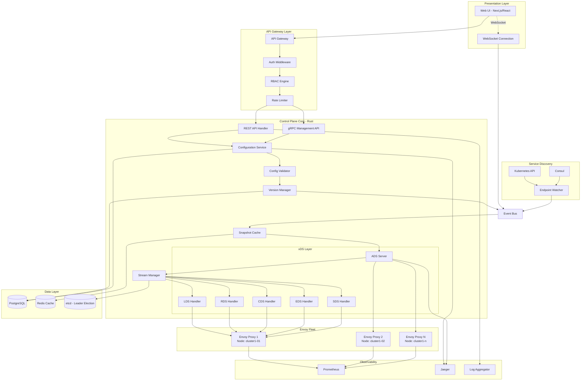
```mermaid
graph TB
    subgraph "Presentation Layer"
        UI[Web UI - Next.js/React]
        WS[WebSocket Connection]
    end

    subgraph "API Gateway Layer"
        APIGW[API Gateway]
        AUTH[Auth Middleware]
        RBAC[RBAC Engine]
        RATELIM[Rate Limiter]
    end

    subgraph "Control Plane Core - Rust"
        REST[REST API Handler]
        GRPC_MGMT[gRPC Management API]
        CONFIGSVC[Configuration Service]
        VALIDATOR[Config Validator]
        VERSIONMGR[Version Manager]

        subgraph "xDS Layer"
            ADS[ADS Server]
            LDS[LDS Handler]
            RDS[RDS Handler]
            CDS[CDS Handler]
            EDS[EDS Handler]
            SDS[SDS Handler]
        end

        SNAPCACHE[Snapshot Cache]
        STREAMMGR[Stream Manager]
    end

    EVENTBUS[Event Bus]

    subgraph "Data Layer"
        POSTGRES[(PostgreSQL)]
        REDIS[(Redis Cache)]
        ETCD[(etcd - Leader Election)]
    end

    subgraph "Service Discovery"
        K8S[Kubernetes API]
        CONSUL[Consul]
        EPWATCHER[Endpoint Watcher]
    end

    subgraph "Envoy Fleet"
        E1[Envoy Proxy 1<br/>Node: cluster1-01]
        E2[Envoy Proxy 2<br/>Node: cluster1-02]
        EN[Envoy Proxy N<br/>Node: cluster1-n]
    end

    subgraph "Observability"
        PROM[Prometheus]
        JAEGER[Jaeger]
        LOGS[Log Aggregator]
    end

    UI --> APIGW
    UI -.WebSocket.-> WS
    WS --> EVENTBUS

    APIGW --> AUTH
    AUTH --> RBAC
    RBAC --> RATELIM
    RATELIM --> REST
    RATELIM --> GRPC_MGMT

    REST --> CONFIGSVC
    GRPC_MGMT --> CONFIGSVC

    CONFIGSVC --> VALIDATOR
    VALIDATOR --> VERSIONMGR
    VERSIONMGR --> POSTGRES
    VERSIONMGR --> EVENTBUS

    EVENTBUS --> SNAPCACHE
    SNAPCACHE --> ADS

    ADS --> STREAMMGR
    STREAMMGR --> LDS
    STREAMMGR --> RDS
    STREAMMGR --> CDS
    STREAMMGR --> EDS
    STREAMMGR --> SDS

    LDS --> E1
    RDS --> E1
    CDS --> E1
    EDS --> E1
    SDS --> E1

    ADS --> E2
    ADS --> EN

    K8S --> EPWATCHER
    CONSUL --> EPWATCHER
    EPWATCHER --> EVENTBUS

    SNAPCACHE --> REDIS
    CONFIGSVC --> POSTGRES
    STREAMMGR --> ETCD

    E1 --> PROM
    E2 --> PROM
    EN --> PROM
    CONFIGSVC --> JAEGER
    ADS --> JAEGER
    REST --> LOGS
```

### 2.2 Layer Responsibilities

| Layer | Responsibility | Technology |
|-------|---------------|------------|
| **Presentation** | User interface, visualization, real-time updates | Next.js, React, WebSocket |
| **API Gateway** | Authentication, authorization, rate limiting, routing | Rust (Axum/Actix-web) |
| **Control Plane** | Configuration management, validation, xDS protocol | Rust (Tonic, Tokio) |
| **Data** | Persistent storage, caching, distributed coordination | PostgreSQL, Redis, etcd |
| **Service Discovery** | Dynamic endpoint resolution, health monitoring | Kubernetes, Consul |
| **Data Plane** | Traffic routing, load balancing, observability | Envoy Proxy |
| **Observability** | Metrics, traces, logs | Prometheus, Jaeger, Loki |

---

## 3. Component Design

### 3.1 Web UI (Next.js/React)

#### 3.1.1 Architecture

```typescript
// UI Component Structure
app/
├── dashboard/
│   ├── page.tsx                    // Main dashboard
│   ├── proxies/
│   │   ├── page.tsx               // Proxy fleet overview
│   │   └── [nodeId]/
│   │       ├── page.tsx           // Individual proxy details
│   │       └── config/page.tsx    // Proxy configuration view
│   ├── configs/
│   │   ├── page.tsx               // Configuration list
│   │   ├── new/page.tsx           // Create configuration
│   │   └── [id]/
│   │       ├── edit/page.tsx      // Edit configuration
│   │       └── history/page.tsx   // Version history
│   └── monitoring/
│       ├── metrics/page.tsx       // Metrics dashboard
│       └── logs/page.tsx          // Log viewer

components/
├── config-editor/
│   ├── ListenerEditor.tsx
│   ├── RouteEditor.tsx
│   ├── ClusterEditor.tsx
│   ├── EndpointEditor.tsx
│   └── ValidationPanel.tsx
├── real-time/
│   ├── ProxyStatusMap.tsx         // Real-time proxy status
│   ├── ConfigPropagation.tsx      // Propagation visualization
│   └── WebSocketProvider.tsx      // WebSocket connection manager
└── visualization/
    ├── TopologyGraph.tsx           // Service mesh topology
    ├── TrafficFlowDiagram.tsx      // Traffic flow visualization
    └── HealthHeatmap.tsx           // Proxy health heatmap

lib/
├── api/
│   ├── client.ts                   // API client configuration
│   ├── configs.ts                  // Configuration API calls
│   ├── proxies.ts                  // Proxy management API calls
│   └── websocket.ts                // WebSocket event handlers
└── state/
    ├── configStore.ts              // Configuration state management
    ├── proxyStore.ts               // Proxy fleet state
    └── uiStore.ts                  // UI state (selections, filters)
```

#### 3.1.2 Key Features

1. **Configuration Editor**
   - Monaco-based YAML/JSON editor with syntax highlighting
   - Real-time validation as you type
   - Auto-completion for Envoy configuration schemas
   - Side-by-side diff viewer for version comparison

2. **Real-Time Updates**
   - WebSocket connection for live proxy status
   - Server-Sent Events (SSE) for configuration propagation tracking
   - Live metrics and health indicators

3. **Visualization**
   - Service mesh topology graph
   - Configuration propagation animation
   - Health status heatmap

4. **Dry-Run Mode**
   - Simulate configuration changes
   - Preview affected proxies
   - View validation results before applying

### 3.2 API Gateway (Rust - Axum)

#### 3.2.1 Component Structure

```rust
// API Gateway Architecture
pub struct ApiGateway {
    router: Router,
    auth_service: Arc<AuthService>,
    rbac_engine: Arc<RbacEngine>,
    rate_limiter: Arc<RateLimiter>,
    metrics: Arc<MetricsCollector>,
}

// Middleware Pipeline
pub struct MiddlewareChain {
    middlewares: Vec<Box<dyn Middleware>>,
}

// Key Middlewares
pub struct AuthMiddleware {
    jwt_validator: JwtValidator,
    mtls_validator: MtlsValidator,
}

pub struct RbacMiddleware {
    policy_engine: Arc<RbacEngine>,
    cache: Arc<RbacCache>,
}

pub struct RateLimitMiddleware {
    limiter: Arc<RateLimiter>,
    config: RateLimitConfig,
}

pub struct TracingMiddleware {
    tracer: Arc<Tracer>,
}

pub struct AuditMiddleware {
    logger: Arc<AuditLogger>,
    storage: Arc<dyn AuditStorage>,
}
```

#### 3.2.2 Request Flow Through Gateway

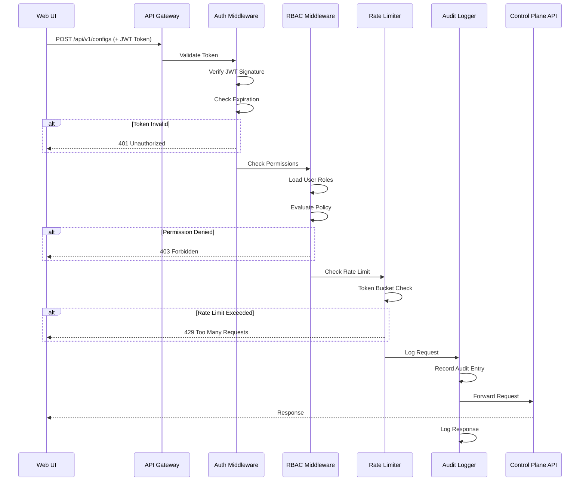
```mermaid
sequenceDiagram
    participant UI as Web UI
    participant GW as API Gateway
    participant AUTH as Auth Middleware
    participant RBAC as RBAC Middleware
    participant RATE as Rate Limiter
    participant AUDIT as Audit Logger
    participant API as Control Plane API

    UI->>GW: POST /api/v1/configs (+ JWT Token)
    GW->>AUTH: Validate Token
    AUTH->>AUTH: Verify JWT Signature
    AUTH->>AUTH: Check Expiration

    alt Token Invalid
        AUTH-->>UI: 401 Unauthorized
    end

    AUTH->>RBAC: Check Permissions
    RBAC->>RBAC: Load User Roles
    RBAC->>RBAC: Evaluate Policy

    alt Permission Denied
        RBAC-->>UI: 403 Forbidden
    end

    RBAC->>RATE: Check Rate Limit
    RATE->>RATE: Token Bucket Check

    alt Rate Limit Exceeded
        RATE-->>UI: 429 Too Many Requests
    end

    RATE->>AUDIT: Log Request
    AUDIT->>AUDIT: Record Audit Entry
    AUDIT->>API: Forward Request
    API-->>UI: Response
    AUDIT->>AUDIT: Log Response
```

### 3.3 Configuration Service (Rust)

#### 3.3.1 Service Architecture

```rust
pub struct ConfigurationService {
    storage: Arc<dyn ConfigStorage>,
    validator: Arc<ConfigValidator>,
    version_manager: Arc<VersionManager>,
    event_bus: Arc<EventBus>,
    cache: Arc<ConfigCache>,
    metrics: Arc<MetricsCollector>,
}

impl ConfigurationService {
    /// Create or update a configuration
    pub async fn upsert_config(
        &self,
        config: ProxyConfig,
        user_context: UserContext,
    ) -> Result<ConfigVersion> {
        // 1. Validate configuration
        let validation_result = self.validator.validate(&config).await?;
        if !validation_result.is_valid() {
            return Err(ValidationError(validation_result.errors));
        }

        // 2. Create new version
        let version = self.version_manager.create_version(&config).await?;

        // 3. Store in database with transaction
        let config_id = self.storage.save_config(config, version).await?;

        // 4. Update cache
        self.cache.set(config_id, config.clone()).await?;

        // 5. Publish event to event bus
        self.event_bus.publish(ConfigChangeEvent {
            config_id,
            version,
            change_type: ChangeType::Update,
            user: user_context.user_id,
            timestamp: Utc::now(),
        }).await?;

        // 6. Record metrics
        self.metrics.record_config_change(&config, &user_context);

        Ok(version)
    }

    /// Apply configuration to proxies
    pub async fn apply_config(
        &self,
        config_id: ConfigId,
        target_selector: ProxySelector,
        options: ApplyOptions,
    ) -> Result<ApplyResult> {
        // 1. Load configuration
        let config = self.storage.load_config(&config_id).await?;

        // 2. Dry-run validation if requested
        if options.dry_run {
            return self.dry_run_apply(&config, &target_selector).await;
        }

        // 3. Resolve target proxies
        let target_proxies = self.resolve_targets(&target_selector).await?;

        // 4. Create deployment plan
        let plan = DeploymentPlan::new(config, target_proxies, options);

        // 5. Execute deployment with rollout strategy
        let result = self.execute_deployment(plan).await?;

        Ok(result)
    }
}
```

#### 3.3.2 Configuration Validation Pipeline

```rust
pub struct ConfigValidator {
    validators: Vec<Box<dyn Validator>>,
}

pub trait Validator: Send + Sync {
    async fn validate(&self, config: &ProxyConfig) -> ValidationResult;
}

// Validation Chain
pub struct SchemaValidator;          // JSON schema validation
pub struct SemanticValidator;         // Logical consistency checks
pub struct DependencyValidator;       // Cross-reference validation
pub struct SecurityValidator;         // Security policy checks
pub struct QuotaValidator;            // Resource quota checks
pub struct ConflictValidator;         // Conflict detection with existing configs
```

### 3.4 Snapshot Cache (Rust)

#### 3.4.1 Cache Architecture

```rust
use dashmap::DashMap;
use std::sync::atomic::{AtomicU64, Ordering};

pub struct SnapshotCache {
    // Per-node configuration snapshots
    snapshots: DashMap<NodeId, Arc<Snapshot>>,

    // Global version counter
    version_counter: AtomicU64,

    // Watch channels for notification
    watchers: DashMap<NodeId, Vec<watch::Sender<Arc<Snapshot>>>>,

    // Metrics
    metrics: Arc<CacheMetrics>,
}

#[derive(Clone)]
pub struct Snapshot {
    pub version: String,
    pub node_id: NodeId,
    pub listeners: Vec<Listener>,
    pub routes: Vec<RouteConfiguration>,
    pub clusters: Vec<Cluster>,
    pub endpoints: Vec<ClusterLoadAssignment>,
    pub secrets: Vec<Secret>,
    pub metadata: SnapshotMetadata,
}

#[derive(Clone)]
pub struct SnapshotMetadata {
    pub created_at: DateTime<Utc>,
    pub config_version: String,
    pub checksum: String,
    pub dependencies: Vec<ConfigId>,
}

impl SnapshotCache {
    /// Update snapshot for a specific node
    pub async fn update_snapshot(
        &self,
        node_id: NodeId,
        snapshot: Snapshot,
    ) -> Result<()> {
        let version = self.version_counter.fetch_add(1, Ordering::SeqCst);
        let snapshot = Arc::new(snapshot);

        // Store snapshot
        self.snapshots.insert(node_id.clone(), snapshot.clone());

        // Notify watchers
        if let Some(watchers) = self.watchers.get(&node_id) {
            for watcher in watchers.iter() {
                let _ = watcher.send(snapshot.clone());
            }
        }

        // Record metrics
        self.metrics.record_snapshot_update(&node_id, version);

        Ok(())
    }

    /// Get snapshot for a node
    pub async fn get_snapshot(&self, node_id: &NodeId) -> Option<Arc<Snapshot>> {
        self.snapshots.get(node_id).map(|s| s.clone())
    }

    /// Watch for snapshot changes
    pub async fn watch_snapshot(
        &self,
        node_id: NodeId,
    ) -> watch::Receiver<Arc<Snapshot>> {
        let (tx, rx) = watch::channel(
            self.get_snapshot(&node_id)
                .await
                .unwrap_or_else(|| Arc::new(Snapshot::default()))
        );

        self.watchers.entry(node_id).or_insert_with(Vec::new).push(tx);

        rx
    }
}
```

### 3.5 xDS Server (Rust - Tonic)

#### 3.5.1 ADS Server Implementation

```rust
use tonic::{Request, Response, Status, Streaming};
use envoy::service::discovery::v3::{
    aggregated_discovery_service_server::AggregatedDiscoveryService,
    DiscoveryRequest, DiscoveryResponse, DeltaDiscoveryRequest, DeltaDiscoveryResponse,
};

pub struct AdsServer {
    snapshot_cache: Arc<SnapshotCache>,
    stream_manager: Arc<StreamManager>,
    metrics: Arc<XdsMetrics>,
}

#[tonic::async_trait]
impl AggregatedDiscoveryService for AdsServer {
    type StreamAggregatedResourcesStream =
        Pin<Box<dyn Stream<Item = Result<DiscoveryResponse, Status>> + Send>>;

    async fn stream_aggregated_resources(
        &self,
        request: Request<Streaming<DiscoveryRequest>>,
    ) -> Result<Response<Self::StreamAggregatedResourcesStream>, Status> {
        let peer_addr = request.remote_addr();
        let mut stream = request.into_inner();

        // Create bidirectional stream handler
        let stream_id = StreamId::new();
        let (response_tx, response_rx) = mpsc::channel(100);

        // Spawn request handler
        let snapshot_cache = self.snapshot_cache.clone();
        let stream_manager = self.stream_manager.clone();
        let metrics = self.metrics.clone();

        tokio::spawn(async move {
            while let Some(result) = stream.next().await {
                match result {
                    Ok(request) => {
                        if let Err(e) = Self::handle_discovery_request(
                            request,
                            &snapshot_cache,
                            &stream_manager,
                            &metrics,
                            &response_tx,
                        ).await {
                            error!("Error handling discovery request: {}", e);
                        }
                    }
                    Err(e) => {
                        error!("Stream error: {}", e);
                        break;
                    }
                }
            }
        });

        Ok(Response::new(Box::pin(ReceiverStream::new(response_rx))))
    }

    async fn delta_aggregated_resources(
        &self,
        request: Request<Streaming<DeltaDiscoveryRequest>>,
    ) -> Result<Response<Self::DeltaAggregatedResourcesStream>, Status> {
        // Incremental xDS implementation
        todo!("Implement Delta xDS")
    }
}

impl AdsServer {
    async fn handle_discovery_request(
        request: DiscoveryRequest,
        snapshot_cache: &Arc<SnapshotCache>,
        stream_manager: &Arc<StreamManager>,
        metrics: &Arc<XdsMetrics>,
        response_tx: &mpsc::Sender<Result<DiscoveryResponse, Status>>,
    ) -> Result<()> {
        // 1. Extract node information
        let node = request.node.ok_or_else(|| anyhow!("Missing node info"))?;
        let node_id = NodeId::from_envoy_node(&node);

        // 2. Parse requested resource type
        let type_url = TypeUrl::from_str(&request.type_url)?;

        // 3. Handle ACK/NACK
        if !request.response_nonce.is_empty() {
            Self::handle_ack_nack(&request, &node_id, metrics).await?;
        }

        // 4. Get snapshot for this node
        let snapshot = snapshot_cache.get_snapshot(&node_id).await
            .ok_or_else(|| anyhow!("No snapshot for node {}", node_id))?;

        // 5. Build discovery response based on type
        let response = match type_url {
            TypeUrl::Listener => Self::build_lds_response(&snapshot, &request)?,
            TypeUrl::RouteConfiguration => Self::build_rds_response(&snapshot, &request)?,
            TypeUrl::Cluster => Self::build_cds_response(&snapshot, &request)?,
            TypeUrl::ClusterLoadAssignment => Self::build_eds_response(&snapshot, &request)?,
            TypeUrl::Secret => Self::build_sds_response(&snapshot, &request)?,
        };

        // 6. Send response
        response_tx.send(Ok(response)).await?;

        // 7. Record metrics
        metrics.record_xds_response(&node_id, &type_url);

        Ok(())
    }

    async fn handle_ack_nack(
        request: &DiscoveryRequest,
        node_id: &NodeId,
        metrics: &Arc<XdsMetrics>,
    ) -> Result<()> {
        if request.error_detail.is_some() {
            // NACK - configuration rejected
            error!(
                "Configuration NACK from node {}: {:?}",
                node_id, request.error_detail
            );
            metrics.record_nack(node_id, &request.type_url);
        } else {
            // ACK - configuration accepted
            debug!("Configuration ACK from node {}", node_id);
            metrics.record_ack(node_id, &request.type_url);
        }
        Ok(())
    }
}
```

### 3.6 Stream Manager

```rust
pub struct StreamManager {
    active_streams: DashMap<StreamId, StreamState>,
    node_streams: DashMap<NodeId, Vec<StreamId>>,
    metrics: Arc<StreamMetrics>,
}

pub struct StreamState {
    stream_id: StreamId,
    node_id: NodeId,
    connected_at: DateTime<Utc>,
    last_activity: DateTime<Utc>,
    subscribed_types: HashSet<TypeUrl>,
    sent_versions: HashMap<TypeUrl, String>,
    acked_versions: HashMap<TypeUrl, String>,
}

impl StreamManager {
    pub async fn register_stream(
        &self,
        stream_id: StreamId,
        node_id: NodeId,
    ) -> Result<()> {
        let state = StreamState {
            stream_id: stream_id.clone(),
            node_id: node_id.clone(),
            connected_at: Utc::now(),
            last_activity: Utc::now(),
            subscribed_types: HashSet::new(),
            sent_versions: HashMap::new(),
            acked_versions: HashMap::new(),
        };

        self.active_streams.insert(stream_id.clone(), state);
        self.node_streams.entry(node_id.clone())
            .or_insert_with(Vec::new)
            .push(stream_id);

        self.metrics.record_stream_connect(&node_id);

        Ok(())
    }

    pub async fn is_update_needed(
        &self,
        node_id: &NodeId,
        type_url: &TypeUrl,
        new_version: &str,
    ) -> bool {
        if let Some(streams) = self.node_streams.get(node_id) {
            for stream_id in streams.iter() {
                if let Some(state) = self.active_streams.get(stream_id) {
                    if let Some(acked_version) = state.acked_versions.get(type_url) {
                        return acked_version != new_version;
                    }
                }
            }
        }
        true // No acked version, update needed
    }
}
```

---

## 4. Information Flow Layers

### 4.1 Layer 1: User Interaction (UI)

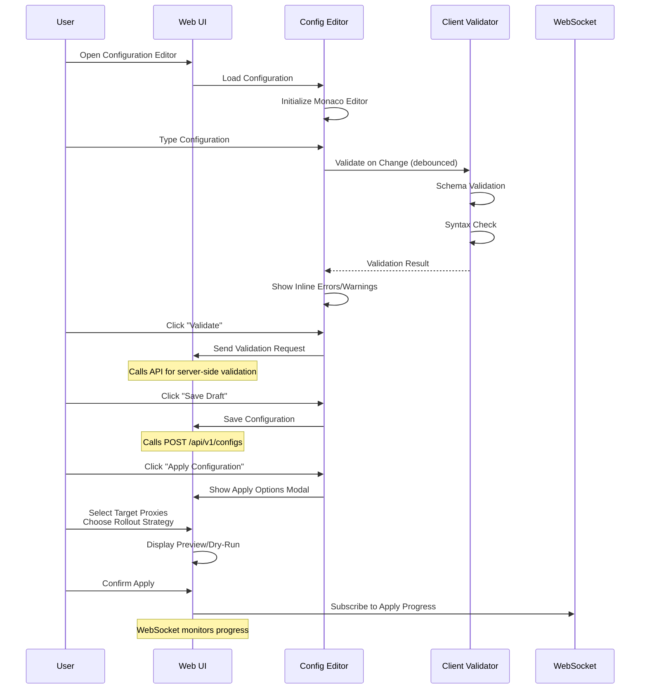
```mermaid
sequenceDiagram
    participant User
    participant UI as Web UI
    participant Editor as Config Editor
    participant Validator as Client Validator
    participant WS as WebSocket

    User->>UI: Open Configuration Editor
    UI->>Editor: Load Configuration
    Editor->>Editor: Initialize Monaco Editor

    User->>Editor: Type Configuration
    Editor->>Validator: Validate on Change (debounced)
    Validator->>Validator: Schema Validation
    Validator->>Validator: Syntax Check
    Validator-->>Editor: Validation Result
    Editor->>Editor: Show Inline Errors/Warnings

    User->>Editor: Click "Validate"
    Editor->>UI: Send Validation Request
    Note over UI: Calls API for server-side validation

    User->>Editor: Click "Save Draft"
    Editor->>UI: Save Configuration
    Note over UI: Calls POST /api/v1/configs

    User->>Editor: Click "Apply Configuration"
    Editor->>UI: Show Apply Options Modal
    User->>UI: Select Target Proxies<br/>Choose Rollout Strategy
    UI->>UI: Display Preview/Dry-Run
    User->>UI: Confirm Apply
    UI->>WS: Subscribe to Apply Progress
    Note over UI: WebSocket monitors progress
```

**Key Points:**
- Client-side validation provides immediate feedback
- Debounced validation prevents excessive API calls
- WebSocket subscription for real-time progress updates

### 4.2 Layer 2: API Gateway Processing

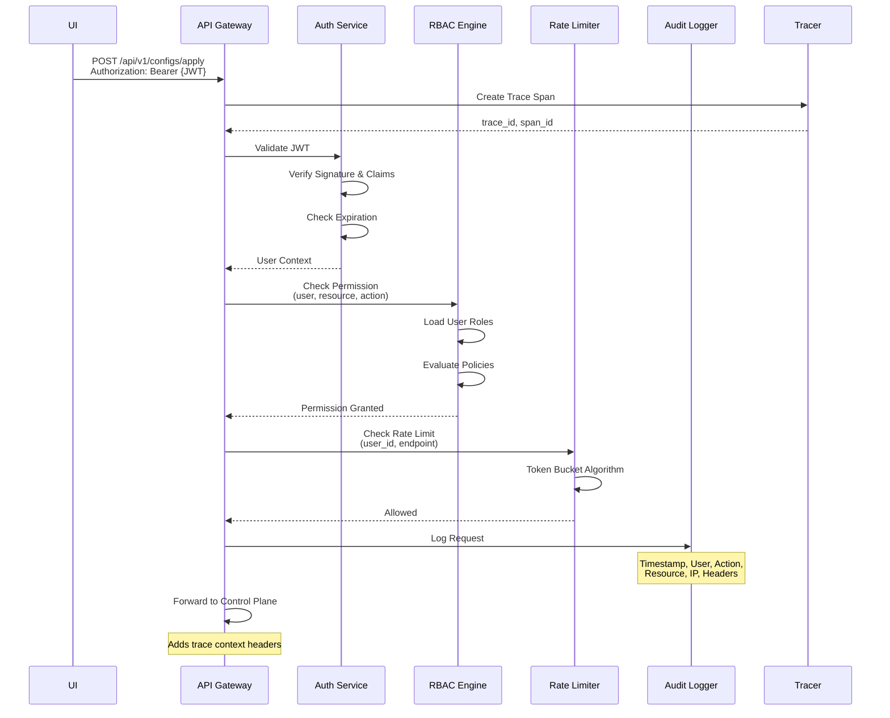
```mermaid
sequenceDiagram
    participant UI
    participant GW as API Gateway
    participant AUTH as Auth Service
    participant RBAC as RBAC Engine
    participant RATE as Rate Limiter
    participant AUDIT as Audit Logger
    participant TRACE as Tracer

    UI->>GW: POST /api/v1/configs/apply<br/>Authorization: Bearer {JWT}

    GW->>TRACE: Create Trace Span
    TRACE-->>GW: trace_id, span_id

    GW->>AUTH: Validate JWT
    AUTH->>AUTH: Verify Signature & Claims
    AUTH->>AUTH: Check Expiration
    AUTH-->>GW: User Context

    GW->>RBAC: Check Permission<br/>(user, resource, action)
    RBAC->>RBAC: Load User Roles
    RBAC->>RBAC: Evaluate Policies
    RBAC-->>GW: Permission Granted

    GW->>RATE: Check Rate Limit<br/>(user_id, endpoint)
    RATE->>RATE: Token Bucket Algorithm
    RATE-->>GW: Allowed

    GW->>AUDIT: Log Request
    Note over AUDIT: Timestamp, User, Action,<br/>Resource, IP, Headers

    GW->>GW: Forward to Control Plane
    Note over GW: Adds trace context headers
```

**Security Layers:**
1. **Authentication**: JWT validation with RS256 signature
2. **Authorization**: Policy-based RBAC with resource-level permissions
3. **Rate Limiting**: Per-user, per-endpoint token bucket
4. **Audit Logging**: Complete request/response logging

### 4.3 Layer 3: Configuration Processing

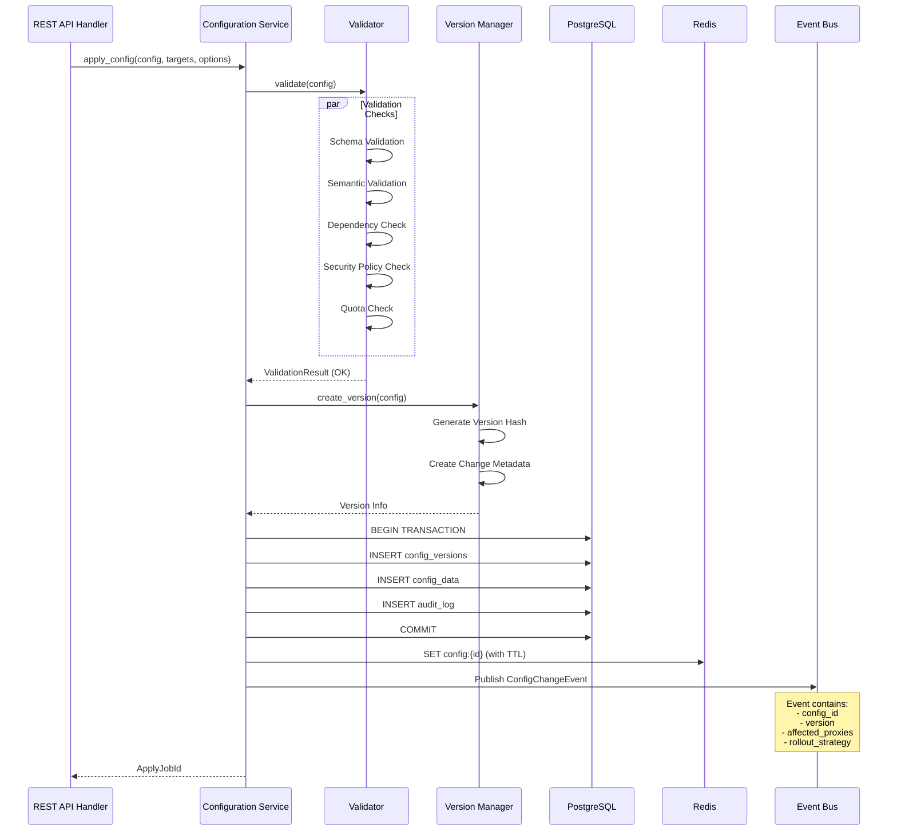
```mermaid
sequenceDiagram
    participant API as REST API Handler
    participant CFG as Configuration Service
    participant VAL as Validator
    participant VER as Version Manager
    participant DB as PostgreSQL
    participant CACHE as Redis
    participant BUS as Event Bus

    API->>CFG: apply_config(config, targets, options)
    CFG->>VAL: validate(config)

    par Validation Checks
        VAL->>VAL: Schema Validation
        VAL->>VAL: Semantic Validation
        VAL->>VAL: Dependency Check
        VAL->>VAL: Security Policy Check
        VAL->>VAL: Quota Check
    end

    VAL-->>CFG: ValidationResult (OK)

    CFG->>VER: create_version(config)
    VER->>VER: Generate Version Hash
    VER->>VER: Create Change Metadata
    VER-->>CFG: Version Info

    CFG->>DB: BEGIN TRANSACTION
    CFG->>DB: INSERT config_versions
    CFG->>DB: INSERT config_data
    CFG->>DB: INSERT audit_log
    CFG->>DB: COMMIT

    CFG->>CACHE: SET config:{id} (with TTL)

    CFG->>BUS: Publish ConfigChangeEvent
    Note over BUS: Event contains:<br/>- config_id<br/>- version<br/>- affected_proxies<br/>- rollout_strategy

    CFG-->>API: ApplyJobId
```

**Validation Pipeline:**
1. **Schema**: JSON schema validation against Envoy xDS spec
2. **Semantic**: Logical consistency (e.g., routes reference valid clusters)
3. **Dependency**: Cross-reference validation
4. **Security**: TLS cert validation, security policy compliance
5. **Quota**: Resource limits per tenant/namespace

### 4.4 Layer 4: Snapshot Generation

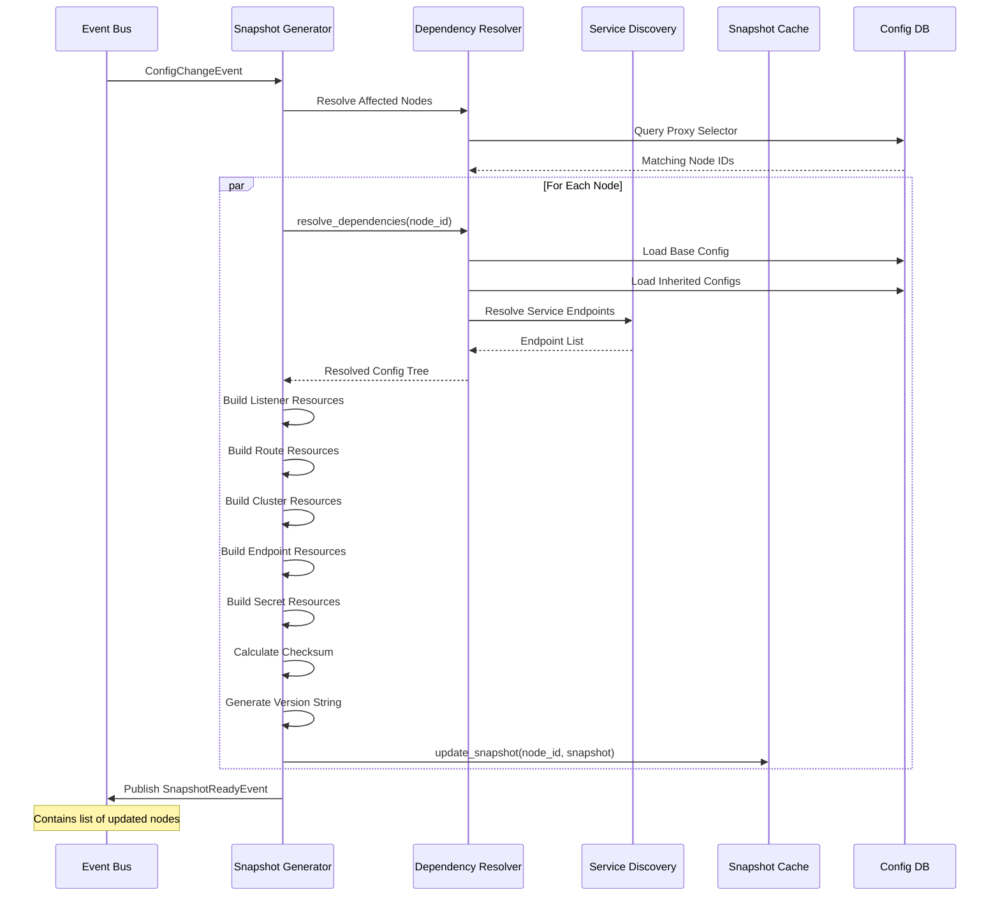
```mermaid
sequenceDiagram
    participant BUS as Event Bus
    participant SNAP as Snapshot Generator
    participant RESOLVER as Dependency Resolver
    participant SD as Service Discovery
    participant CACHE as Snapshot Cache
    participant DB as Config DB

    BUS->>SNAP: ConfigChangeEvent

    SNAP->>RESOLVER: Resolve Affected Nodes
    RESOLVER->>DB: Query Proxy Selector
    DB-->>RESOLVER: Matching Node IDs

    par For Each Node
        SNAP->>RESOLVER: resolve_dependencies(node_id)
        RESOLVER->>DB: Load Base Config
        RESOLVER->>DB: Load Inherited Configs
        RESOLVER->>SD: Resolve Service Endpoints
        SD-->>RESOLVER: Endpoint List
        RESOLVER-->>SNAP: Resolved Config Tree

        SNAP->>SNAP: Build Listener Resources
        SNAP->>SNAP: Build Route Resources
        SNAP->>SNAP: Build Cluster Resources
        SNAP->>SNAP: Build Endpoint Resources
        SNAP->>SNAP: Build Secret Resources

        SNAP->>SNAP: Calculate Checksum
        SNAP->>SNAP: Generate Version String

        SNAP->>CACHE: update_snapshot(node_id, snapshot)
    end

    SNAP->>BUS: Publish SnapshotReadyEvent
    Note over BUS: Contains list of updated nodes
```

**Snapshot Generation Process:**

1. **Dependency Resolution**: Resolve config inheritance and references
2. **Endpoint Resolution**: Query service discovery for current endpoints
3. **Resource Building**: Convert high-level config to Envoy xDS resources
4. **Versioning**: Generate consistent version string
5. **Caching**: Store in snapshot cache

### 4.5 Layer 5: xDS Distribution

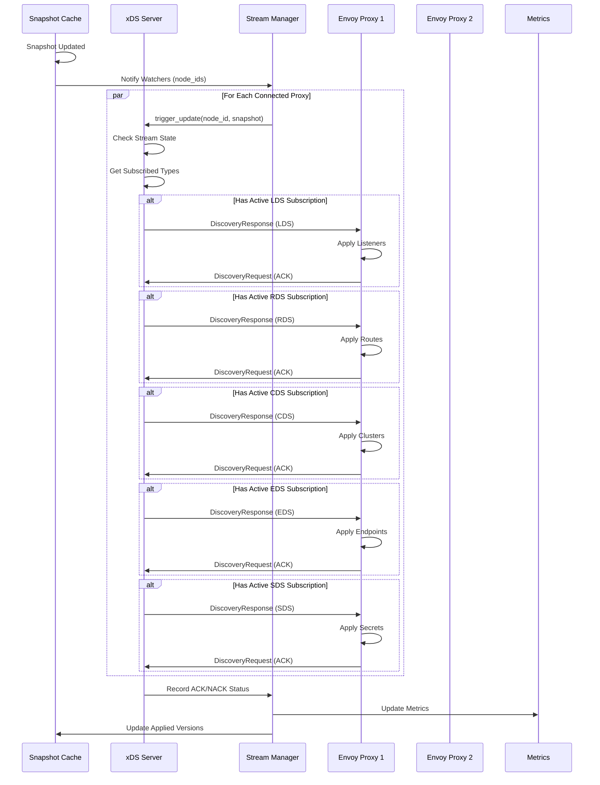
```mermaid
sequenceDiagram
    participant CACHE as Snapshot Cache
    participant XDS as xDS Server
    participant STREAM as Stream Manager
    participant E1 as Envoy Proxy 1
    participant E2 as Envoy Proxy 2
    participant METRICS as Metrics

    CACHE->>CACHE: Snapshot Updated
    CACHE->>STREAM: Notify Watchers (node_ids)

    par For Each Connected Proxy
        STREAM->>XDS: trigger_update(node_id, snapshot)

        XDS->>XDS: Check Stream State
        XDS->>XDS: Get Subscribed Types

        alt Has Active LDS Subscription
            XDS->>E1: DiscoveryResponse (LDS)
            E1->>E1: Apply Listeners
            E1->>XDS: DiscoveryRequest (ACK)
        end

        alt Has Active RDS Subscription
            XDS->>E1: DiscoveryResponse (RDS)
            E1->>E1: Apply Routes
            E1->>XDS: DiscoveryRequest (ACK)
        end

        alt Has Active CDS Subscription
            XDS->>E1: DiscoveryResponse (CDS)
            E1->>E1: Apply Clusters
            E1->>XDS: DiscoveryRequest (ACK)
        end

        alt Has Active EDS Subscription
            XDS->>E1: DiscoveryResponse (EDS)
            E1->>E1: Apply Endpoints
            E1->>XDS: DiscoveryRequest (ACK)
        end

        alt Has Active SDS Subscription
            XDS->>E1: DiscoveryResponse (SDS)
            E1->>E1: Apply Secrets
            E1->>XDS: DiscoveryRequest (ACK)
        end
    end

    XDS->>STREAM: Record ACK/NACK Status
    STREAM->>METRICS: Update Metrics
    STREAM->>CACHE: Update Applied Versions
```

**xDS Resource Ordering (Important!):**

Envoy requires resources to be applied in a specific order to maintain consistency:

1. **CDS** (Clusters) - Define upstream services
2. **EDS** (Endpoints) - Populate cluster endpoints
3. **LDS** (Listeners) - Define network listeners
4. **RDS** (Routes) - Define HTTP routing rules (referenced by listeners)
5. **SDS** (Secrets) - TLS certificates (can be updated anytime)

**Note**: Using ADS (Aggregated Discovery Service) handles ordering automatically.

### 4.6 Layer 6: Real-Time Feedback to UI

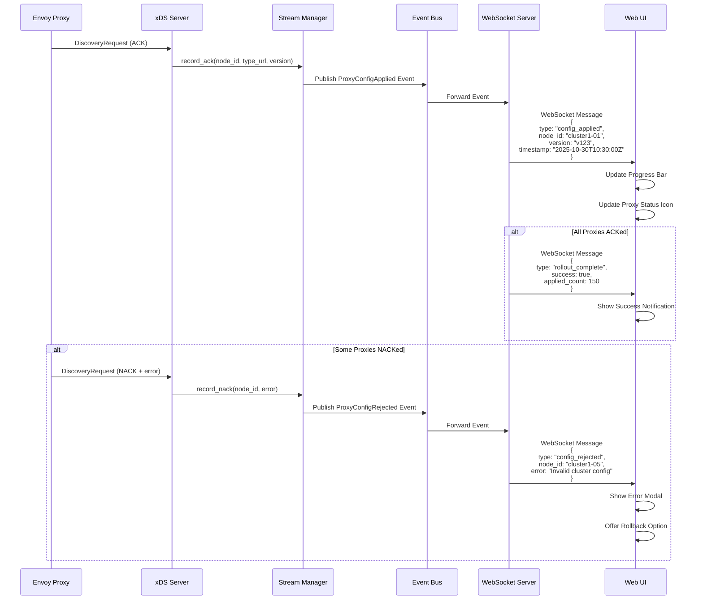
```mermaid
sequenceDiagram
    participant E as Envoy Proxy
    participant XDS as xDS Server
    participant STREAM as Stream Manager
    participant BUS as Event Bus
    participant WS as WebSocket Server
    participant UI as Web UI

    E->>XDS: DiscoveryRequest (ACK)
    XDS->>STREAM: record_ack(node_id, type_url, version)
    STREAM->>BUS: Publish ProxyConfigApplied Event

    BUS->>WS: Forward Event
    WS->>UI: WebSocket Message<br/>{<br/>  type: "config_applied",<br/>  node_id: "cluster1-01",<br/>  version: "v123",<br/>  timestamp: "2025-10-30T10:30:00Z"<br/>}

    UI->>UI: Update Progress Bar
    UI->>UI: Update Proxy Status Icon

    alt All Proxies ACKed
        WS->>UI: WebSocket Message<br/>{<br/>  type: "rollout_complete",<br/>  success: true,<br/>  applied_count: 150<br/>}
        UI->>UI: Show Success Notification
    end

    alt Some Proxies NACKed
        E->>XDS: DiscoveryRequest (NACK + error)
        XDS->>STREAM: record_nack(node_id, error)
        STREAM->>BUS: Publish ProxyConfigRejected Event
        BUS->>WS: Forward Event
        WS->>UI: WebSocket Message<br/>{<br/>  type: "config_rejected",<br/>  node_id: "cluster1-05",<br/>  error: "Invalid cluster config"<br/>}
        UI->>UI: Show Error Modal
        UI->>UI: Offer Rollback Option
    end
```

---

## 5. Detailed Flow Sequences

### 5.1 Complete Flow: Configuration Creation and Application

```mermaid
sequenceDiagram
    autonumber
    participant User
    participant UI
    participant GW as API Gateway
    participant CFG as Config Service
    participant VAL as Validator
    participant DB as PostgreSQL
    participant SNAP as Snapshot Gen
    participant CACHE as Snapshot Cache
    participant XDS as xDS Server
    participant E as Envoy Fleet

    User->>UI: Create New Config
    UI->>GW: POST /api/v1/configs
    GW->>GW: Auth + RBAC + Rate Limit
    GW->>CFG: create_config()

    CFG->>VAL: validate()
    VAL-->>CFG: ValidationResult (OK)

    CFG->>DB: Save Configuration
    DB-->>CFG: config_id

    CFG-->>UI: 201 Created {config_id}
    UI->>User: Show Success

    User->>UI: Apply Config to Proxies
    UI->>UI: Show Target Selection
    User->>UI: Select: namespace=prod
    User->>UI: Choose: Rolling Update (10% at a time)

    UI->>GW: POST /api/v1/configs/{id}/apply
    GW->>CFG: apply_config(id, selector, strategy)

    CFG->>CFG: Resolve Target Proxies
    Note over CFG: Query: namespace=prod<br/>Result: 100 proxies

    CFG->>CFG: Create Deployment Waves
    Note over CFG: Wave 1: 10 proxies<br/>Wave 2: 10 proxies<br/>...<br/>Wave 10: 10 proxies

    loop For Each Wave
        CFG->>SNAP: generate_snapshots(proxy_ids)

        par For Each Proxy in Wave
            SNAP->>SNAP: Build Snapshot
            SNAP->>CACHE: update_snapshot(node_id)
        end

        CACHE->>XDS: Notify: snapshots updated

        par For Each Proxy in Wave
            XDS->>E: Send xDS Updates
            E->>E: Apply Config
            E->>XDS: ACK/NACK
        end

        XDS->>CFG: Report Wave Status
        CFG->>UI: WebSocket: Wave Complete

        alt All ACKs in Wave
            CFG->>CFG: Continue to Next Wave
        else Any NACKs in Wave
            CFG->>CFG: Halt Rollout
            CFG->>UI: WebSocket: Rollout Failed
            break Deployment Failed
        end
    end

    CFG->>UI: WebSocket: Rollout Complete
    UI->>User: Show Success Summary
```

### 5.2 Service Discovery Integration Flow

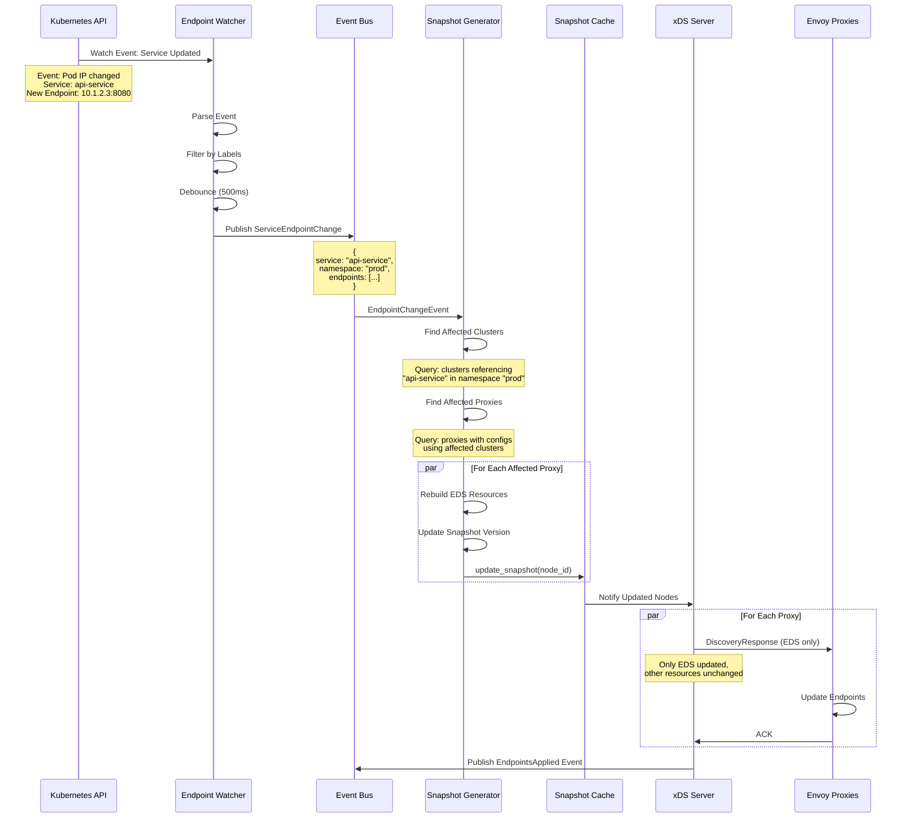
```mermaid
sequenceDiagram
    participant K8S as Kubernetes API
    participant WATCHER as Endpoint Watcher
    participant BUS as Event Bus
    participant SNAP as Snapshot Generator
    participant CACHE as Snapshot Cache
    participant XDS as xDS Server
    participant E as Envoy Proxies

    K8S->>WATCHER: Watch Event: Service Updated
    Note over K8S: Event: Pod IP changed<br/>Service: api-service<br/>New Endpoint: 10.1.2.3:8080

    WATCHER->>WATCHER: Parse Event
    WATCHER->>WATCHER: Filter by Labels
    WATCHER->>WATCHER: Debounce (500ms)

    WATCHER->>BUS: Publish ServiceEndpointChange
    Note over BUS: {<br/>  service: "api-service",<br/>  namespace: "prod",<br/>  endpoints: [...]<br/>}

    BUS->>SNAP: EndpointChangeEvent

    SNAP->>SNAP: Find Affected Clusters
    Note over SNAP: Query: clusters referencing<br/>"api-service" in namespace "prod"

    SNAP->>SNAP: Find Affected Proxies
    Note over SNAP: Query: proxies with configs<br/>using affected clusters

    par For Each Affected Proxy
        SNAP->>SNAP: Rebuild EDS Resources
        SNAP->>SNAP: Update Snapshot Version
        SNAP->>CACHE: update_snapshot(node_id)
    end

    CACHE->>XDS: Notify Updated Nodes

    par For Each Proxy
        XDS->>E: DiscoveryResponse (EDS only)
        Note over XDS: Only EDS updated,<br/>other resources unchanged
        E->>E: Update Endpoints
        E->>XDS: ACK
    end

    XDS->>BUS: Publish EndpointsApplied Event
```

**Key Optimizations:**

1. **Debouncing**: Wait 500ms for rapid changes to settle
2. **Incremental Updates**: Only send EDS, not full config
3. **Targeted Distribution**: Only notify affected proxies
4. **Event Deduplication**: Prevent duplicate endpoint updates

### 5.3 Configuration Rollback Flow

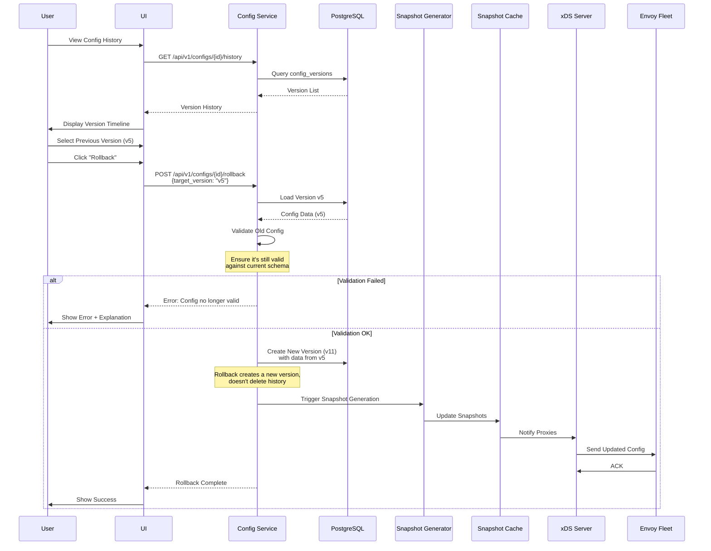
```mermaid
sequenceDiagram
    participant User
    participant UI
    participant CFG as Config Service
    participant DB as PostgreSQL
    participant SNAP as Snapshot Generator
    participant CACHE as Snapshot Cache
    participant XDS as xDS Server
    participant E as Envoy Fleet

    User->>UI: View Config History
    UI->>CFG: GET /api/v1/configs/{id}/history
    CFG->>DB: Query config_versions
    DB-->>CFG: Version List
    CFG-->>UI: Version History

    UI->>User: Display Version Timeline
    User->>UI: Select Previous Version (v5)
    User->>UI: Click "Rollback"

    UI->>CFG: POST /api/v1/configs/{id}/rollback<br/>{target_version: "v5"}

    CFG->>DB: Load Version v5
    DB-->>CFG: Config Data (v5)

    CFG->>CFG: Validate Old Config
    Note over CFG: Ensure it's still valid<br/>against current schema

    alt Validation Failed
        CFG-->>UI: Error: Config no longer valid
        UI->>User: Show Error + Explanation
    else Validation OK
        CFG->>DB: Create New Version (v11)<br/>with data from v5
        Note over CFG: Rollback creates a new version,<br/>doesn't delete history

        CFG->>SNAP: Trigger Snapshot Generation
        SNAP->>CACHE: Update Snapshots
        CACHE->>XDS: Notify Proxies
        XDS->>E: Send Updated Config
        E->>XDS: ACK

        CFG-->>UI: Rollback Complete
        UI->>User: Show Success
    end
```

### 5.4 Health Check and Failure Detection

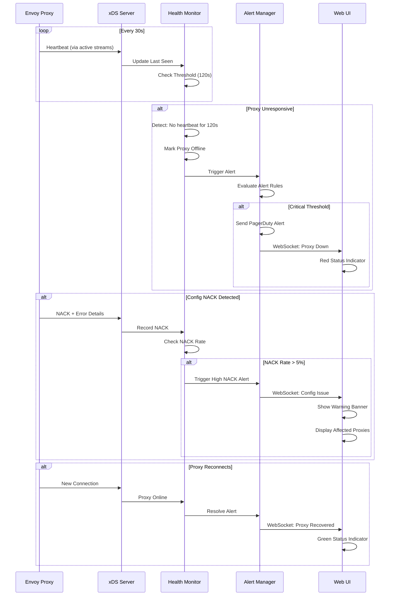
```mermaid
sequenceDiagram
    participant E as Envoy Proxy
    participant XDS as xDS Server
    participant MON as Health Monitor
    participant ALERT as Alert Manager
    participant UI as Web UI

    loop Every 30s
        E->>XDS: Heartbeat (via active streams)
        XDS->>MON: Update Last Seen
        MON->>MON: Check Threshold (120s)
    end

    alt Proxy Unresponsive
        MON->>MON: Detect: No heartbeat for 120s
        MON->>MON: Mark Proxy Offline
        MON->>ALERT: Trigger Alert
        ALERT->>ALERT: Evaluate Alert Rules

        alt Critical Threshold
            ALERT->>ALERT: Send PagerDuty Alert
            ALERT->>UI: WebSocket: Proxy Down
            UI->>UI: Red Status Indicator
        end
    end

    alt Config NACK Detected
        E->>XDS: NACK + Error Details
        XDS->>MON: Record NACK
        MON->>MON: Check NACK Rate

        alt NACK Rate > 5%
            MON->>ALERT: Trigger High NACK Alert
            ALERT->>UI: WebSocket: Config Issue
            UI->>UI: Show Warning Banner
            UI->>UI: Display Affected Proxies
        end
    end

    alt Proxy Reconnects
        E->>XDS: New Connection
        XDS->>MON: Proxy Online
        MON->>ALERT: Resolve Alert
        ALERT->>UI: WebSocket: Proxy Recovered
        UI->>UI: Green Status Indicator
    end
```

---

## 6. State Management

### 6.1 Configuration State Machine

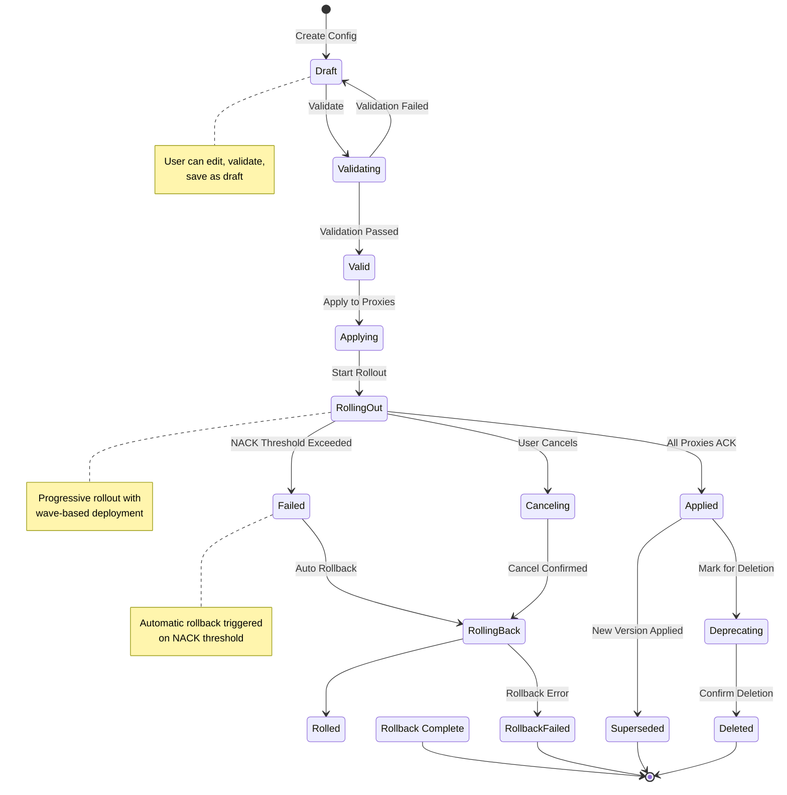
```mermaid
stateDiagram-v2
    [*] --> Draft: Create Config

    Draft --> Validating: Validate
    Validating --> Draft: Validation Failed
    Validating --> Valid: Validation Passed

    Valid --> Applying: Apply to Proxies
    Applying --> RollingOut: Start Rollout

    RollingOut --> Applied: All Proxies ACK
    RollingOut --> Failed: NACK Threshold Exceeded
    RollingOut --> Canceling: User Cancels

    Failed --> RollingBack: Auto Rollback
    Canceling --> RollingBack: Cancel Confirmed

    RollingBack --> Rolled Back: Rollback Complete
    RollingBack --> RollbackFailed: Rollback Error

    Applied --> Superseded: New Version Applied
    Applied --> Deprecating: Mark for Deletion

    Deprecating --> Deleted: Confirm Deletion

    Rolled Back --> [*]
    RollbackFailed --> [*]
    Superseded --> [*]
    Deleted --> [*]

    note right of Draft
        User can edit, validate,
        save as draft
    end note

    note right of RollingOut
        Progressive rollout with
        wave-based deployment
    end note

    note right of Failed
        Automatic rollback triggered
        on NACK threshold
    end note
```

### 6.2 Proxy Connection State

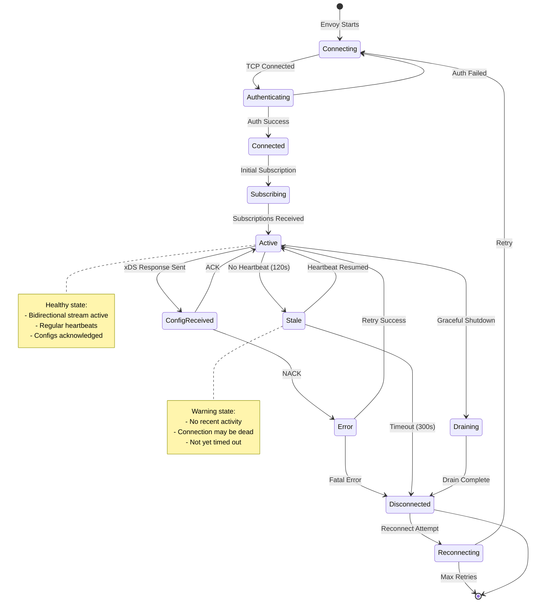
```mermaid
stateDiagram-v2
    [*] --> Connecting: Envoy Starts

    Connecting --> Authenticating: TCP Connected
    Authenticating --> Connecting: Auth Failed
    Authenticating --> Connected: Auth Success

    Connected --> Subscribing: Initial Subscription
    Subscribing --> Active: Subscriptions Received

    Active --> ConfigReceived: xDS Response Sent
    ConfigReceived --> Active: ACK
    ConfigReceived --> Error: NACK

    Error --> Active: Retry Success
    Error --> Disconnected: Fatal Error

    Active --> Stale: No Heartbeat (120s)
    Stale --> Active: Heartbeat Resumed
    Stale --> Disconnected: Timeout (300s)

    Active --> Draining: Graceful Shutdown
    Draining --> Disconnected: Drain Complete

    Disconnected --> Reconnecting: Reconnect Attempt
    Reconnecting --> Connecting: Retry
    Reconnecting --> [*]: Max Retries

    Disconnected --> [*]

    note right of Active
        Healthy state:
        - Bidirectional stream active
        - Regular heartbeats
        - Configs acknowledged
    end note

    note right of Stale
        Warning state:
        - No recent activity
        - Connection may be dead
        - Not yet timed out
    end note
```

### 6.3 Deployment State Tracking

```rust
#[derive(Debug, Clone, Serialize, Deserialize)]
pub struct DeploymentState {
    pub deployment_id: Uuid,
    pub config_id: ConfigId,
    pub config_version: String,
    pub status: DeploymentStatus,
    pub strategy: RolloutStrategy,
    pub waves: Vec<DeploymentWave>,
    pub started_at: DateTime<Utc>,
    pub completed_at: Option<DateTime<Utc>>,
    pub rollback_version: Option<String>,
}

#[derive(Debug, Clone, Serialize, Deserialize)]
pub enum DeploymentStatus {
    Pending,
    InProgress { current_wave: usize },
    Paused { at_wave: usize },
    Completed,
    Failed { reason: String, at_wave: usize },
    RollingBack,
    RolledBack,
}

#[derive(Debug, Clone, Serialize, Deserialize)]
pub struct DeploymentWave {
    pub wave_number: usize,
    pub target_proxies: Vec<NodeId>,
    pub status: WaveStatus,
    pub acks: usize,
    pub nacks: usize,
    pub errors: Vec<ProxyError>,
    pub started_at: Option<DateTime<Utc>>,
    pub completed_at: Option<DateTime<Utc>>,
}

#[derive(Debug, Clone, Serialize, Deserialize)]
pub enum WaveStatus {
    Pending,
    InProgress,
    Completed,
    Failed,
}
```

---

## 7. Error Handling and Rollback

### 7.1 Error Classification

```rust
#[derive(Debug, thiserror::Error)]
pub enum ControlPlaneError {
    // Validation Errors (4xx - User Error)
    #[error("Configuration validation failed: {0}")]
    ValidationError(ValidationErrors),

    #[error("Invalid proxy selector: {0}")]
    InvalidSelector(String),

    #[error("Configuration conflict: {0}")]
    ConfigConflict(String),

    #[error("Resource quota exceeded: {0}")]
    QuotaExceeded(String),

    // System Errors (5xx - Server Error)
    #[error("Database error: {0}")]
    DatabaseError(#[from] sqlx::Error),

    #[error("Cache error: {0}")]
    CacheError(String),

    #[error("xDS protocol error: {0}")]
    XdsError(String),

    // Operational Errors
    #[error("Deployment timeout: {0}")]
    DeploymentTimeout(String),

    #[error("Rollback failed: {0}")]
    RollbackFailed(String),

    #[error("Proxy communication error: {0}")]
    ProxyError(String),
}

impl ControlPlaneError {
    pub fn is_retryable(&self) -> bool {
        matches!(self,
            ControlPlaneError::DatabaseError(_) |
            ControlPlaneError::CacheError(_) |
            ControlPlaneError::ProxyError(_)
        )
    }

    pub fn http_status(&self) -> StatusCode {
        match self {
            ControlPlaneError::ValidationError(_) => StatusCode::BAD_REQUEST,
            ControlPlaneError::InvalidSelector(_) => StatusCode::BAD_REQUEST,
            ControlPlaneError::ConfigConflict(_) => StatusCode::CONFLICT,
            ControlPlaneError::QuotaExceeded(_) => StatusCode::FORBIDDEN,
            _ => StatusCode::INTERNAL_SERVER_ERROR,
        }
    }
}
```

### 7.2 Rollback Strategy

```rust
pub struct RollbackManager {
    config_service: Arc<ConfigurationService>,
    snapshot_cache: Arc<SnapshotCache>,
    stream_manager: Arc<StreamManager>,
}

impl RollbackManager {
    pub async fn auto_rollback(
        &self,
        deployment_id: Uuid,
        reason: RollbackReason,
    ) -> Result<RollbackResult> {
        // 1. Load deployment state
        let deployment = self.load_deployment(deployment_id).await?;

        // 2. Determine rollback target version
        let rollback_version = deployment.rollback_version
            .ok_or_else(|| anyhow!("No rollback version available"))?;

        // 3. Load previous configuration
        let previous_config = self.config_service
            .load_version(&deployment.config_id, &rollback_version)
            .await?;

        // 4. Identify proxies that received the bad config
        let affected_proxies = self.get_affected_proxies(&deployment).await?;

        // 5. Generate snapshots with previous config
        let mut rollback_tasks = Vec::new();
        for node_id in affected_proxies {
            let snapshot = self.generate_rollback_snapshot(
                &node_id,
                &previous_config,
            ).await?;

            rollback_tasks.push(self.apply_rollback_snapshot(node_id, snapshot));
        }

        // 6. Apply rollback in parallel (fast rollback)
        let results = futures::future::join_all(rollback_tasks).await;

        // 7. Check results
        let mut success_count = 0;
        let mut failure_count = 0;

        for result in results {
            match result {
                Ok(_) => success_count += 1,
                Err(_) => failure_count += 1,
            }
        }

        Ok(RollbackResult {
            success_count,
            failure_count,
            rollback_version,
        })
    }
}

#[derive(Debug)]
pub enum RollbackReason {
    HighNackRate { rate: f64, threshold: f64 },
    DeploymentTimeout,
    ManualTrigger { user: String },
    HealthCheckFailed { failed_proxies: usize },
}
```

### 7.3 Automatic Rollback Triggers

```rust
pub struct RollbackPolicy {
    pub nack_threshold_percent: f64,  // Default: 5%
    pub nack_sample_size: usize,       // Default: 10 proxies minimum
    pub timeout_duration: Duration,     // Default: 10 minutes
    pub health_check_failures: usize,  // Default: 3 consecutive failures
}

impl RollbackPolicy {
    pub fn should_rollback(
        &self,
        deployment: &DeploymentState,
        metrics: &DeploymentMetrics,
    ) -> Option<RollbackReason> {
        // Check NACK rate
        if metrics.total_responses >= self.nack_sample_size {
            let nack_rate = (metrics.nacks as f64) / (metrics.total_responses as f64);
            if nack_rate > self.nack_threshold_percent / 100.0 {
                return Some(RollbackReason::HighNackRate {
                    rate: nack_rate * 100.0,
                    threshold: self.nack_threshold_percent,
                });
            }
        }

        // Check timeout
        if let Some(started) = deployment.started_at {
            let elapsed = Utc::now() - started;
            if elapsed.to_std().unwrap() > self.timeout_duration {
                return Some(RollbackReason::DeploymentTimeout);
            }
        }

        // Check health failures
        if metrics.health_check_failures >= self.health_check_failures {
            return Some(RollbackReason::HealthCheckFailed {
                failed_proxies: metrics.health_check_failures,
            });
        }

        None
    }
}
```

---

## 8. Security and Validation

### 8.1 Multi-Layer Validation

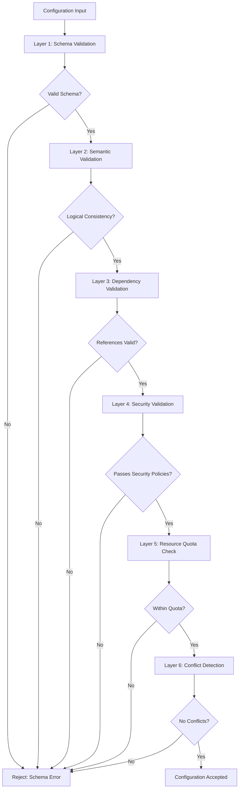
```mermaid
graph TD
    A[Configuration Input] --> B[Layer 1: Schema Validation]
    B --> C{Valid Schema?}
    C -->|No| Z[Reject: Schema Error]
    C -->|Yes| D[Layer 2: Semantic Validation]

    D --> E{Logical Consistency?}
    E -->|No| Z
    E -->|Yes| F[Layer 3: Dependency Validation]

    F --> G{References Valid?}
    G -->|No| Z
    G -->|Yes| H[Layer 4: Security Validation]

    H --> I{Passes Security Policies?}
    I -->|No| Z
    I -->|Yes| J[Layer 5: Resource Quota Check]

    J --> K{Within Quota?}
    K -->|No| Z
    K -->|Yes| L[Layer 6: Conflict Detection]

    L --> M{No Conflicts?}
    M -->|No| Z
    M -->|Yes| N[Configuration Accepted]
```

### 8.2 Security Validation Rules

```rust
pub struct SecurityValidator {
    policies: Vec<Box<dyn SecurityPolicy>>,
}

pub trait SecurityPolicy: Send + Sync {
    fn validate(&self, config: &ProxyConfig) -> Result<()>;
    fn name(&self) -> &str;
}

// Example Security Policies

pub struct TlsEnforcementPolicy;
impl SecurityPolicy for TlsEnforcementPolicy {
    fn validate(&self, config: &ProxyConfig) -> Result<()> {
        for listener in &config.listeners {
            if listener.port < 1024 && !listener.has_tls() {
                return Err(anyhow!(
                    "Privileged ports must use TLS: port {}",
                    listener.port
                ));
            }
        }
        Ok(())
    }

    fn name(&self) -> &str { "TLS Enforcement" }
}

pub struct CertificateValidationPolicy;
impl SecurityPolicy for CertificateValidationPolicy {
    fn validate(&self, config: &ProxyConfig) -> Result<()> {
        for secret in &config.secrets {
            if let SecretType::TlsCertificate { cert, key } = &secret.secret_type {
                // Validate certificate
                let cert = x509_parser::parse_x509_certificate(cert)?;

                // Check expiration
                let now = Utc::now();
                if cert.validity().not_after < now {
                    return Err(anyhow!(
                        "Certificate expired: {}",
                        secret.name
                    ));
                }

                // Check key matches cert
                // ... validation logic
            }
        }
        Ok(())
    }

    fn name(&self) -> &str { "Certificate Validation" }
}

pub struct PrivateIpBlockPolicy;
impl SecurityPolicy for PrivateIpBlockPolicy {
    fn validate(&self, config: &ProxyConfig) -> Result<()> {
        for cluster in &config.clusters {
            for endpoint in &cluster.endpoints {
                if is_private_ip(&endpoint.address) {
                    return Err(anyhow!(
                        "Private IPs not allowed in production: {}",
                        endpoint.address
                    ));
                }
            }
        }
        Ok(())
    }

    fn name(&self) -> &str { "Private IP Block" }
}
```

### 8.3 Authentication and Authorization

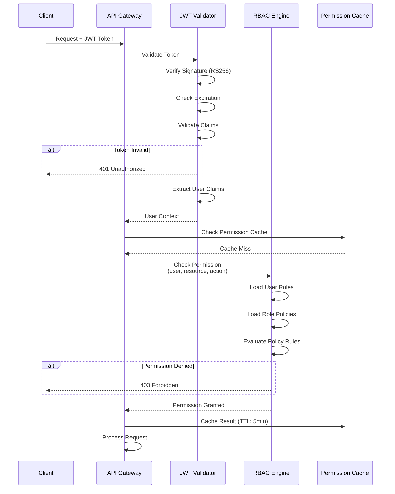
```mermaid
sequenceDiagram
    participant Client
    participant GW as API Gateway
    participant JWT as JWT Validator
    participant RBAC as RBAC Engine
    participant CACHE as Permission Cache

    Client->>GW: Request + JWT Token
    GW->>JWT: Validate Token

    JWT->>JWT: Verify Signature (RS256)
    JWT->>JWT: Check Expiration
    JWT->>JWT: Validate Claims

    alt Token Invalid
        JWT-->>Client: 401 Unauthorized
    end

    JWT->>JWT: Extract User Claims
    JWT-->>GW: User Context

    GW->>CACHE: Check Permission Cache
    CACHE-->>GW: Cache Miss

    GW->>RBAC: Check Permission<br/>(user, resource, action)
    RBAC->>RBAC: Load User Roles
    RBAC->>RBAC: Load Role Policies
    RBAC->>RBAC: Evaluate Policy Rules

    alt Permission Denied
        RBAC-->>Client: 403 Forbidden
    end

    RBAC-->>GW: Permission Granted
    GW->>CACHE: Cache Result (TTL: 5min)
    GW->>GW: Process Request
```

**RBAC Policy Example:**

```yaml
# rbac-policies.yaml
roles:
  - name: admin
    permissions:
      - resource: "configs/*"
        actions: ["create", "read", "update", "delete", "apply"]
      - resource: "proxies/*"
        actions: ["read", "reload", "drain"]
      - resource: "snapshots/*"
        actions: ["read", "create", "delete"]

  - name: operator
    permissions:
      - resource: "configs/*"
        actions: ["read", "apply"]
      - resource: "proxies/*"
        actions: ["read"]
      - resource: "snapshots/*"
        actions: ["read"]

  - name: viewer
    permissions:
      - resource: "configs/*"
        actions: ["read"]
      - resource: "proxies/*"
        actions: ["read"]

users:
  - email: "admin@example.com"
    roles: ["admin"]

  - email: "ops@example.com"
    roles: ["operator"]
```

### 8.4 Audit Logging

```rust
pub struct AuditLogger {
    storage: Arc<dyn AuditStorage>,
}

#[derive(Debug, Serialize)]
pub struct AuditEntry {
    pub id: Uuid,
    pub timestamp: DateTime<Utc>,
    pub user: String,
    pub user_ip: IpAddr,
    pub action: AuditAction,
    pub resource_type: String,
    pub resource_id: String,
    pub result: AuditResult,
    pub metadata: serde_json::Value,
}

#[derive(Debug, Serialize)]
pub enum AuditAction {
    Create,
    Read,
    Update,
    Delete,
    Apply,
    Rollback,
}

#[derive(Debug, Serialize)]
pub enum AuditResult {
    Success,
    Failure { reason: String },
    PartialSuccess { details: String },
}

impl AuditLogger {
    pub async fn log(&self, entry: AuditEntry) -> Result<()> {
        // Store in database
        self.storage.save(entry.clone()).await?;

        // Also send to centralized logging
        info!(
            target: "audit",
            user = %entry.user,
            action = ?entry.action,
            resource = %entry.resource_id,
            result = ?entry.result,
            "Audit event"
        );

        Ok(())
    }
}
```

---

## 9. Performance Optimization

### 9.1 Caching Strategy

```rust
pub struct MultiLevelCache {
    l1_memory: Arc<MemoryCache>,      // Hot data, TTL: 60s
    l2_redis: Arc<RedisCache>,         // Warm data, TTL: 5min
    l3_database: Arc<PostgresStorage>, // Cold data, persistent
}

impl MultiLevelCache {
    pub async fn get_config(&self, id: &ConfigId) -> Result<ProxyConfig> {
        // L1: Check memory cache
        if let Some(config) = self.l1_memory.get(id).await? {
            metrics::increment_counter!("cache.l1.hits");
            return Ok(config);
        }

        // L2: Check Redis cache
        if let Some(config) = self.l2_redis.get(id).await? {
            metrics::increment_counter!("cache.l2.hits");
            // Populate L1
            self.l1_memory.set(id, config.clone()).await?;
            return Ok(config);
        }

        // L3: Load from database
        metrics::increment_counter!("cache.misses");
        let config = self.l3_database.load_config(id).await?;

        // Populate L2 and L1
        self.l2_redis.set(id, config.clone()).await?;
        self.l1_memory.set(id, config.clone()).await?;

        Ok(config)
    }
}
```

### 9.2 Batching and Debouncing

```rust
pub struct EndpointWatcher {
    event_queue: Arc<Mutex<Vec<ServiceEvent>>>,
    debounce_duration: Duration,
}

impl EndpointWatcher {
    pub async fn watch_kubernetes(&self) {
        let api: Api<Service> = Api::all(self.client.clone());
        let mut watcher = watcher(api, ListParams::default()).boxed();

        while let Some(event) = watcher.try_next().await? {
            // Add to queue
            self.event_queue.lock().await.push(event);

            // Debounce: wait for events to settle
            tokio::time::sleep(self.debounce_duration).await;

            // Process batched events
            let events = {
                let mut queue = self.event_queue.lock().await;
                std::mem::take(&mut *queue)
            };

            self.process_batched_events(events).await?;
        }
    }

    async fn process_batched_events(&self, events: Vec<ServiceEvent>) -> Result<()> {
        // Deduplicate events
        let mut unique_services = HashMap::new();
        for event in events {
            unique_services.insert(event.service_name.clone(), event);
        }

        // Process unique events
        for (_, event) in unique_services {
            self.handle_service_change(event).await?;
        }

        Ok(())
    }
}
```

### 9.3 Connection Pooling

```rust
pub struct ControlPlane {
    db_pool: PgPool,
    redis_pool: RedisPool,
}

impl ControlPlane {
    pub async fn new(config: Config) -> Result<Self> {
        // PostgreSQL connection pool
        let db_pool = PgPoolOptions::new()
            .max_connections(20)
            .min_connections(5)
            .acquire_timeout(Duration::from_secs(5))
            .idle_timeout(Duration::from_secs(300))
            .max_lifetime(Duration::from_secs(1800))
            .connect(&config.database_url)
            .await?;

        // Redis connection pool
        let redis_pool = RedisPool::new(
            RedisConfig {
                url: config.redis_url,
                pool_size: 10,
                timeout: Duration::from_secs(5),
            }
        ).await?;

        Ok(Self { db_pool, redis_pool })
    }
}
```

---

## 10. Observability and Monitoring

### 10.1 Metrics Collection

```rust
use prometheus::{IntCounterVec, HistogramVec, GaugeVec};

pub struct Metrics {
    // xDS Metrics
    xds_requests: IntCounterVec,
    xds_responses: IntCounterVec,
    xds_acks: IntCounterVec,
    xds_nacks: IntCounterVec,
    xds_latency: HistogramVec,

    // Configuration Metrics
    config_changes: IntCounterVec,
    config_validation_duration: HistogramVec,
    config_apply_duration: HistogramVec,

    // Proxy Metrics
    connected_proxies: GaugeVec,
    proxy_versions: GaugeVec,

    // Snapshot Metrics
    snapshot_generations: IntCounterVec,
    snapshot_cache_size: GaugeVec,

    // API Metrics
    http_requests: IntCounterVec,
    http_request_duration: HistogramVec,
}

impl Metrics {
    pub fn record_xds_request(&self, node_id: &str, type_url: &str) {
        self.xds_requests
            .with_label_values(&[node_id, type_url])
            .inc();
    }

    pub fn record_config_change(&self, config_type: &str, result: &str) {
        self.config_changes
            .with_label_values(&[config_type, result])
            .inc();
    }

    pub fn record_proxy_connection(&self, cluster: &str, version: &str) {
        self.connected_proxies
            .with_label_values(&[cluster])
            .inc();

        self.proxy_versions
            .with_label_values(&[version])
            .inc();
    }
}
```

### 10.2 Distributed Tracing

```rust
use opentelemetry::{global, trace::{Tracer, Span}};
use tracing_opentelemetry::OpenTelemetrySpanExt;

pub async fn apply_config_with_tracing(
    config_service: &ConfigurationService,
    config_id: ConfigId,
) -> Result<()> {
    let tracer = global::tracer("control-plane");
    let mut span = tracer.start("apply_config");
    span.set_attribute("config.id", config_id.to_string());

    // Attach span context
    let cx = Context::current_with_span(span);
    let _guard = cx.attach();

    // Create child span for validation
    let validation_result = {
        let _validation_span = tracer.start("validate_config");
        config_service.validate(&config_id).await?
    };

    // Create child span for snapshot generation
    {
        let _snapshot_span = tracer.start("generate_snapshots");
        config_service.generate_snapshots(&config_id).await?
    };

    // Create child span for distribution
    {
        let mut distribution_span = tracer.start("distribute_to_proxies");
        distribution_span.set_attribute("proxy.count", 100);
        config_service.distribute(&config_id).await?
    };

    Ok(())
}
```

### 10.3 Structured Logging

```rust
use tracing::{info, warn, error, instrument};

#[instrument(
    name = "config.apply",
    skip(config_service),
    fields(
        config.id = %config_id,
        config.version = tracing::field::Empty,
        target.proxies = tracing::field::Empty,
        result = tracing::field::Empty,
    )
)]
pub async fn apply_configuration(
    config_service: Arc<ConfigurationService>,
    config_id: ConfigId,
    user: UserContext,
) -> Result<()> {
    let span = tracing::Span::current();

    info!(
        user.id = %user.id,
        user.email = %user.email,
        "Starting configuration application"
    );

    let config = config_service.load_config(&config_id).await?;
    span.record("config.version", &config.version.as_str());

    let target_proxies = config_service.resolve_targets(&config).await?;
    span.record("target.proxies", target_proxies.len());

    match config_service.apply(&config, &target_proxies).await {
        Ok(_) => {
            span.record("result", "success");
            info!("Configuration applied successfully");
            Ok(())
        }
        Err(e) => {
            span.record("result", "failure");
            error!(error = %e, "Configuration application failed");
            Err(e)
        }
    }
}
```

---

## 11. Data Structures

### 11.1 Core Data Models

```rust
// Configuration Models

#[derive(Debug, Clone, Serialize, Deserialize)]
pub struct ProxyConfig {
    pub id: ConfigId,
    pub version: String,
    pub metadata: ConfigMetadata,
    pub spec: ConfigSpec,
}

#[derive(Debug, Clone, Serialize, Deserialize)]
pub struct ConfigMetadata {
    pub name: String,
    pub namespace: String,
    pub labels: HashMap<String, String>,
    pub annotations: HashMap<String, String>,
    pub created_at: DateTime<Utc>,
    pub updated_at: DateTime<Utc>,
    pub created_by: String,
}

#[derive(Debug, Clone, Serialize, Deserialize)]
pub struct ConfigSpec {
    pub listeners: Vec<ListenerConfig>,
    pub routes: Vec<RouteConfig>,
    pub clusters: Vec<ClusterConfig>,
    pub secrets: Option<Vec<SecretConfig>>,
}

// xDS Resource Models (simplified)

#[derive(Debug, Clone)]
pub struct ListenerConfig {
    pub name: String,
    pub address: String,
    pub port: u16,
    pub filter_chains: Vec<FilterChain>,
}

#[derive(Debug, Clone)]
pub struct RouteConfig {
    pub name: String,
    pub virtual_hosts: Vec<VirtualHost>,
}

#[derive(Debug, Clone)]
pub struct ClusterConfig {
    pub name: String,
    pub cluster_type: ClusterType,
    pub endpoints: Option<Vec<Endpoint>>,
    pub load_balancing_policy: LoadBalancingPolicy,
    pub health_checks: Option<Vec<HealthCheck>>,
}

#[derive(Debug, Clone)]
pub enum ClusterType {
    Static,
    StrictDns,
    LogicalDns,
    Eds,
    OriginalDst,
}

#[derive(Debug, Clone)]
pub enum LoadBalancingPolicy {
    RoundRobin,
    LeastRequest,
    RingHash,
    Random,
    Maglev,
}

// Proxy and Node Models

#[derive(Debug, Clone, Hash, Eq, PartialEq)]
pub struct NodeId(String);

#[derive(Debug, Clone)]
pub struct ProxyNode {
    pub node_id: NodeId,
    pub cluster: String,
    pub metadata: NodeMetadata,
    pub locality: Option<Locality>,
}

#[derive(Debug, Clone)]
pub struct NodeMetadata {
    pub version: String,
    pub build: String,
    pub labels: HashMap<String, String>,
}

#[derive(Debug, Clone)]
pub struct Locality {
    pub region: String,
    pub zone: String,
    pub sub_zone: Option<String>,
}

// Deployment Models

#[derive(Debug, Clone)]
pub struct DeploymentPlan {
    pub id: Uuid,
    pub config_id: ConfigId,
    pub target_selector: ProxySelector,
    pub strategy: RolloutStrategy,
    pub waves: Vec<DeploymentWave>,
    pub rollback_version: Option<String>,
}

#[derive(Debug, Clone)]
pub enum RolloutStrategy {
    AllAtOnce,
    Rolling { wave_size: usize, pause_duration: Duration },
    Canary { initial_percentage: f64, increment: f64, interval: Duration },
    BlueGreen,
}

#[derive(Debug, Clone)]
pub struct ProxySelector {
    pub namespaces: Option<Vec<String>>,
    pub clusters: Option<Vec<String>>,
    pub labels: Option<HashMap<String, String>>,
    pub node_ids: Option<Vec<NodeId>>,
}
```

### 11.2 Database Schema

```sql
-- Configuration Tables

CREATE TABLE configs (
    id UUID PRIMARY KEY,
    name VARCHAR(255) NOT NULL,
    namespace VARCHAR(255) NOT NULL,
    created_at TIMESTAMPTZ NOT NULL DEFAULT NOW(),
    updated_at TIMESTAMPTZ NOT NULL DEFAULT NOW(),
    created_by VARCHAR(255) NOT NULL,
    current_version VARCHAR(64) NOT NULL,
    UNIQUE(namespace, name)
);

CREATE TABLE config_versions (
    id UUID PRIMARY KEY,
    config_id UUID NOT NULL REFERENCES configs(id) ON DELETE CASCADE,
    version VARCHAR(64) NOT NULL,
    spec JSONB NOT NULL,
    checksum VARCHAR(64) NOT NULL,
    created_at TIMESTAMPTZ NOT NULL DEFAULT NOW(),
    created_by VARCHAR(255) NOT NULL,
    UNIQUE(config_id, version)
);

CREATE INDEX idx_config_versions_config_id ON config_versions(config_id);
CREATE INDEX idx_config_versions_created_at ON config_versions(created_at DESC);

-- Proxy Tables

CREATE TABLE proxy_nodes (
    node_id VARCHAR(255) PRIMARY KEY,
    cluster VARCHAR(255) NOT NULL,
    version VARCHAR(64),
    metadata JSONB,
    first_seen TIMESTAMPTZ NOT NULL DEFAULT NOW(),
    last_seen TIMESTAMPTZ NOT NULL DEFAULT NOW(),
    status VARCHAR(32) NOT NULL
);

CREATE INDEX idx_proxy_nodes_cluster ON proxy_nodes(cluster);
CREATE INDEX idx_proxy_nodes_status ON proxy_nodes(status);

-- Deployment Tables

CREATE TABLE deployments (
    id UUID PRIMARY KEY,
    config_id UUID NOT NULL REFERENCES configs(id),
    config_version VARCHAR(64) NOT NULL,
    status VARCHAR(32) NOT NULL,
    strategy JSONB NOT NULL,
    started_at TIMESTAMPTZ NOT NULL DEFAULT NOW(),
    completed_at TIMESTAMPTZ,
    created_by VARCHAR(255) NOT NULL
);

CREATE TABLE deployment_waves (
    id UUID PRIMARY KEY,
    deployment_id UUID NOT NULL REFERENCES deployments(id) ON DELETE CASCADE,
    wave_number INT NOT NULL,
    target_proxies JSONB NOT NULL,
    status VARCHAR(32) NOT NULL,
    acks INT NOT NULL DEFAULT 0,
    nacks INT NOT NULL DEFAULT 0,
    started_at TIMESTAMPTZ,
    completed_at TIMESTAMPTZ,
    UNIQUE(deployment_id, wave_number)
);

-- Audit Tables

CREATE TABLE audit_log (
    id UUID PRIMARY KEY,
    timestamp TIMESTAMPTZ NOT NULL DEFAULT NOW(),
    user_id VARCHAR(255) NOT NULL,
    user_ip INET NOT NULL,
    action VARCHAR(32) NOT NULL,
    resource_type VARCHAR(64) NOT NULL,
    resource_id VARCHAR(255) NOT NULL,
    result VARCHAR(32) NOT NULL,
    metadata JSONB
);

CREATE INDEX idx_audit_log_timestamp ON audit_log(timestamp DESC);
CREATE INDEX idx_audit_log_user_id ON audit_log(user_id);
CREATE INDEX idx_audit_log_resource ON audit_log(resource_type, resource_id);
```

---

## 12. Implementation Patterns

### 12.1 Event-Driven Architecture

```rust
use tokio::sync::broadcast;

pub struct EventBus {
    tx: broadcast::Sender<Event>,
}

#[derive(Debug, Clone)]
pub enum Event {
    ConfigCreated(ConfigEvent),
    ConfigUpdated(ConfigEvent),
    ConfigDeleted(ConfigEvent),
    ConfigApplied(ApplyEvent),
    SnapshotGenerated(SnapshotEvent),
    ProxyConnected(ProxyEvent),
    ProxyDisconnected(ProxyEvent),
    DeploymentStarted(DeploymentEvent),
    DeploymentCompleted(DeploymentEvent),
    DeploymentFailed(DeploymentEvent),
}

impl EventBus {
    pub fn new() -> Self {
        let (tx, _rx) = broadcast::channel(1000);
        Self { tx }
    }

    pub async fn publish(&self, event: Event) -> Result<()> {
        self.tx.send(event)?;
        Ok(())
    }

    pub fn subscribe(&self) -> broadcast::Receiver<Event> {
        self.tx.subscribe()
    }
}

// Example subscriber
pub async fn config_change_handler(event_bus: Arc<EventBus>) {
    let mut rx = event_bus.subscribe();

    while let Ok(event) = rx.recv().await {
        match event {
            Event::ConfigUpdated(cfg_event) => {
                // Trigger snapshot generation
                info!("Config updated: {}", cfg_event.config_id);
            }
            Event::ProxyConnected(proxy_event) => {
                // Send initial configuration
                info!("Proxy connected: {}", proxy_event.node_id);
            }
            _ => {}
        }
    }
}
```

### 12.2 Actor Pattern for Stream Management

```rust
use tokio::sync::mpsc;

pub struct StreamActor {
    node_id: NodeId,
    receiver: mpsc::Receiver<StreamMessage>,
    snapshot_cache: Arc<SnapshotCache>,
    response_tx: mpsc::Sender<DiscoveryResponse>,
}

pub enum StreamMessage {
    SendSnapshot { type_url: TypeUrl },
    ProcessAck { version: String, type_url: TypeUrl },
    ProcessNack { version: String, type_url: TypeUrl, error: String },
    Disconnect,
}

impl StreamActor {
    pub async fn run(mut self) {
        while let Some(msg) = self.receiver.recv().await {
            match msg {
                StreamMessage::SendSnapshot { type_url } => {
                    if let Err(e) = self.send_snapshot(&type_url).await {
                        error!("Failed to send snapshot: {}", e);
                    }
                }
                StreamMessage::ProcessAck { version, type_url } => {
                    self.handle_ack(&version, &type_url).await;
                }
                StreamMessage::ProcessNack { version, type_url, error } => {
                    self.handle_nack(&version, &type_url, &error).await;
                }
                StreamMessage::Disconnect => {
                    info!("Stream actor disconnecting: {}", self.node_id);
                    break;
                }
            }
        }
    }
}
```

### 12.3 Graceful Shutdown

```rust
use tokio::signal;

pub async fn run_control_plane(config: Config) -> Result<()> {
    let control_plane = ControlPlane::new(config).await?;

    // Spawn all services
    let xds_handle = tokio::spawn(control_plane.run_xds_server());
    let api_handle = tokio::spawn(control_plane.run_api_server());
    let watcher_handle = tokio::spawn(control_plane.run_endpoint_watcher());

    // Wait for shutdown signal
    let shutdown = async {
        signal::ctrl_c().await.expect("Failed to listen for Ctrl+C");
        info!("Received shutdown signal");
    };

    tokio::select! {
        _ = shutdown => {
            info!("Initiating graceful shutdown...");

            // 1. Stop accepting new connections
            control_plane.stop_accepting_connections().await;

            // 2. Drain existing connections (30s timeout)
            let drain_timeout = Duration::from_secs(30);
            tokio::time::timeout(
                drain_timeout,
                control_plane.drain_connections()
            ).await?;

            // 3. Cancel background tasks
            xds_handle.abort();
            api_handle.abort();
            watcher_handle.abort();

            // 4. Flush metrics and logs
            control_plane.flush_metrics().await?;
            control_plane.flush_logs().await?;

            // 5. Close database connections
            control_plane.close_connections().await?;

            info!("Shutdown complete");
        }
    }

    Ok(())
}
```

---

## Conclusion

This detailed design document describes the complete information flow from the Web UI through multiple layers to the Envoy proxy fleet. The architecture is designed for:

- **High Performance**: Sub-second configuration propagation
- **Reliability**: Multi-layer validation, automatic rollback, zero-downtime updates
- **Security**: End-to-end authentication, authorization, and audit logging
- **Observability**: Comprehensive metrics, traces, and logs at every layer
- **Scalability**: Event-driven architecture supporting 10,000+ proxies

The implementation leverages Rust's performance and safety guarantees, modern async programming with Tokio, and production-proven protocols like gRPC and xDS.

---

**Next Steps:**
1. Review and approve this design
2. Set up development environment
3. Implement Phase 1: Core Foundation
4. Develop UI prototypes
5. Begin integration testing

